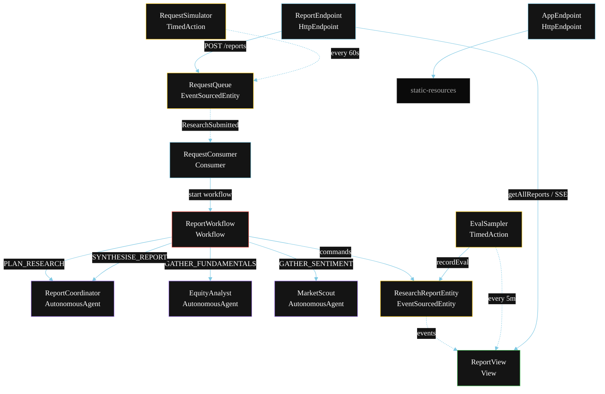
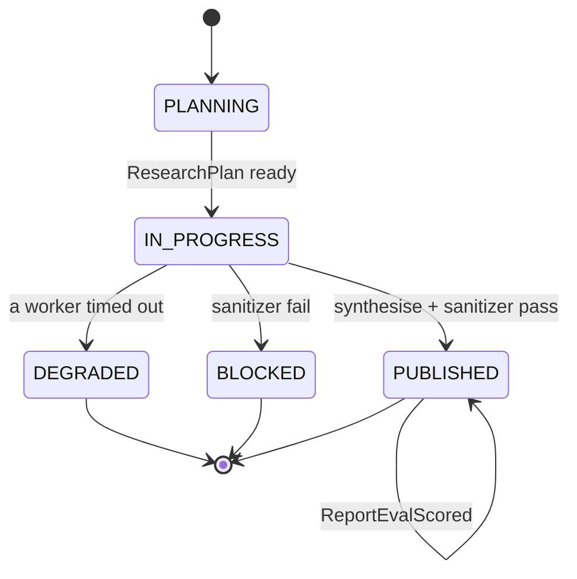
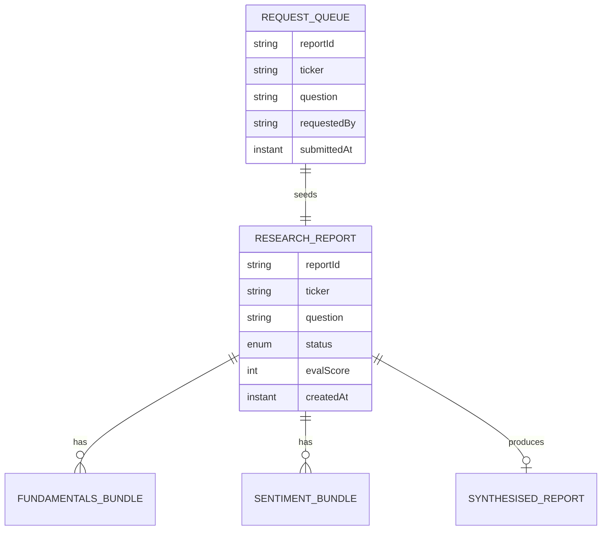

# PLAN — Investment Research Multi-Agent

Architectural sketch for `/akka:specify`. Mirrors `SPEC.md` Section 4 component names exactly. Mermaid sources here are rendered on the Architecture tab of the embedded UI; carry the Lesson 24 CSS overrides into the generated `index.html`.

## Component graph



Solid arrows: synchronous commands. Dashed arrows: event subscriptions. Dotted arrows: scheduled ticks.

## Interaction sequence

```mermaid
sequenceDiagram
  participant U as User / Simulator
  participant RE as ReportEndpoint
  participant RQ as RequestQueue
  participant WF as ReportWorkflow
  participant CO as ReportCoordinator
  participant EA as EquityAnalyst
  participant MS as MarketScout
  participant RRE as ResearchReportEntity

  U->>RE: POST /api/reports {ticker, question}
  RE->>RQ: enqueueRequest
  RQ-->>WF: RequestConsumer starts workflow
  WF->>RRE: createReport (PLANNING)
  WF->>CO: PLAN_RESEARCH -> ResearchPlan
  WF->>RRE: status IN_PROGRESS
  par parallel fan-out
    WF->>EA: GATHER_FUNDAMENTALS -> FundamentalsBundle
  and
    WF->>MS: GATHER_SENTIMENT -> SentimentBundle
  end
  Note over WF: join; if either step times out (60s) -> degradeStep
  WF->>CO: SYNTHESISE_REPORT(fundamentals, sentiment) -> SynthesisedReport
  WF->>WF: sanitizerStep vets the report
  alt sanitizer passes
    WF->>RRE: publishReport (PUBLISHED)
  else sanitizer fails
    WF->>RRE: blockReport (BLOCKED)
  end
```

## State machine



## Entity model



## Component table

| Component | Akka primitive | File path |
|---|---|---|
| `ReportCoordinator` | AutonomousAgent | `application/ReportCoordinator.java` |
| `EquityAnalyst` | AutonomousAgent | `application/EquityAnalyst.java` |
| `MarketScout` | AutonomousAgent | `application/MarketScout.java` |
| `ReportTasks` | Task constants | `application/ReportTasks.java` |
| `ReportWorkflow` | Workflow | `application/ReportWorkflow.java` |
| `ResearchReportEntity` | EventSourcedEntity | `domain/ResearchReportEntity.java` |
| `RequestQueue` | EventSourcedEntity | `domain/RequestQueue.java` |
| `ReportView` | View | `application/ReportView.java` |
| `RequestConsumer` | Consumer | `application/RequestConsumer.java` |
| `RequestSimulator` | TimedAction | `application/RequestSimulator.java` |
| `EvalSampler` | TimedAction | `application/EvalSampler.java` |
| `ReportEndpoint` | HttpEndpoint | `api/ReportEndpoint.java` |
| `AppEndpoint` | HttpEndpoint | `api/AppEndpoint.java` |

## Concurrency notes

- **Step timeouts (Lesson 4):** `fundamentalsStep` and `sentimentStep` get 60s; `synthesiseStep` gets 90s. The 5s default fails every LLM call. `WorkflowSettings` is nested inside `Workflow` — no import.
- **Parallel fan-out:** `fundamentalsStep` and `sentimentStep` run concurrently via `CompletionStage` zip, not two sequential step calls.
- **Idempotency:** the workflow id is the `reportId`. Re-delivery of the same `ResearchSubmitted` event resolves to the same workflow instance — no duplicate report.
- **Degrade path (compensation):** if either worker times out, `defaultStepRecovery` routes to `degradeStep`, which synthesises from whichever partial output exists and ends with `ReportDegraded`. No infinite retry.
- **Eval sampling:** `EvalSampler` reads `ReportView.getAllReports` (no enum WHERE clause — Lesson 2) and filters client-side for the oldest `PUBLISHED` report lacking an `evalScore`.
