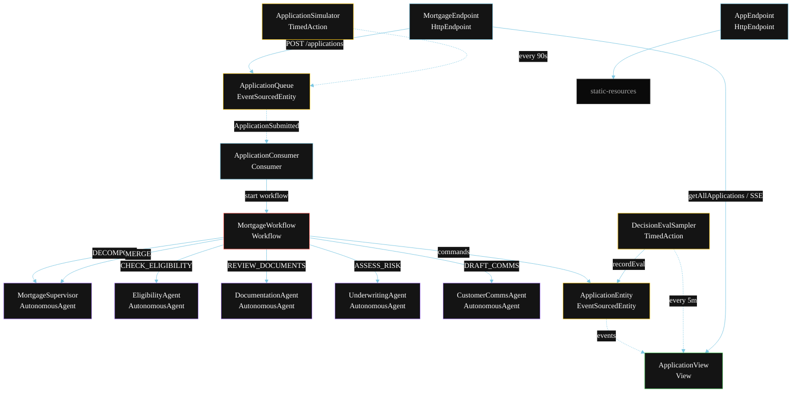
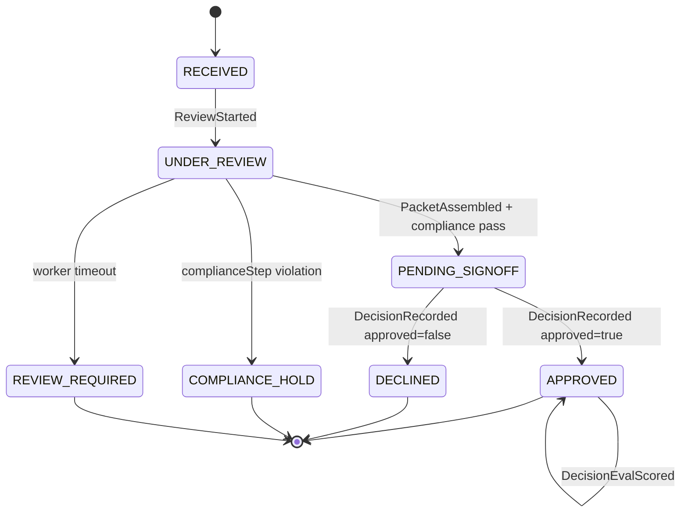
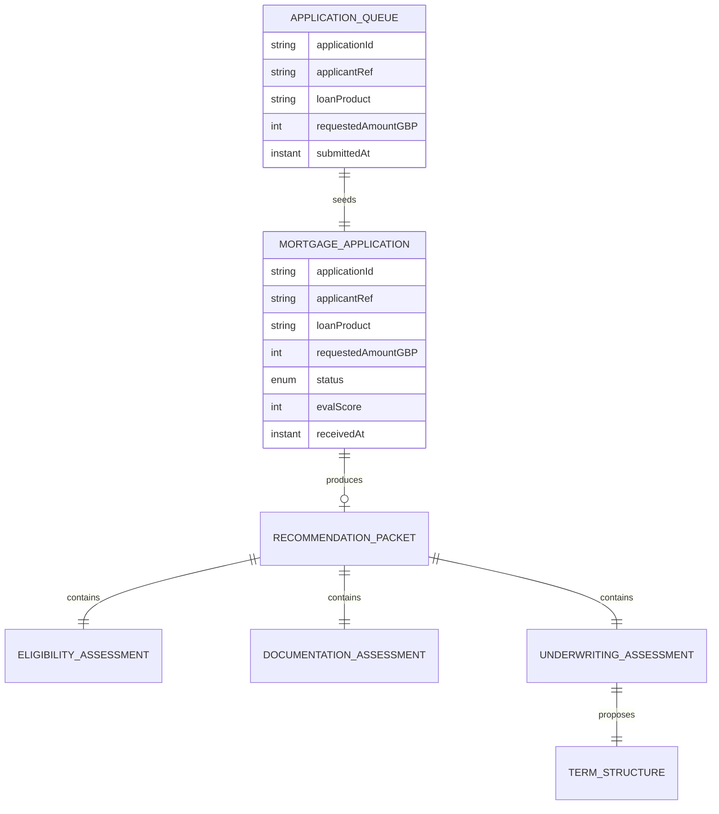

# PLAN — Mortgage Assistant (Multi-Agent)

Architectural sketch for `/akka:specify`. Mirrors `SPEC.md` Section 4 component names exactly. Mermaid sources here are rendered on the Architecture tab of the embedded UI; carry the Lesson 24 CSS overrides into the generated `index.html`.

## Component graph



Solid arrows: synchronous commands. Dashed arrows: event subscriptions. Dotted arrows: scheduled ticks.

## Interaction sequence

```mermaid
sequenceDiagram
  participant U as User / Simulator
  participant ME as MortgageEndpoint
  participant AQ as ApplicationQueue
  participant WF as MortgageWorkflow
  participant SV as MortgageSupervisor
  participant EL as EligibilityAgent
  participant DO as DocumentationAgent
  participant UW as UnderwritingAgent
  participant CC as CustomerCommsAgent
  participant AP as ApplicationEntity

  U->>ME: POST /api/applications {applicationRequest}
  ME->>AQ: enqueueApplication
  AQ-->>WF: ApplicationConsumer starts workflow
  WF->>AP: receiveApplication (RECEIVED)
  WF->>SV: DECOMPOSE -> WorkPlan
  WF->>AP: startReview (UNDER_REVIEW)
  WF->>CC: DRAFT_COMMS (acknowledgement)
  par parallel fan-out
    WF->>EL: CHECK_ELIGIBILITY -> EligibilityAssessment
  and
    WF->>DO: REVIEW_DOCUMENTS -> DocumentationAssessment
  and
    WF->>UW: ASSESS_RISK -> UnderwritingAssessment
  end
  Note over WF: join; if any step times out (90s) -> reviewRequiredStep
  WF->>SV: MERGE(all three assessments) -> RecommendationPacket
  WF->>WF: complianceStep vets proposed terms
  alt compliance holds
    WF->>AP: applyComplianceHold (COMPLIANCE_HOLD)
  else compliance passes
    WF->>AP: requestSignOff (PENDING_SIGNOFF)
    Note over WF,AP: workflow pauses; waits for POST /api/applications/{id}/decision
    U->>ME: POST /api/applications/{id}/decision {approved, decidedBy, notes}
    ME->>AP: recordDecision (APPROVED or DECLINED)
    WF->>CC: DRAFT_COMMS (outcome notification)
    WF->>AP: emitStep
  end
```

## State machine



## Entity model



## Component table

| Component | Akka primitive | File path |
|---|---|---|
| `MortgageSupervisor` | AutonomousAgent | `application/MortgageSupervisor.java` |
| `EligibilityAgent` | AutonomousAgent | `application/EligibilityAgent.java` |
| `DocumentationAgent` | AutonomousAgent | `application/DocumentationAgent.java` |
| `UnderwritingAgent` | AutonomousAgent | `application/UnderwritingAgent.java` |
| `CustomerCommsAgent` | AutonomousAgent | `application/CustomerCommsAgent.java` |
| `MortgageTasks` | Task constants | `application/MortgageTasks.java` |
| `MortgageWorkflow` | Workflow | `application/MortgageWorkflow.java` |
| `ApplicationEntity` | EventSourcedEntity | `domain/ApplicationEntity.java` |
| `ApplicationQueue` | EventSourcedEntity | `domain/ApplicationQueue.java` |
| `ApplicationView` | View | `application/ApplicationView.java` |
| `ApplicationConsumer` | Consumer | `application/ApplicationConsumer.java` |
| `ApplicationSimulator` | TimedAction | `application/ApplicationSimulator.java` |
| `DecisionEvalSampler` | TimedAction | `application/DecisionEvalSampler.java` |
| `MortgageEndpoint` | HttpEndpoint | `api/MortgageEndpoint.java` |
| `AppEndpoint` | HttpEndpoint | `api/AppEndpoint.java` |

## Concurrency notes

- **Step timeouts (Lesson 4):** `eligibilityStep`, `documentationStep`, and `underwritingStep` each get 90s; `mergeStep` gets 120s. The 5s default fails every LLM call. `WorkflowSettings` is nested inside `Workflow` — no import.
- **Parallel fan-out:** `eligibilityStep`, `documentationStep`, and `underwritingStep` run concurrently via a three-way `CompletionStage` zip, not sequential calls.
- **Idempotency:** the workflow id is the `applicationId`. Re-delivery of the same `ApplicationSubmitted` event resolves to the same workflow instance — no duplicate application.
- **HITL pause:** `signOffStep` emits `SignOffRequested` and suspends via a paused Workflow step. It resumes only when `ApplicationEntity.recordDecision` is called. No polling loop.
- **Degrade path (Lesson 4):** if any worker times out, `defaultStepRecovery` routes to `reviewRequiredStep`, which calls `ApplicationEntity.workerTimedOut` and ends. No infinite retry.
- **Eval sampling:** `DecisionEvalSampler` reads `ApplicationView.getAllApplications` and filters client-side for the oldest `APPROVED` or `DECLINED` application lacking an `evalScore`.
- **PII scope:** the workflow holds the sanitised `applicantRef` only; raw applicant fields (name, address, national insurance / SSN) stay in `ApplicationEntity` and are never forwarded to any AutonomousAgent invocation.
