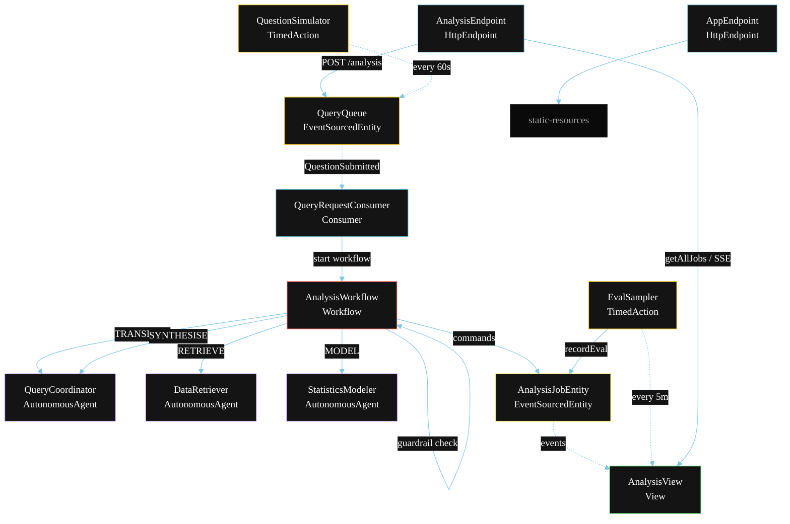
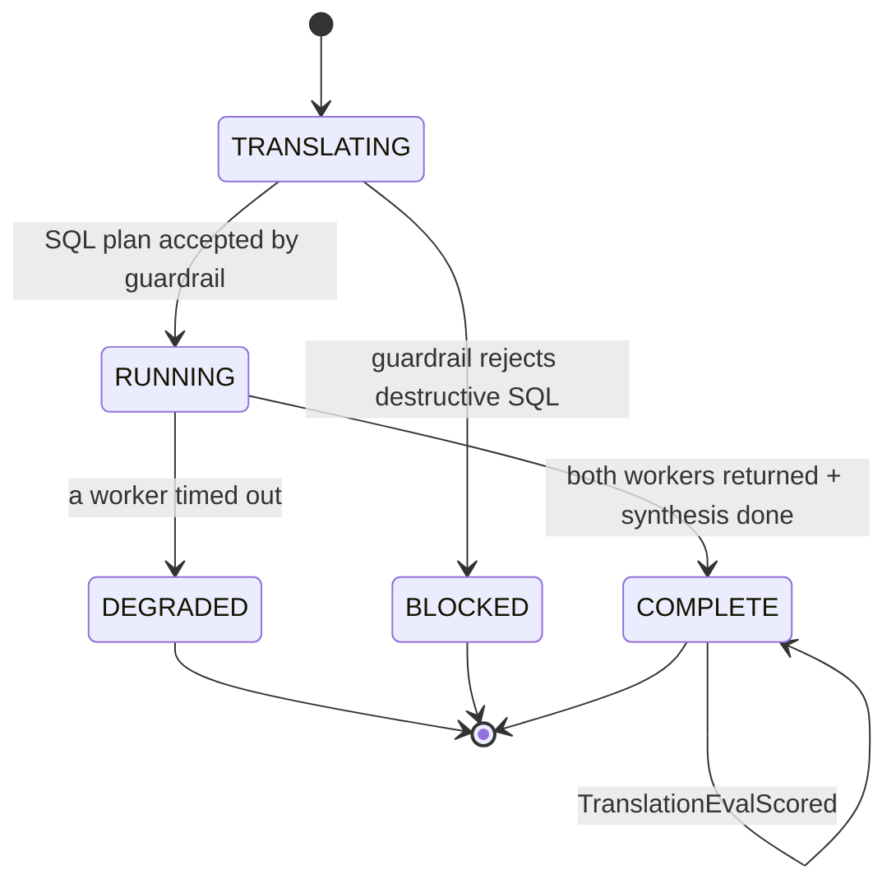
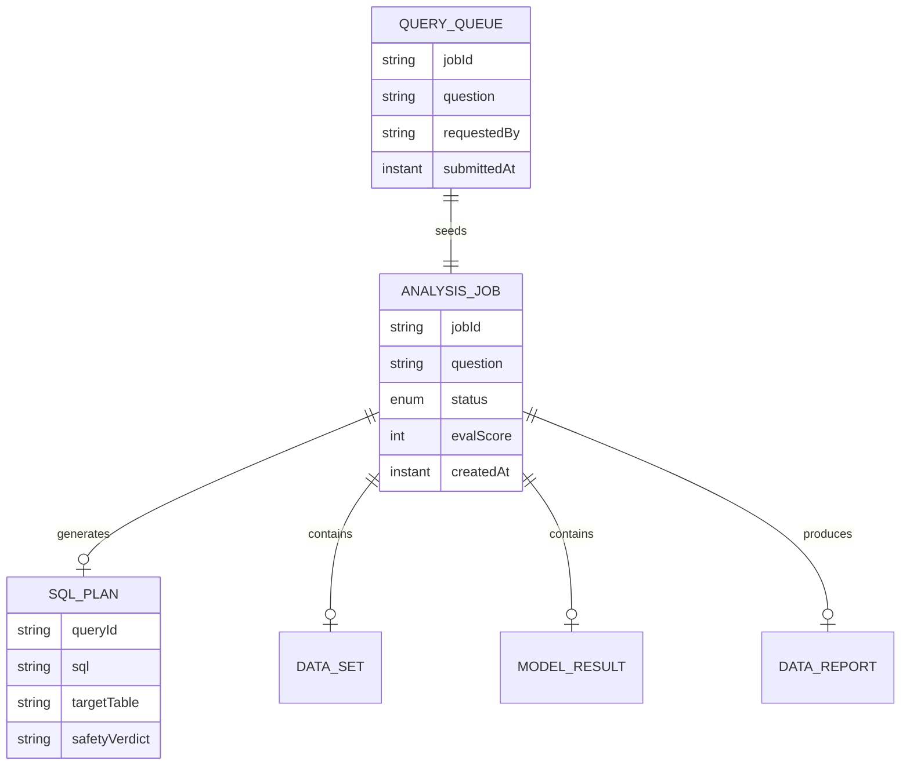

# PLAN — Multi-Agent NL2SQL Data Science

Architectural sketch for `/akka:specify`. Mirrors `SPEC.md` Section 4 component names exactly. Mermaid sources here are rendered on the Architecture tab of the embedded UI; carry the Lesson 24 CSS overrides into the generated `index.html`.

## Component graph



Solid arrows: synchronous commands. Dashed arrows: event subscriptions. Dotted arrows: scheduled ticks.

## Interaction sequence

```mermaid
sequenceDiagram
  participant U as User / Simulator
  participant AE as AnalysisEndpoint
  participant QQ as QueryQueue
  participant WF as AnalysisWorkflow
  participant QC as QueryCoordinator
  participant DR as DataRetriever
  participant SM as StatisticsModeler
  participant JE as AnalysisJobEntity

  U->>AE: POST /api/analysis {question}
  AE->>QQ: enqueueQuestion
  QQ-->>WF: QueryRequestConsumer starts workflow
  WF->>JE: createJob (TRANSLATING)
  WF->>QC: TRANSLATE -> SqlPlan
  WF->>WF: guardrailStep (inspect SqlPlan.sql)
  alt SQL is safe
    WF->>JE: attachSqlPlan (RUNNING)
    par parallel fan-out
      WF->>DR: RETRIEVE -> DataSet
    and
      WF->>SM: MODEL -> ModelResult
    end
    Note over WF: join; if either step times out (60s) -> degradeStep
    WF->>QC: SYNTHESISE(dataSet, modelResult) -> DataReport
    WF->>JE: completeJob (COMPLETE)
  else SQL is destructive
    WF->>JE: blockJob (BLOCKED)
  end
```

## State machine



## Entity model



## Component table

| Component | Akka primitive | File path |
|---|---|---|
| `QueryCoordinator` | AutonomousAgent | `application/QueryCoordinator.java` |
| `DataRetriever` | AutonomousAgent | `application/DataRetriever.java` |
| `StatisticsModeler` | AutonomousAgent | `application/StatisticsModeler.java` |
| `DataScienceTasks` | Task constants | `application/DataScienceTasks.java` |
| `AnalysisWorkflow` | Workflow | `application/AnalysisWorkflow.java` |
| `AnalysisJobEntity` | EventSourcedEntity | `domain/AnalysisJobEntity.java` |
| `QueryQueue` | EventSourcedEntity | `domain/QueryQueue.java` |
| `AnalysisView` | View | `application/AnalysisView.java` |
| `QueryRequestConsumer` | Consumer | `application/QueryRequestConsumer.java` |
| `QuestionSimulator` | TimedAction | `application/QuestionSimulator.java` |
| `EvalSampler` | TimedAction | `application/EvalSampler.java` |
| `AnalysisEndpoint` | HttpEndpoint | `api/AnalysisEndpoint.java` |
| `AppEndpoint` | HttpEndpoint | `api/AppEndpoint.java` |

## Concurrency notes

- **Step timeouts (Lesson 4):** `retrieveStep` and `modelStep` get 60s; `synthesiseStep` gets 90s. The 5s default fails every LLM call. `WorkflowSettings` is nested inside `Workflow` — no import.
- **Parallel fan-out:** `retrieveStep` and `modelStep` run concurrently via `CompletionStage` zip, not two sequential step calls.
- **Guardrail placement:** `guardrailStep` runs between `translateStep` and the parallel fan-out. If the SQL contains a destructive keyword, the workflow ends immediately without starting either worker.
- **Idempotency:** the workflow id is the `jobId`. Re-delivery of the same `QuestionSubmitted` event resolves to the same workflow instance — no duplicate job.
- **Degrade path (compensation):** if either worker times out, `defaultStepRecovery` routes to `degradeStep`, which synthesises from whichever partial output exists and ends with `JobDegraded`. No infinite retry.
- **Eval sampling:** `EvalSampler` reads `AnalysisView.getAllJobs` (no enum WHERE clause) and filters client-side for the oldest `COMPLETE` job lacking an `evalScore`.
