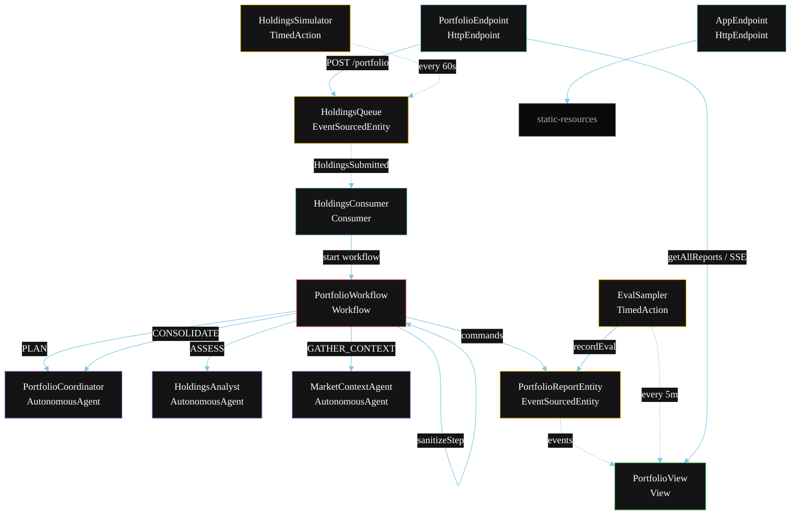
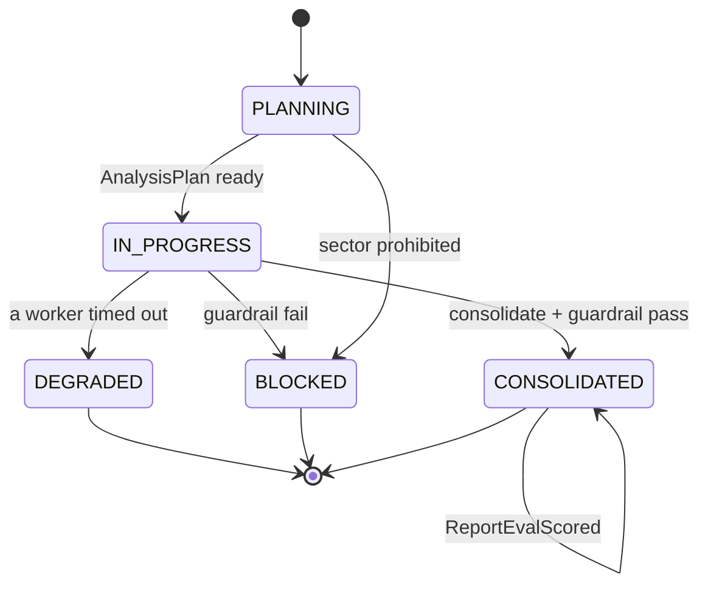
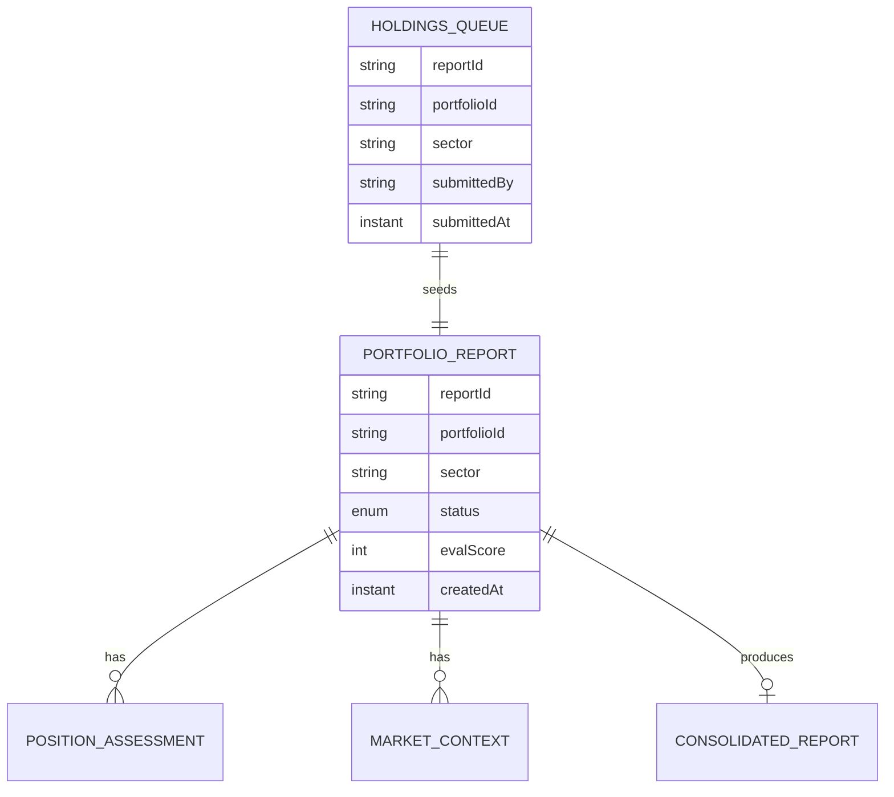

# PLAN — Portfolio Assistant (Multi-Agent)

Architectural sketch for `/akka:specify`. Mirrors `SPEC.md` Section 4 component names exactly. Mermaid sources here are rendered on the Architecture tab of the embedded UI; carry the Lesson 24 CSS overrides into the generated `index.html`.

## Component graph



Solid arrows: synchronous commands. Dashed arrows: event subscriptions. Dotted arrows: scheduled ticks.

## Interaction sequence

```mermaid
sequenceDiagram
  participant U as User / Simulator
  participant PE as PortfolioEndpoint
  participant HQ as HoldingsQueue
  participant WF as PortfolioWorkflow
  participant CO as PortfolioCoordinator
  participant HA as HoldingsAnalyst
  participant MC as MarketContextAgent
  participant RE as PortfolioReportEntity

  U->>PE: POST /api/portfolio {portfolioId, sector, holdings}
  PE->>WF: sanitizeStep (sector check)
  alt sector prohibited
    WF->>RE: block (BLOCKED, no agent work)
  else sector valid
    PE->>HQ: enqueueHoldings
    HQ-->>WF: HoldingsConsumer starts workflow
    WF->>RE: createReport (PLANNING)
    WF->>CO: PLAN -> AnalysisPlan
    WF->>RE: status IN_PROGRESS
    par parallel fan-out
      WF->>HA: ASSESS -> PositionAssessment
    and
      WF->>MC: GATHER_CONTEXT -> MarketContext
    end
    Note over WF: join; if either step times out (60s) -> degradeStep
    WF->>CO: CONSOLIDATE(assessment, context) -> ConsolidatedReport
    WF->>WF: guardrailStep vets the report
    alt guardrail passes
      WF->>RE: consolidate (CONSOLIDATED)
    else guardrail fails
      WF->>RE: block (BLOCKED)
    end
  end
```

## State machine



## Entity model



## Component table

| Component | Akka primitive | File path |
|---|---|---|
| `PortfolioCoordinator` | AutonomousAgent | `application/PortfolioCoordinator.java` |
| `HoldingsAnalyst` | AutonomousAgent | `application/HoldingsAnalyst.java` |
| `MarketContextAgent` | AutonomousAgent | `application/MarketContextAgent.java` |
| `PortfolioTasks` | Task constants | `application/PortfolioTasks.java` |
| `PortfolioWorkflow` | Workflow | `application/PortfolioWorkflow.java` |
| `PortfolioReportEntity` | EventSourcedEntity | `domain/PortfolioReportEntity.java` |
| `HoldingsQueue` | EventSourcedEntity | `domain/HoldingsQueue.java` |
| `PortfolioView` | View | `application/PortfolioView.java` |
| `HoldingsConsumer` | Consumer | `application/HoldingsConsumer.java` |
| `HoldingsSimulator` | TimedAction | `application/HoldingsSimulator.java` |
| `EvalSampler` | TimedAction | `application/EvalSampler.java` |
| `SectorRegistry` | Registry util | `domain/SectorRegistry.java` |
| `PortfolioEndpoint` | HttpEndpoint | `api/PortfolioEndpoint.java` |
| `AppEndpoint` | HttpEndpoint | `api/AppEndpoint.java` |

## Concurrency notes

- **Step timeouts (Lesson 4):** `assessStep` and `contextStep` get 60s; `consolidateStep` gets 90s. The 5s default fails every LLM call. `WorkflowSettings` is nested inside `Workflow` — no import.
- **Parallel fan-out:** `assessStep` and `contextStep` run concurrently via `CompletionStage` zip, not two sequential step calls.
- **Sanitize-first gate:** `sanitizeStep` runs before any agent or entity work. A prohibited sector short-circuits the workflow immediately; no `HoldingsQueue` entry is written.
- **Idempotency:** the workflow id is the `reportId`. Re-delivery of the same `HoldingsSubmitted` event resolves to the same workflow instance — no duplicate report.
- **Degrade path (compensation):** if either worker times out, `defaultStepRecovery` routes to `degradeStep`, which consolidates from whichever partial output exists and ends with `ReportDegraded`. No infinite retry.
- **Eval sampling:** `EvalSampler` reads `PortfolioView.getAllReports` (no enum WHERE clause) and filters client-side for the oldest `CONSOLIDATED` report lacking an `evalScore`.
