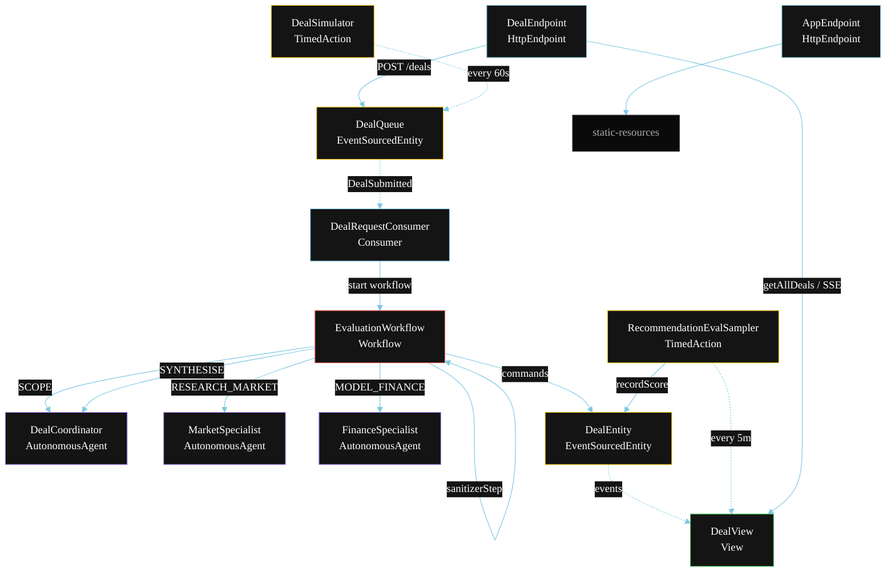
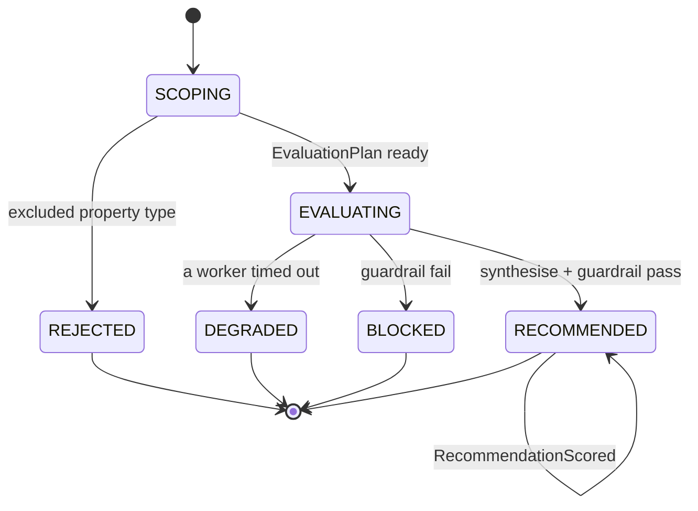
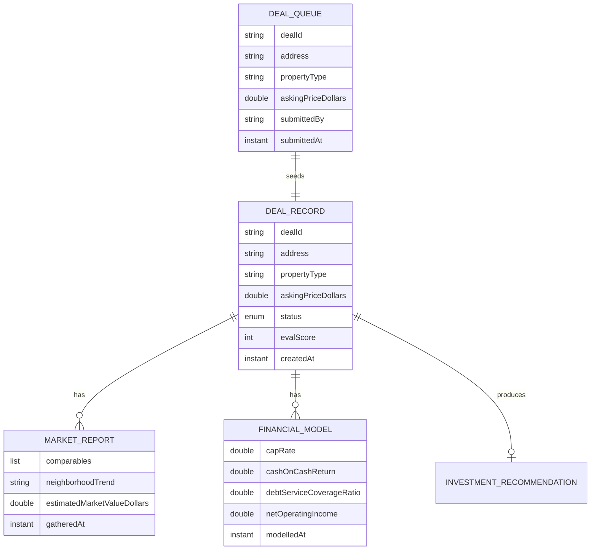

# PLAN — Real Estate Investment Multi-Agent

Architectural sketch for `/akka:specify`. Mirrors `SPEC.md` Section 4 component names exactly. Mermaid sources here are rendered on the Architecture tab of the embedded UI; carry the Lesson 24 CSS overrides into the generated `index.html`.

## Component graph



Solid arrows: synchronous commands. Dashed arrows: event subscriptions or scheduled ticks.

## Interaction sequence

```mermaid
sequenceDiagram
  participant U as User / Simulator
  participant DE as DealEndpoint
  participant DQ as DealQueue
  participant WF as EvaluationWorkflow
  participant CO as DealCoordinator
  participant MS as MarketSpecialist
  participant FS as FinanceSpecialist
  participant ENT as DealEntity

  U->>DE: POST /api/deals {address, propertyType, askingPriceDollars}
  DE->>DQ: submitDeal
  DQ-->>WF: DealRequestConsumer starts workflow
  WF->>WF: sanitizerStep (property type check)
  alt excluded property type
    WF->>ENT: rejectDeal (REJECTED)
  else passes sanitizer
    WF->>ENT: createDeal (SCOPING)
    WF->>CO: SCOPE -> EvaluationPlan
    WF->>ENT: status EVALUATING
    par parallel fan-out
      WF->>MS: RESEARCH_MARKET -> MarketReport
    and
      WF->>FS: MODEL_FINANCE -> FinancialModel
    end
    Note over WF: join; if either step times out (60s) -> degradeStep
    WF->>CO: SYNTHESISE(marketReport, financialModel) -> InvestmentRecommendation
    WF->>WF: guardrailStep vets the recommendation
    alt guardrail passes
      WF->>ENT: recommend (RECOMMENDED)
    else guardrail fails
      WF->>ENT: block (BLOCKED)
    end
  end
```

## State machine



## Entity model



## Component table

| Component | Akka primitive | File path |
|---|---|---|
| `DealCoordinator` | AutonomousAgent | `application/DealCoordinator.java` |
| `MarketSpecialist` | AutonomousAgent | `application/MarketSpecialist.java` |
| `FinanceSpecialist` | AutonomousAgent | `application/FinanceSpecialist.java` |
| `DealTasks` | Task constants | `application/DealTasks.java` |
| `EvaluationWorkflow` | Workflow | `application/EvaluationWorkflow.java` |
| `DealEntity` | EventSourcedEntity | `domain/DealEntity.java` |
| `DealQueue` | EventSourcedEntity | `domain/DealQueue.java` |
| `DealView` | View | `application/DealView.java` |
| `DealRequestConsumer` | Consumer | `application/DealRequestConsumer.java` |
| `DealSimulator` | TimedAction | `application/DealSimulator.java` |
| `RecommendationEvalSampler` | TimedAction | `application/RecommendationEvalSampler.java` |
| `DealEndpoint` | HttpEndpoint | `api/DealEndpoint.java` |
| `AppEndpoint` | HttpEndpoint | `api/AppEndpoint.java` |

## Concurrency notes

- **Step timeouts (Lesson 4):** `marketStep` and `financeStep` get 60s; `synthesiseStep` gets 90s. The 5s default fails every LLM call. `WorkflowSettings` is nested inside `Workflow` — no import.
- **Parallel fan-out:** `marketStep` and `financeStep` run concurrently via `CompletionStage` zip, not two sequential step calls.
- **Sanitizer-first:** `sanitizerStep` is a pure Java check on `DealSubmission.propertyType`. It runs before any `forAutonomousAgent` call. If matched, the workflow ends with `DealRejected` — no LLM token is consumed.
- **Idempotency:** the workflow id is the `dealId`. Re-delivery of the same `DealSubmitted` event resolves to the same workflow instance — no duplicate deal.
- **Degrade path (compensation):** if either worker times out, `defaultStepRecovery` routes to `degradeStep`, which synthesises from whichever partial output exists and ends with `DealDegraded`. No infinite retry.
- **Eval sampling:** `RecommendationEvalSampler` reads `DealView.getAllDeals` (no enum WHERE clause) and filters client-side for the oldest `RECOMMENDED` deal lacking an `evalScore`.
