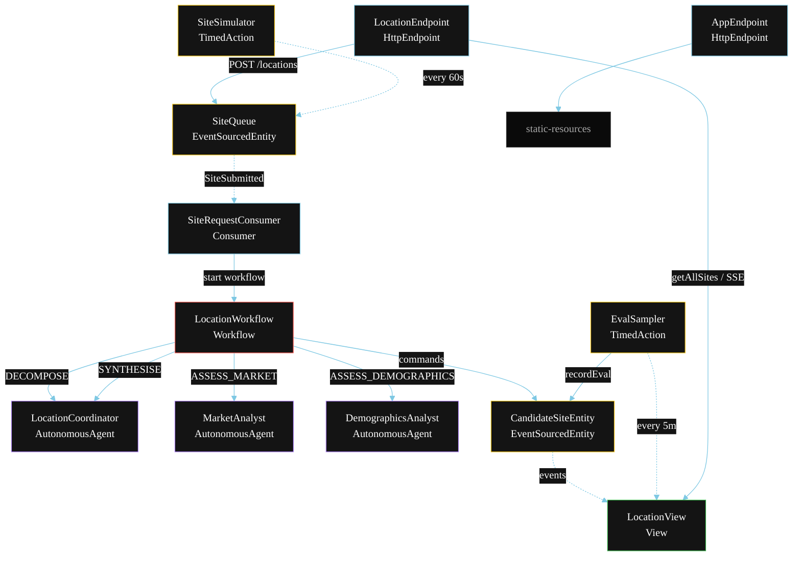
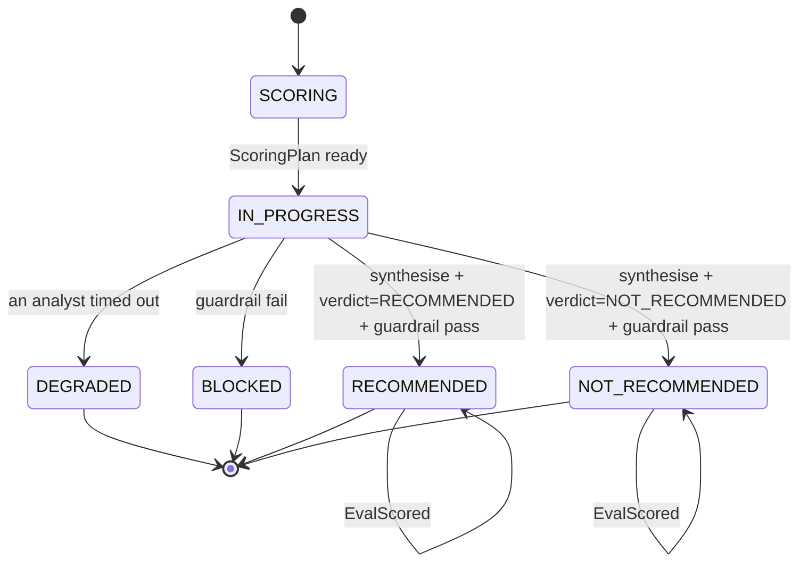
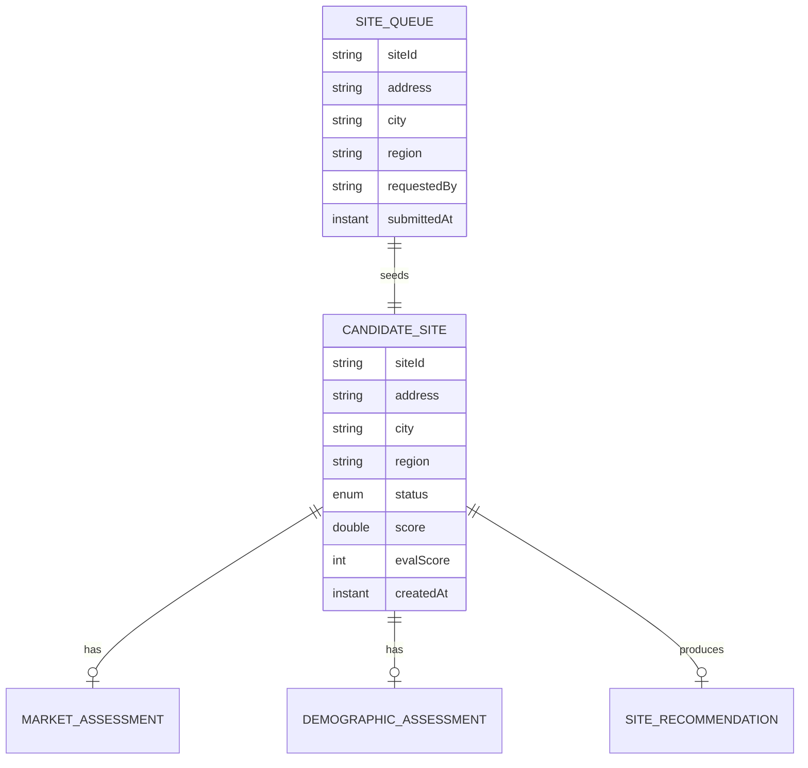

# PLAN — Retail AI Location Strategy

Architectural sketch for `/akka:specify`. Mirrors `SPEC.md` Section 4 component names exactly. Mermaid sources here are rendered on the Architecture tab of the embedded UI; carry the Lesson 24 CSS overrides into the generated `index.html`.

## Component graph



Solid arrows: synchronous commands. Dashed arrows: event subscriptions. Dotted arrows: scheduled ticks.

## Interaction sequence

```mermaid
sequenceDiagram
  participant U as User / Simulator
  participant LE as LocationEndpoint
  participant SQ as SiteQueue
  participant WF as LocationWorkflow
  participant CO as LocationCoordinator
  participant MA as MarketAnalyst
  participant DA as DemographicsAnalyst
  participant CE as CandidateSiteEntity

  U->>LE: POST /api/locations {address, city, region}
  LE->>SQ: enqueueSite
  SQ-->>WF: SiteRequestConsumer starts workflow
  WF->>CE: createSite (SCORING)
  WF->>CO: DECOMPOSE -> ScoringPlan
  WF->>CE: status IN_PROGRESS
  par parallel fan-out
    WF->>MA: ASSESS_MARKET -> MarketAssessment
  and
    WF->>DA: ASSESS_DEMOGRAPHICS -> DemographicAssessment
  end
  Note over WF: join; if either step times out (60s) -> degradeStep
  WF->>CO: SYNTHESISE(market, demographics) -> SiteRecommendation
  WF->>WF: guardrailStep vets the recommendation
  alt guardrail passes
    WF->>CE: recommend or notRecommend (RECOMMENDED / NOT_RECOMMENDED)
  else guardrail fails
    WF->>CE: block (BLOCKED)
  end
```

## State machine



## Entity model



## Component table

| Component | Akka primitive | File path |
|---|---|---|
| `LocationCoordinator` | AutonomousAgent | `application/LocationCoordinator.java` |
| `MarketAnalyst` | AutonomousAgent | `application/MarketAnalyst.java` |
| `DemographicsAnalyst` | AutonomousAgent | `application/DemographicsAnalyst.java` |
| `LocationTasks` | Task constants | `application/LocationTasks.java` |
| `LocationWorkflow` | Workflow | `application/LocationWorkflow.java` |
| `CandidateSiteEntity` | EventSourcedEntity | `domain/CandidateSiteEntity.java` |
| `SiteQueue` | EventSourcedEntity | `domain/SiteQueue.java` |
| `LocationView` | View | `application/LocationView.java` |
| `SiteRequestConsumer` | Consumer | `application/SiteRequestConsumer.java` |
| `SiteSimulator` | TimedAction | `application/SiteSimulator.java` |
| `EvalSampler` | TimedAction | `application/EvalSampler.java` |
| `LocationEndpoint` | HttpEndpoint | `api/LocationEndpoint.java` |
| `AppEndpoint` | HttpEndpoint | `api/AppEndpoint.java` |

## Concurrency notes

- **Step timeouts (Lesson 4):** `assessMarketStep` and `assessDemographicsStep` get 60s; `synthesiseStep` gets 90s. The 5s default fails every LLM call. `WorkflowSettings` is nested inside `Workflow` — no import.
- **Parallel fan-out:** `assessMarketStep` and `assessDemographicsStep` run concurrently via `CompletionStage` zip, not two sequential step calls.
- **Idempotency:** the workflow id is the `siteId`. Re-delivery of the same `SiteSubmitted` event resolves to the same workflow instance — no duplicate evaluation.
- **Degrade path (compensation):** if either analyst times out, `defaultStepRecovery` routes to `degradeStep`, which synthesises from whichever partial output exists and ends with `SiteDegraded`. No infinite retry.
- **Eval sampling:** `EvalSampler` reads `LocationView.getAllSites` (no enum WHERE clause — Lesson 2) and filters client-side for the oldest `RECOMMENDED` or `NOT_RECOMMENDED` site lacking an `evalScore`.
