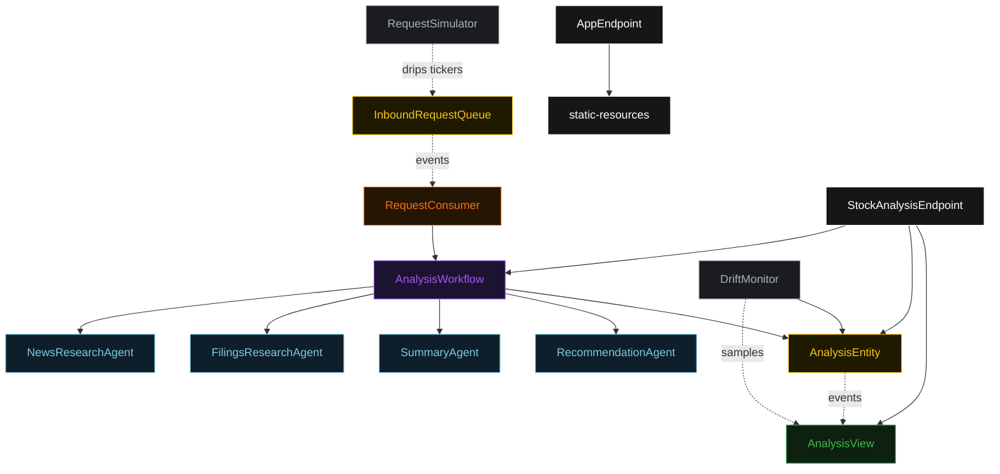
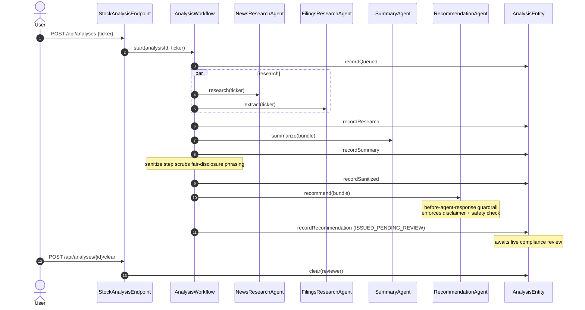
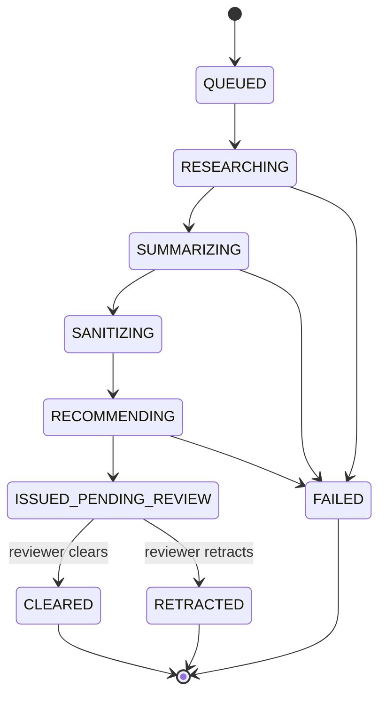
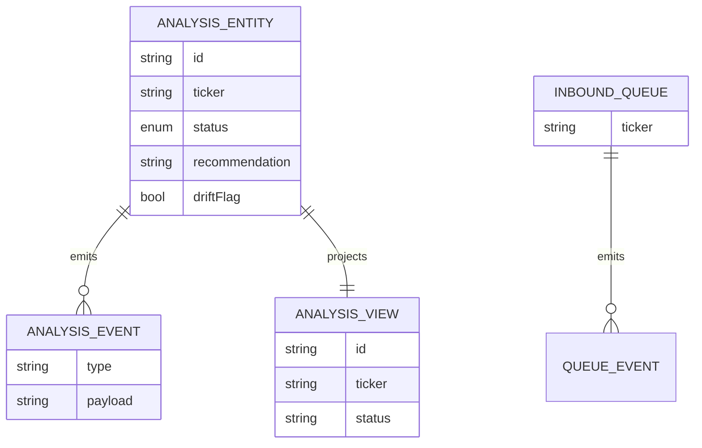

# PLAN — `stock-analyst-regulated`

Architectural sketch for the Stock Analysis Team sample. Four mermaid diagrams + component table + concurrency notes.

---

## Component graph

## Interaction sequence

## State machine

## Entity model

## Component table

| Component | Path (generated) |
|---|---|
| StockAnalysisEndpoint | `api/StockAnalysisEndpoint.java` |
| AppEndpoint | `api/AppEndpoint.java` |
| AnalysisWorkflow | `application/AnalysisWorkflow.java` |
| NewsResearchAgent | `application/NewsResearchAgent.java` |
| FilingsResearchAgent | `application/FilingsResearchAgent.java` |
| SummaryAgent | `application/SummaryAgent.java` |
| RecommendationAgent | `application/RecommendationAgent.java` |
| AnalysisEntity | `application/AnalysisEntity.java` |
| InboundRequestQueue | `application/InboundRequestQueue.java` |
| AnalysisView | `application/AnalysisView.java` |
| RequestConsumer | `application/RequestConsumer.java` |
| RequestSimulator | `application/RequestSimulator.java` |
| DriftMonitor | `application/DriftMonitor.java` |
| Domain records | `domain/*.java` |

## Concurrency notes

- **Step timeouts.** `researchStep`, `summarizeStep`, and `recommendStep` call agents; each gets an explicit `stepTimeout(ofSeconds(60))` (Lesson 4). The 5s default would time out every LLM call.
- **Recovery.** `defaultStepRecovery(maxRetries(2).failoverTo(AnalysisWorkflow::error))` records `AnalysisFailed` and ends.
- **Idempotency.** The workflow id is the `analysisId`; re-delivery of the same `InboundRequestQueued` event uses a deterministic id derived from the queue offset so the consumer does not start duplicate analyses.
- **No compensation saga.** The sanitize and recommend steps are forward-only; the human-over-the-loop Retract is the corrective action, applied after issuance rather than as a rollback.
- **View indexing.** `AnalysisView` exposes one unfiltered query; status filtering is client-side because Akka cannot auto-index the enum column (Lesson 2).
