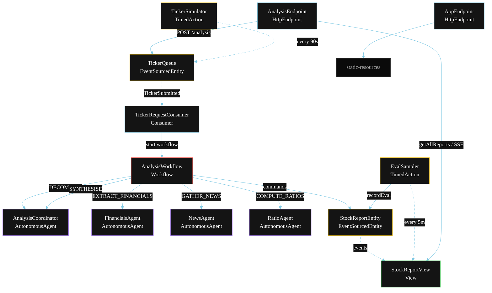
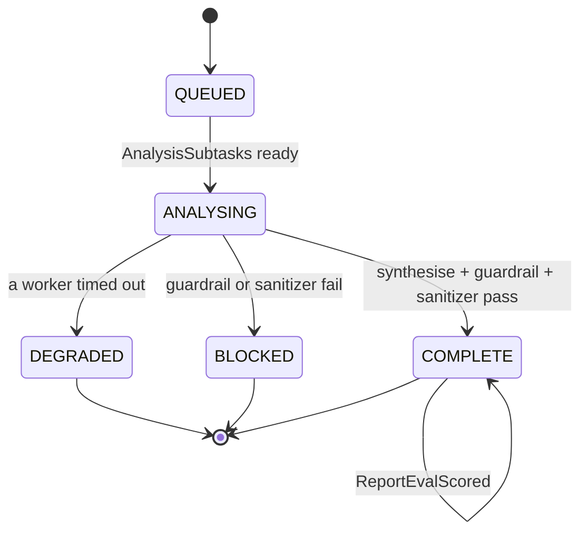
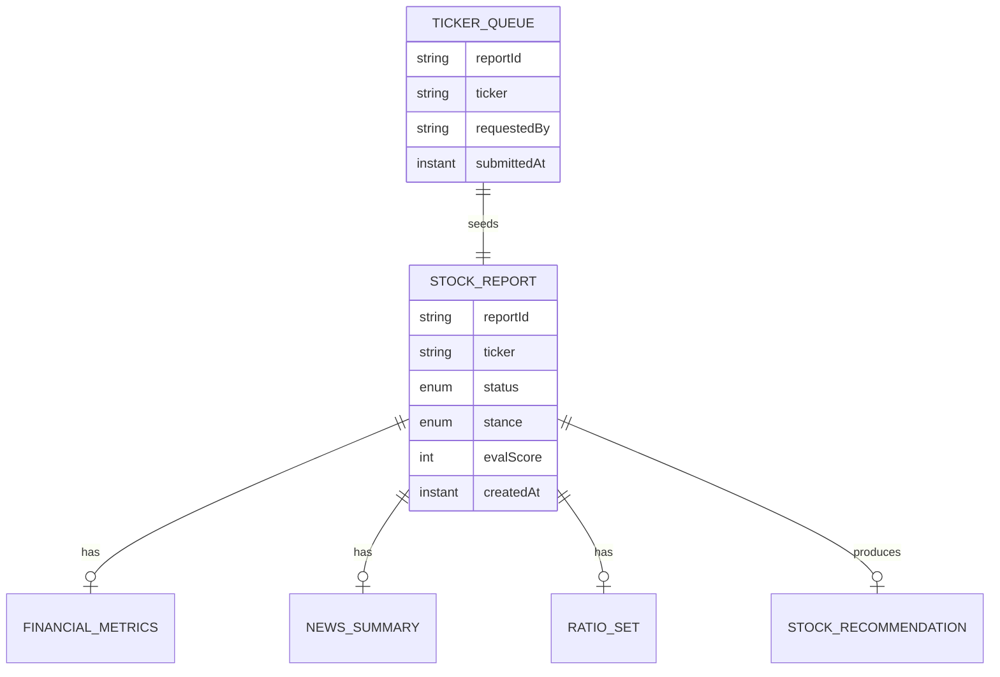

# PLAN — AI Team for Fundamental Stock Analysis

Architectural sketch for `/akka:specify`. Mirrors `SPEC.md` Section 4 component names exactly. Mermaid sources here are rendered on the Architecture tab of the embedded UI; carry the Lesson 24 CSS overrides into the generated `index.html`.

## Component graph



Solid arrows: synchronous commands. Dashed arrows: event subscriptions. Dotted arrows: scheduled ticks.

## Interaction sequence

```mermaid
sequenceDiagram
  participant U as User / Simulator
  participant AE as AnalysisEndpoint
  participant TQ as TickerQueue
  participant WF as AnalysisWorkflow
  participant CO as AnalysisCoordinator
  participant FA as FinancialsAgent
  participant NA as NewsAgent
  participant RA as RatioAgent
  participant SE as StockReportEntity

  U->>AE: POST /api/analysis {ticker}
  AE->>TQ: enqueueTicker
  TQ-->>WF: TickerRequestConsumer starts workflow
  WF->>SE: createReport (QUEUED)
  WF->>CO: DECOMPOSE -> AnalysisSubtasks
  WF->>SE: status ANALYSING
  par parallel fan-out
    WF->>FA: EXTRACT_FINANCIALS -> FinancialMetrics
  and
    WF->>NA: GATHER_NEWS -> NewsSummary
  and
    WF->>RA: COMPUTE_RATIOS -> RatioSet
  end
  Note over WF: join; if any step times out (60s) -> degradeStep
  WF->>CO: SYNTHESISE(financials, news, ratios) -> StockRecommendation
  WF->>WF: guardrailStep vets for direct advice
  WF->>WF: sanitizerStep strips price-sensitive text
  alt both controls pass
    WF->>SE: complete (COMPLETE)
  else guardrail or sanitizer fails
    WF->>SE: block (BLOCKED)
  end
```

## State machine



## Entity model



## Component table

| Component | Akka primitive | File path |
|---|---|---|
| `AnalysisCoordinator` | AutonomousAgent | `application/AnalysisCoordinator.java` |
| `FinancialsAgent` | AutonomousAgent | `application/FinancialsAgent.java` |
| `NewsAgent` | AutonomousAgent | `application/NewsAgent.java` |
| `RatioAgent` | AutonomousAgent | `application/RatioAgent.java` |
| `AnalysisTasks` | Task constants | `application/AnalysisTasks.java` |
| `AnalysisWorkflow` | Workflow | `application/AnalysisWorkflow.java` |
| `StockReportEntity` | EventSourcedEntity | `domain/StockReportEntity.java` |
| `TickerQueue` | EventSourcedEntity | `domain/TickerQueue.java` |
| `StockReportView` | View | `application/StockReportView.java` |
| `TickerRequestConsumer` | Consumer | `application/TickerRequestConsumer.java` |
| `TickerSimulator` | TimedAction | `application/TickerSimulator.java` |
| `EvalSampler` | TimedAction | `application/EvalSampler.java` |
| `AnalysisEndpoint` | HttpEndpoint | `api/AnalysisEndpoint.java` |
| `AppEndpoint` | HttpEndpoint | `api/AppEndpoint.java` |

## Concurrency notes

- **Step timeouts (Lesson 4):** `financialsStep`, `newsStep`, and `ratiosStep` each get 60s; `synthesiseStep` gets 90s. The 5s default fails every LLM call. `WorkflowSettings` is nested inside `Workflow` — no import.
- **Parallel fan-out:** `financialsStep`, `newsStep`, and `ratiosStep` run concurrently via `CompletionStage.allOf`, not three sequential step calls.
- **Idempotency:** the workflow id is the `reportId`. Re-delivery of the same `TickerSubmitted` event resolves to the same workflow instance — no duplicate report.
- **Degrade path (compensation):** if any worker times out, `defaultStepRecovery` routes to `degradeStep`, which synthesises from whichever partial results exist and ends with `ReportDegraded`. No infinite retry.
- **Three-way join:** the join step collects whichever of `FinancialMetrics`, `NewsSummary`, and `RatioSet` completed before passing them to the Coordinator. Fields for missing workers are empty `Optional`s, and the Coordinator's prompt instructs it to note missing inputs in the summary.
- **Eval sampling:** `EvalSampler` reads `StockReportView.getAllReports` (no enum WHERE clause) and filters client-side for the oldest `COMPLETE` report lacking an `evalScore`.
