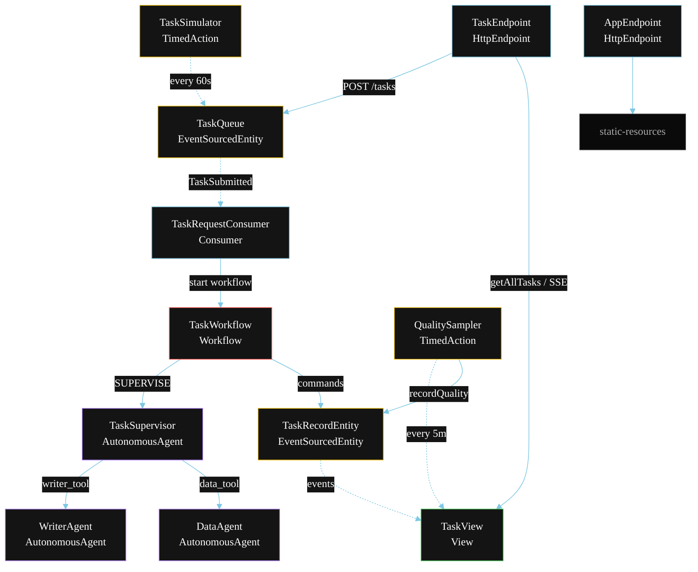
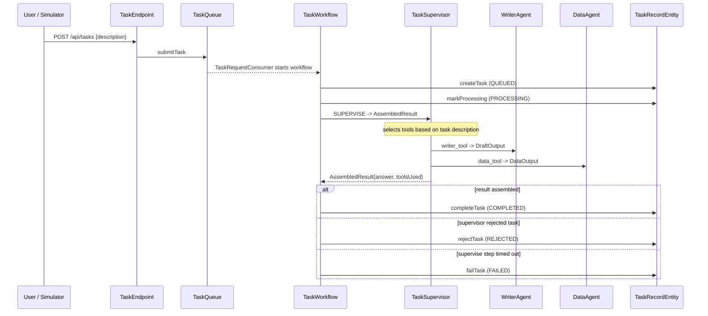
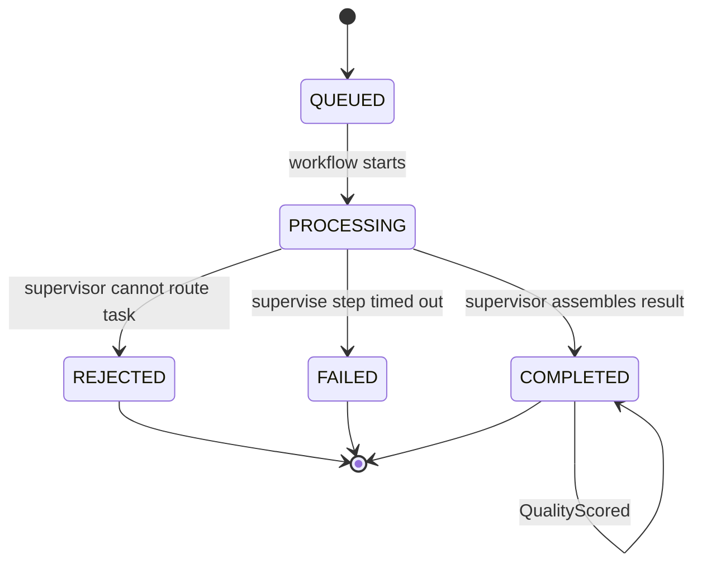
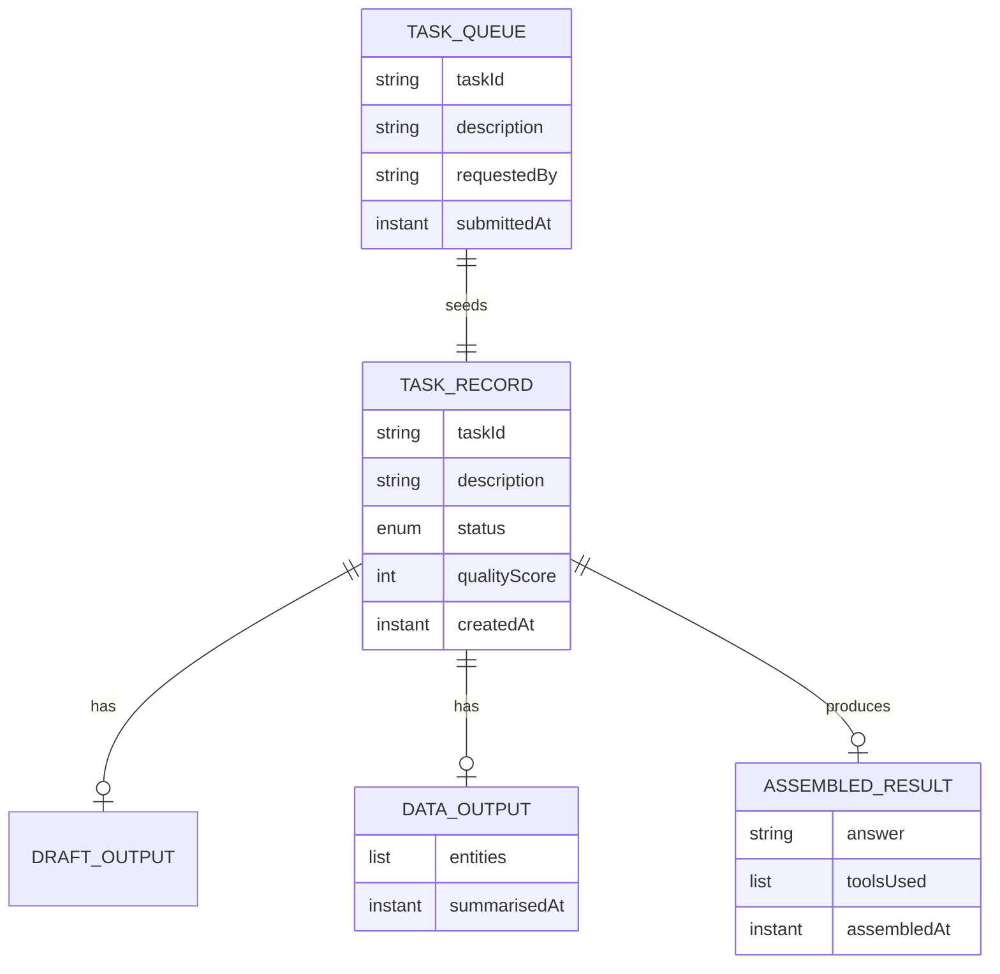

# PLAN — Agents as Tools

Architectural sketch for `/akka:specify`. Mirrors `SPEC.md` Section 4 component names exactly. Mermaid sources here are rendered on the Architecture tab of the embedded UI; carry the Lesson 24 CSS overrides into the generated `index.html`.

## Component graph

Solid arrows: synchronous commands or tool calls. Dashed arrows: event subscriptions. Dotted arrows: scheduled ticks.

## Interaction sequence

## State machine

## Entity model

## Component table

| Component | Akka primitive | File path |
|---|---|---|
| `TaskSupervisor` | AutonomousAgent | `application/TaskSupervisor.java` |
| `WriterAgent` | AutonomousAgent | `application/WriterAgent.java` |
| `DataAgent` | AutonomousAgent | `application/DataAgent.java` |
| `AgentTasks` | Task constants | `application/AgentTasks.java` |
| `TaskWorkflow` | Workflow | `application/TaskWorkflow.java` |
| `TaskRecordEntity` | EventSourcedEntity | `domain/TaskRecordEntity.java` |
| `TaskQueue` | EventSourcedEntity | `domain/TaskQueue.java` |
| `TaskView` | View | `application/TaskView.java` |
| `TaskRequestConsumer` | Consumer | `application/TaskRequestConsumer.java` |
| `TaskSimulator` | TimedAction | `application/TaskSimulator.java` |
| `QualitySampler` | TimedAction | `application/QualitySampler.java` |
| `TaskEndpoint` | HttpEndpoint | `api/TaskEndpoint.java` |
| `AppEndpoint` | HttpEndpoint | `api/AppEndpoint.java` |

## Concurrency notes

- **Step timeouts (Lesson 4):** `superviseStep` gets 120s to allow the supervisor to call both tools in sequence. Each underlying tool call is bounded by the supervisor's iteration budget (45 s per tool). The 5s default fails every LLM call. `WorkflowSettings` is nested inside `Workflow` — no import.
- **Tool call model:** unlike parallel fan-out blueprints, the supervisor calls tools sequentially inside its own iteration loop. The workflow sees one `SUPERVISE` step returning the assembled result; it does not fork separate steps per tool.
- **Idempotency:** the workflow id is the `taskId`. Re-delivery of the same `TaskSubmitted` event resolves to the same workflow instance — no duplicate task record.
- **Rejection path:** the supervisor returns a rejection indicator in `AssembledResult` (e.g., `toolsUsed` is empty and `answer` starts with "REJECTED:"). The workflow inspects this and routes to `rejectStep` rather than `persistStep`.
- **Quality sampling:** `QualitySampler` reads `TaskView.getAllTasks` (no enum WHERE clause) and filters client-side for the oldest `COMPLETED` task lacking a `qualityScore`.
