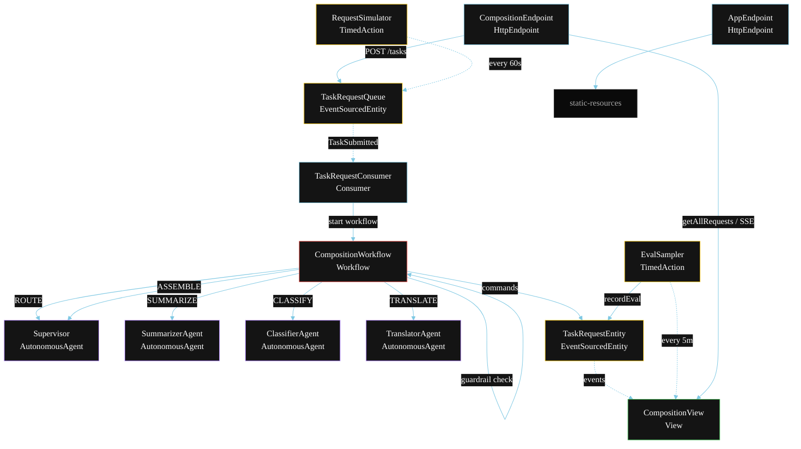
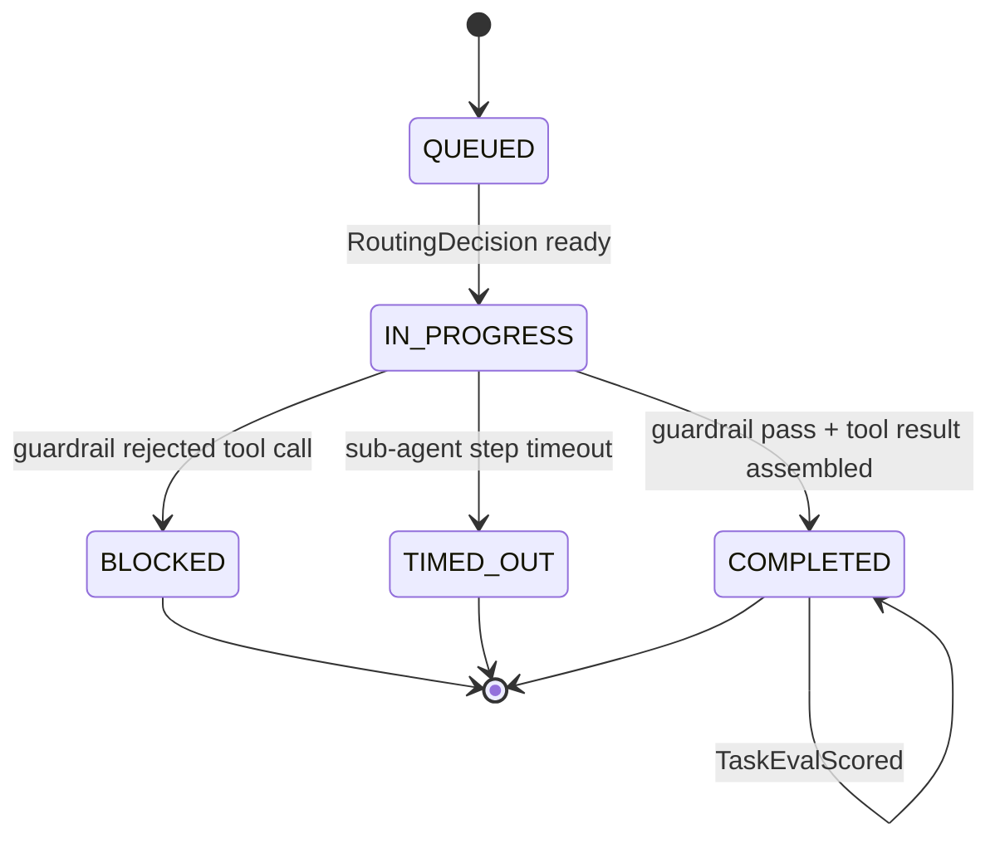
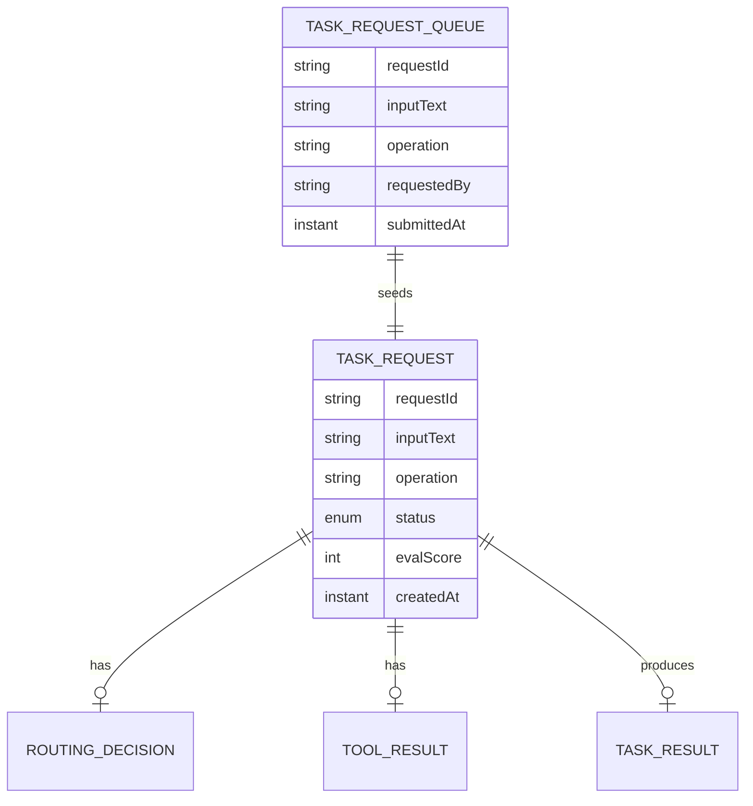

# PLAN — OpenAI Agents-as-Tools Composition

Architectural sketch for `/akka:specify`. Mirrors `SPEC.md` Section 4 component names exactly. Mermaid sources here are rendered on the Architecture tab of the embedded UI; carry the Lesson 24 CSS overrides into the generated `index.html`.

## Component graph



Solid arrows: synchronous commands. Dashed arrows: event subscriptions. Dotted arrows: scheduled ticks.

## Interaction sequence

```mermaid
sequenceDiagram
  participant U as User / Simulator
  participant CE as CompositionEndpoint
  participant TQ as TaskRequestQueue
  participant WF as CompositionWorkflow
  participant SV as Supervisor
  participant SUB as Selected Sub-Agent
  participant TE as TaskRequestEntity

  U->>CE: POST /api/tasks {inputText, operation}
  CE->>TQ: enqueueTask
  TQ-->>WF: TaskRequestConsumer starts workflow
  WF->>TE: createRequest (QUEUED)
  WF->>SV: ROUTE -> RoutingDecision
  WF->>TE: attachRouting (IN_PROGRESS)
  WF->>WF: guardrailStep (before-tool-call)
  alt guardrail blocks
    WF->>TE: block (BLOCKED)
  else guardrail passes
    WF->>SUB: dispatch selected tool (SUMMARIZE / CLASSIFY / TRANSLATE)
    Note over WF: 60s stepTimeout; on timeout -> RequestTimedOut
    WF->>TE: attachToolResult
    WF->>SV: ASSEMBLE(routing, toolResult) -> TaskResult
    WF->>TE: complete (COMPLETED)
  end
```

## State machine



## Entity model



## Component table

| Component | Akka primitive | File path |
|---|---|---|
| `Supervisor` | AutonomousAgent | `application/Supervisor.java` |
| `SummarizerAgent` | AutonomousAgent | `application/SummarizerAgent.java` |
| `ClassifierAgent` | AutonomousAgent | `application/ClassifierAgent.java` |
| `TranslatorAgent` | AutonomousAgent | `application/TranslatorAgent.java` |
| `CompositionTasks` | Task constants | `application/CompositionTasks.java` |
| `CompositionWorkflow` | Workflow | `application/CompositionWorkflow.java` |
| `TaskRequestEntity` | EventSourcedEntity | `domain/TaskRequestEntity.java` |
| `TaskRequestQueue` | EventSourcedEntity | `domain/TaskRequestQueue.java` |
| `CompositionView` | View | `application/CompositionView.java` |
| `TaskRequestConsumer` | Consumer | `application/TaskRequestConsumer.java` |
| `RequestSimulator` | TimedAction | `application/RequestSimulator.java` |
| `EvalSampler` | TimedAction | `application/EvalSampler.java` |
| `CompositionEndpoint` | HttpEndpoint | `api/CompositionEndpoint.java` |
| `AppEndpoint` | HttpEndpoint | `api/AppEndpoint.java` |

## Concurrency notes

- **Step timeouts (Lesson 4):** `dispatchStep` and `assembleStep` each get 60s. The 5s default fails every LLM call. `WorkflowSettings` is nested inside `Workflow` — no import.
- **Guardrail placement:** the guardrail step runs after `routeStep` returns a `RoutingDecision` but before the sub-agent is dispatched. This is the before-tool-call contract — the decision exists, but the tool has not been called yet.
- **Tool dispatch branching:** `dispatchStep` reads `RoutingDecision.selectedTool` and calls the corresponding agent. All three branches share the same 60s stepTimeout.
- **Idempotency:** the workflow id is the `requestId`. Re-delivery of the same `TaskSubmitted` event resolves to the same workflow instance — no duplicate request.
- **Eval sampling:** `EvalSampler` reads `CompositionView.getAllRequests` (no enum WHERE clause) and filters client-side for the oldest `COMPLETED` request lacking an `evalScore`.
