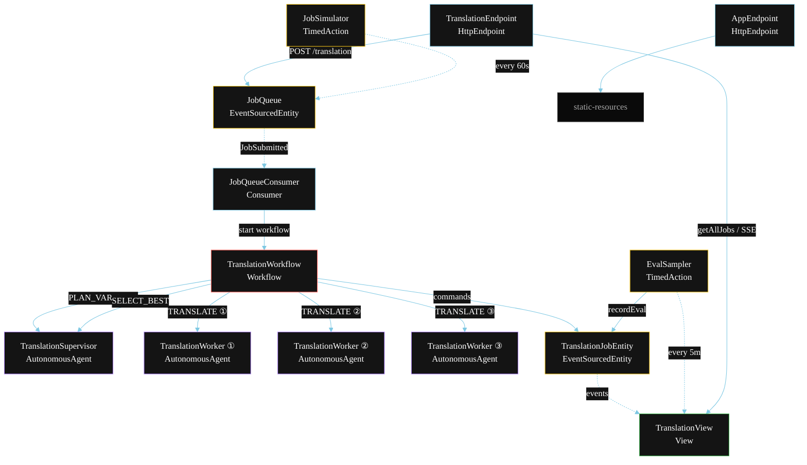
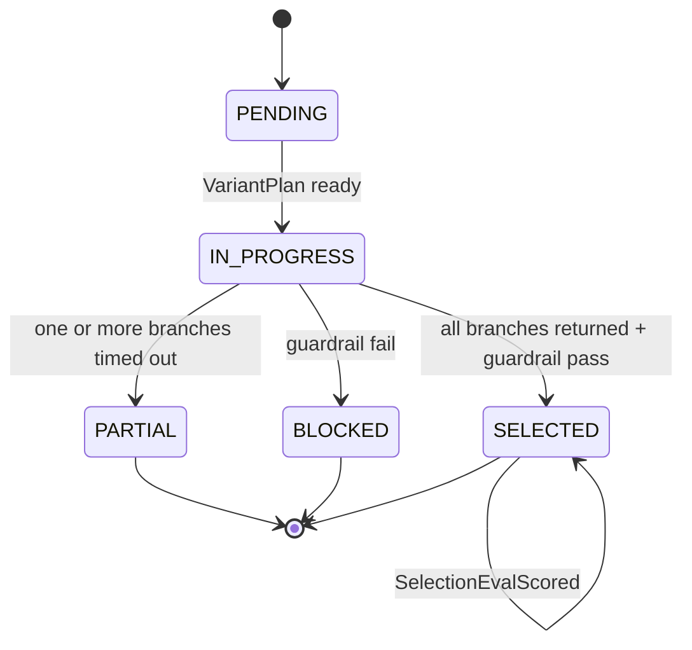
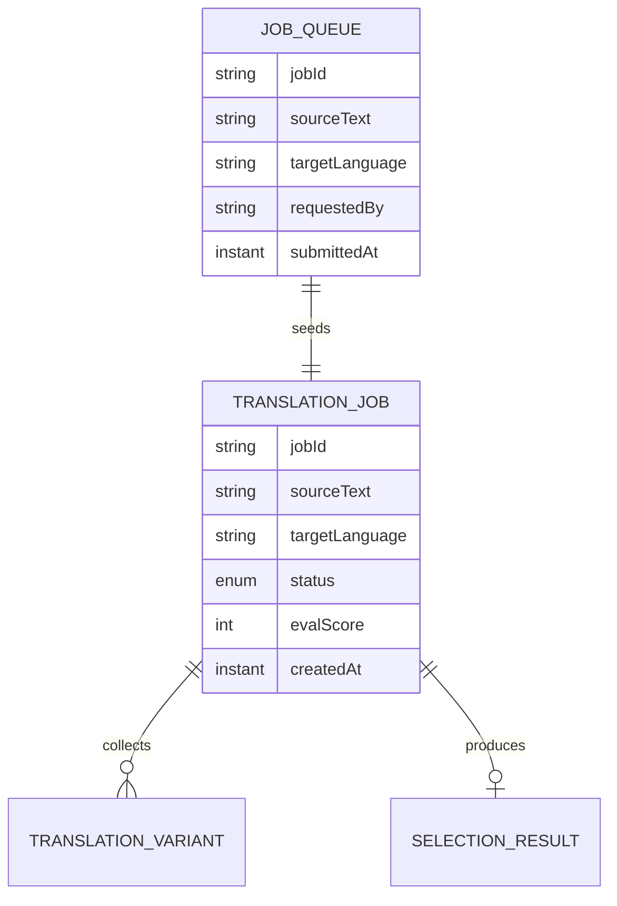

# PLAN — Parallel Best-of-N

Architectural sketch for `/akka:specify`. Mirrors `SPEC.md` Section 4 component names exactly. Mermaid sources here are rendered on the Architecture tab of the embedded UI; carry the Lesson 24 CSS overrides into the generated `index.html`.

## Component graph



Solid arrows: synchronous commands. Dashed arrows: event subscriptions. Dotted arrows: scheduled ticks.

## Interaction sequence

```mermaid
sequenceDiagram
  participant U as User / Simulator
  participant TE as TranslationEndpoint
  participant JQ as JobQueue
  participant WF as TranslationWorkflow
  participant SV as TranslationSupervisor
  participant W1 as Worker ①
  participant W2 as Worker ②
  participant W3 as Worker ③
  participant JE as TranslationJobEntity

  U->>TE: POST /api/translation {sourceText, targetLanguage}
  TE->>JQ: enqueueJob
  JQ-->>WF: JobQueueConsumer starts workflow
  WF->>JE: createJob (PENDING)
  WF->>SV: PLAN_VARIANTS -> VariantPlan
  WF->>JE: status IN_PROGRESS
  par parallel fan-out
    WF->>W1: TRANSLATE (formal) -> TranslationVariant
  and
    WF->>W2: TRANSLATE (informal) -> TranslationVariant
  and
    WF->>W3: TRANSLATE (literal) -> TranslationVariant
  end
  Note over WF: join; any branch timeout (60s) -> collectPartialStep
  WF->>SV: SELECT_BEST(variants) -> SelectionResult
  WF->>WF: guardrailStep vets the selected translation
  alt guardrail passes
    WF->>JE: selectJob (SELECTED)
  else guardrail fails
    WF->>JE: blockJob (BLOCKED)
  end
```

## State machine



## Entity model



## Component table

| Component | Akka primitive | File path |
|---|---|---|
| `TranslationSupervisor` | AutonomousAgent | `application/TranslationSupervisor.java` |
| `TranslationWorker` | AutonomousAgent | `application/TranslationWorker.java` |
| `TranslationTasks` | Task constants | `application/TranslationTasks.java` |
| `TranslationWorkflow` | Workflow | `application/TranslationWorkflow.java` |
| `TranslationJobEntity` | EventSourcedEntity | `domain/TranslationJobEntity.java` |
| `JobQueue` | EventSourcedEntity | `domain/JobQueue.java` |
| `TranslationView` | View | `application/TranslationView.java` |
| `JobQueueConsumer` | Consumer | `application/JobQueueConsumer.java` |
| `JobSimulator` | TimedAction | `application/JobSimulator.java` |
| `EvalSampler` | TimedAction | `application/EvalSampler.java` |
| `TranslationEndpoint` | HttpEndpoint | `api/TranslationEndpoint.java` |
| `AppEndpoint` | HttpEndpoint | `api/AppEndpoint.java` |

## Concurrency notes

- **Step timeouts (Lesson 4):** each of the three branch steps gets 60s; `selectStep` gets 90s. The 5s default fails every LLM call. `WorkflowSettings` is nested inside `Workflow` — no import.
- **Parallel fan-out:** all three branch steps run concurrently via `CompletionStage` allOf / zip chaining, not three sequential step calls.
- **Partial collection:** if any branch times out, `collectPartialStep` gathers the variants that did return and passes them to `selectStep`. At least one variant is always available (the supervisor never receives an empty list).
- **Idempotency:** the workflow id is the `jobId`. Re-delivery of the same `JobSubmitted` event resolves to the same workflow instance — no duplicate job.
- **Eval sampling:** `EvalSampler` reads `TranslationView.getAllJobs` and filters client-side for the oldest `SELECTED` job lacking an `evalScore`.
