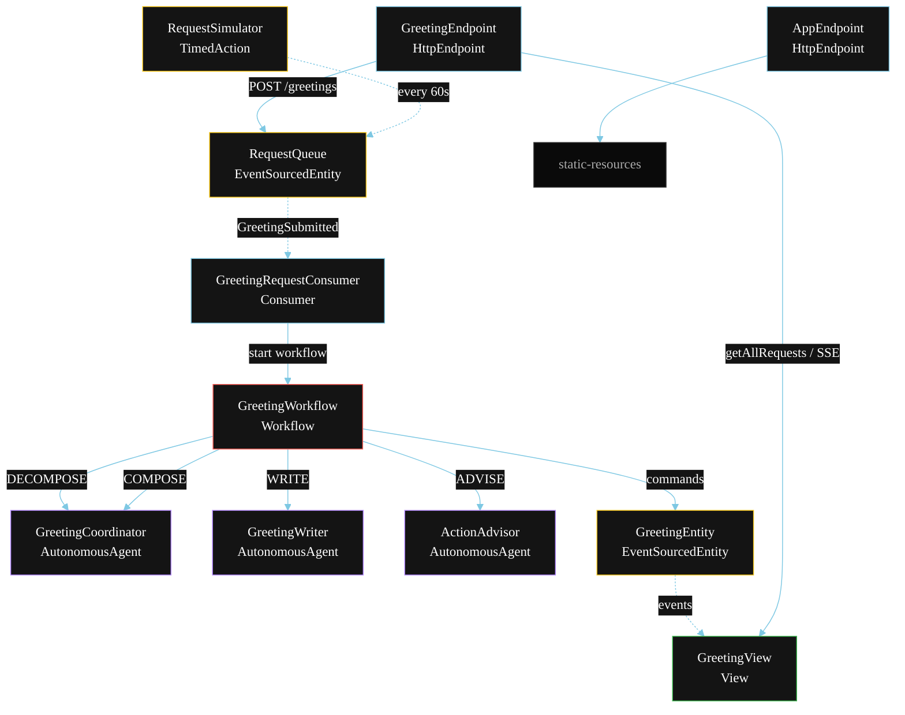
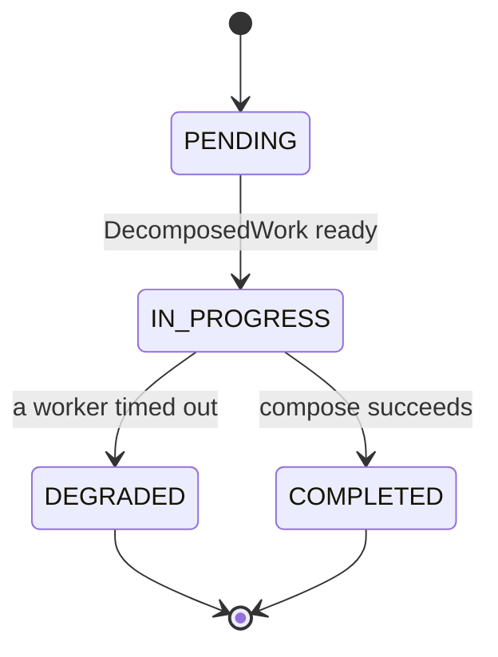
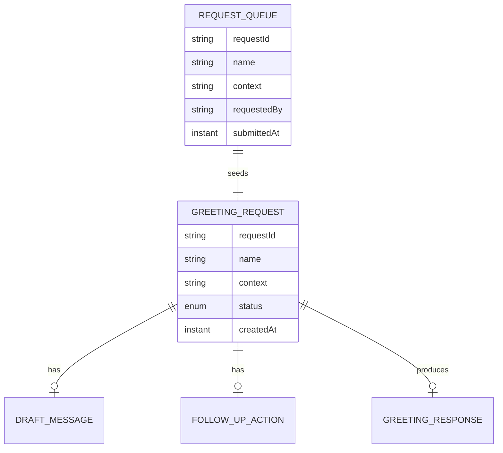

# PLAN — Multi-Agent Hello World

Architectural sketch for `/akka:specify`. Mirrors `SPEC.md` Section 4 component names exactly. Mermaid sources here are rendered on the Architecture tab of the embedded UI; carry the Lesson 24 CSS overrides into the generated `index.html`.

## Component graph



Solid arrows: synchronous commands. Dashed arrows: event subscriptions. Dotted arrows: scheduled ticks.

## Interaction sequence

```mermaid
sequenceDiagram
  participant U as User / Simulator
  participant GE as GreetingEndpoint
  participant RQ as RequestQueue
  participant WF as GreetingWorkflow
  participant CO as GreetingCoordinator
  participant GW as GreetingWriter
  participant AA as ActionAdvisor
  participant EN as GreetingEntity

  U->>GE: POST /api/greetings {name, context}
  GE->>RQ: enqueueGreeting
  RQ-->>WF: GreetingRequestConsumer starts workflow
  WF->>EN: createRequest (PENDING)
  WF->>CO: DECOMPOSE -> DecomposedWork
  WF->>EN: status IN_PROGRESS
  par parallel fan-out
    WF->>GW: WRITE -> DraftMessage
  and
    WF->>AA: ADVISE -> FollowUpAction
  end
  Note over WF: join; if either step times out (30s) -> degradeStep
  WF->>CO: COMPOSE(draft, followUp) -> GreetingResponse
  WF->>EN: complete (COMPLETED)
```

## State machine



## Entity model



## Component table

| Component | Akka primitive | File path |
|---|---|---|
| `GreetingCoordinator` | AutonomousAgent | `application/GreetingCoordinator.java` |
| `GreetingWriter` | AutonomousAgent | `application/GreetingWriter.java` |
| `ActionAdvisor` | AutonomousAgent | `application/ActionAdvisor.java` |
| `GreetingTasks` | Task constants | `application/GreetingTasks.java` |
| `GreetingWorkflow` | Workflow | `application/GreetingWorkflow.java` |
| `GreetingEntity` | EventSourcedEntity | `domain/GreetingEntity.java` |
| `RequestQueue` | EventSourcedEntity | `domain/RequestQueue.java` |
| `GreetingView` | View | `application/GreetingView.java` |
| `GreetingRequestConsumer` | Consumer | `application/GreetingRequestConsumer.java` |
| `RequestSimulator` | TimedAction | `application/RequestSimulator.java` |
| `GreetingEndpoint` | HttpEndpoint | `api/GreetingEndpoint.java` |
| `AppEndpoint` | HttpEndpoint | `api/AppEndpoint.java` |

## Concurrency notes

- **Step timeouts (Lesson 4):** `writeStep` and `adviseStep` get 30s; `composeStep` gets 45s. The 5s default fails every LLM call. `WorkflowSettings` is nested inside `Workflow` — no import.
- **Parallel fan-out:** `writeStep` and `adviseStep` run concurrently via `CompletionStage` zip, not two sequential step calls.
- **Idempotency:** the workflow id is the `requestId`. Re-delivery of the same `GreetingSubmitted` event resolves to the same workflow instance — no duplicate request.
- **Degrade path (compensation):** if either worker times out, `defaultStepRecovery` routes to `degradeStep`, which composes from whichever partial output exists and ends with `RequestDegraded`. No infinite retry.
- **No eval sampler:** this baseline carries no eval-event control. The pattern is demonstrated cleanly without sampling overhead.
