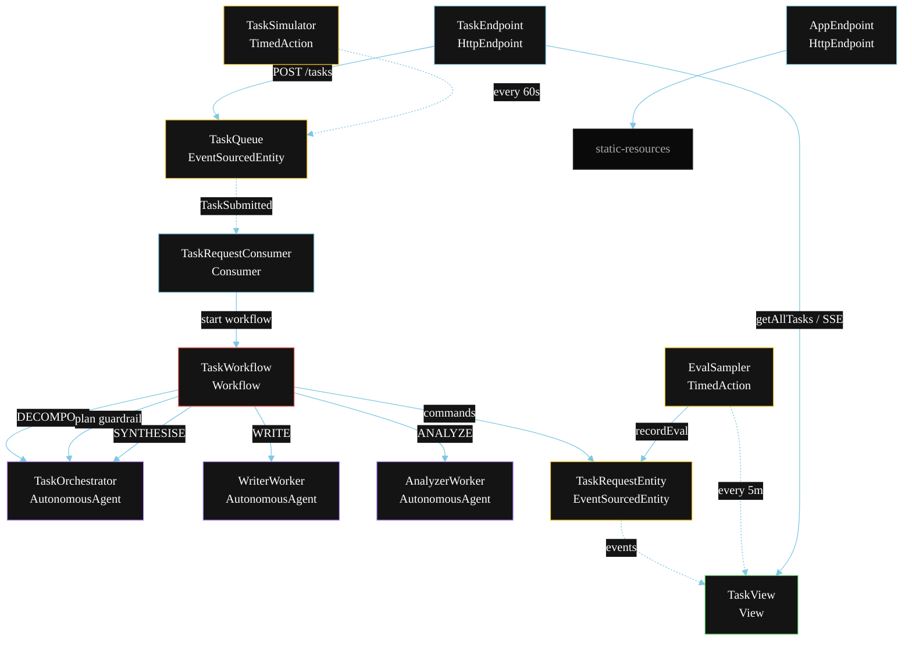
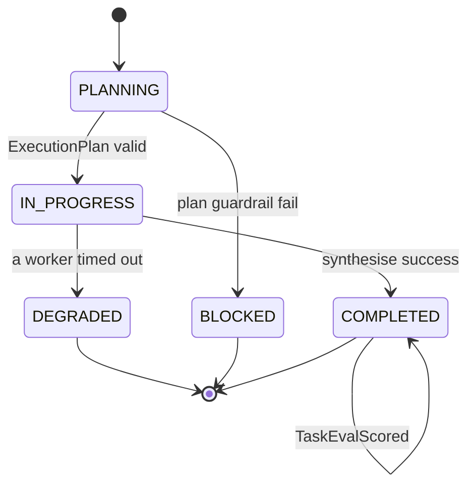
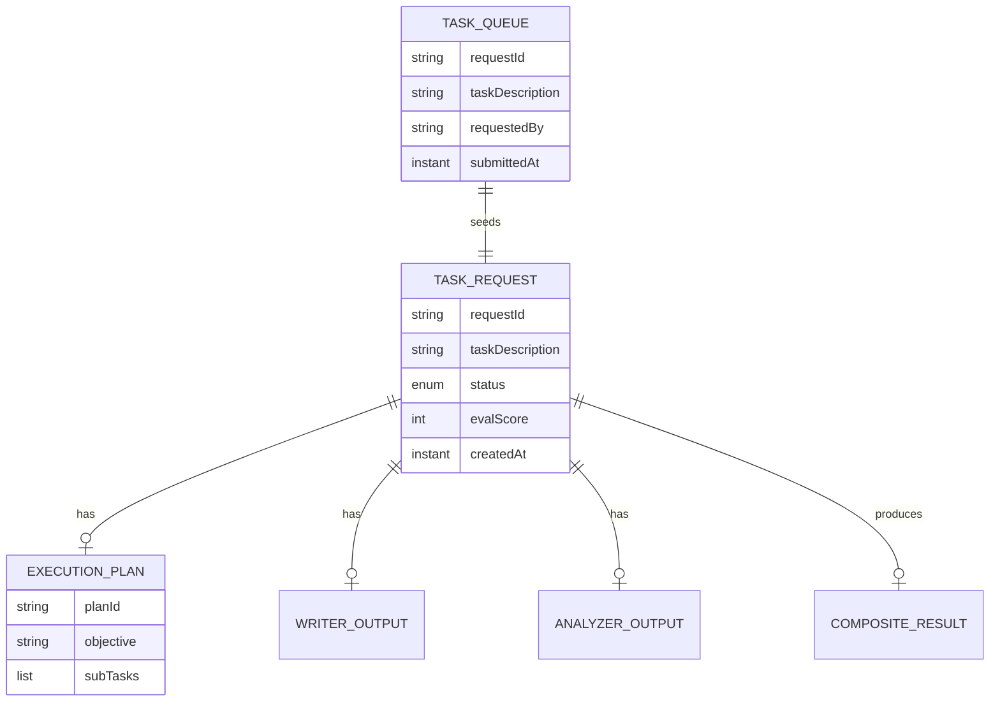

# PLAN — Orchestrator-Workers

Architectural sketch for `/akka:specify`. Mirrors `SPEC.md` Section 4 component names exactly. Mermaid sources here are rendered on the Architecture tab of the embedded UI; carry the Lesson 24 CSS overrides into the generated `index.html`.

## Component graph



Solid arrows: synchronous commands. Dashed arrows: event subscriptions. Dotted arrows: scheduled ticks.

## Interaction sequence

```mermaid
sequenceDiagram
  participant U as User / Simulator
  participant TE as TaskEndpoint
  participant TQ as TaskQueue
  participant WF as TaskWorkflow
  participant OC as TaskOrchestrator
  participant WW as WriterWorker
  participant AW as AnalyzerWorker
  participant RE as TaskRequestEntity

  U->>TE: POST /api/tasks {taskDescription}
  TE->>TQ: enqueueTask
  TQ-->>WF: TaskRequestConsumer starts workflow
  WF->>RE: createTask (PLANNING)
  WF->>OC: DECOMPOSE -> ExecutionPlan
  WF->>WF: planGuardrailStep validates plan
  alt plan invalid
    WF->>RE: block (BLOCKED)
  else plan valid
    WF->>RE: attachPlan + status IN_PROGRESS
    par parallel fan-out
      WF->>WW: WRITE -> WriterOutput
    and
      WF->>AW: ANALYZE -> AnalyzerOutput
    end
    Note over WF: join; if either step times out (60s) -> degradeStep
    WF->>OC: SYNTHESISE(writerOutput, analyzerOutput) -> CompositeResult
    WF->>RE: complete (COMPLETED)
  end
```

## State machine



## Entity model



## Component table

| Component | Akka primitive | File path |
|---|---|---|
| `TaskOrchestrator` | AutonomousAgent | `application/TaskOrchestrator.java` |
| `WriterWorker` | AutonomousAgent | `application/WriterWorker.java` |
| `AnalyzerWorker` | AutonomousAgent | `application/AnalyzerWorker.java` |
| `OrchestratorTasks` | Task constants | `application/OrchestratorTasks.java` |
| `TaskWorkflow` | Workflow | `application/TaskWorkflow.java` |
| `TaskRequestEntity` | EventSourcedEntity | `domain/TaskRequestEntity.java` |
| `TaskQueue` | EventSourcedEntity | `domain/TaskQueue.java` |
| `TaskView` | View | `application/TaskView.java` |
| `TaskRequestConsumer` | Consumer | `application/TaskRequestConsumer.java` |
| `TaskSimulator` | TimedAction | `application/TaskSimulator.java` |
| `EvalSampler` | TimedAction | `application/EvalSampler.java` |
| `TaskEndpoint` | HttpEndpoint | `api/TaskEndpoint.java` |
| `AppEndpoint` | HttpEndpoint | `api/AppEndpoint.java` |

## Concurrency notes

- **Step timeouts (Lesson 4):** `writeStep` and `analyzeStep` get 60s; `synthesiseStep` gets 90s. The 5s default fails every LLM call. `WorkflowSettings` is nested inside `Workflow` — no import.
- **Plan guardrail before fan-out:** `planGuardrailStep` runs between `decomposeStep` and the parallel fan-out. Workers are never dispatched for a malformed plan.
- **Parallel fan-out:** `writeStep` and `analyzeStep` run concurrently via `CompletionStage` zip, not two sequential step calls.
- **Idempotency:** the workflow id is the `requestId`. Re-delivery of the same `TaskSubmitted` event resolves to the same workflow instance — no duplicate task.
- **Degrade path (compensation):** if either worker times out, `defaultStepRecovery` routes to `degradeStep`, which synthesises from whichever partial output exists and ends with `TaskDegraded`. No infinite retry.
- **Eval sampling:** `EvalSampler` reads `TaskView.getAllTasks` (no enum WHERE clause) and filters client-side for the oldest `COMPLETED` task lacking an `evalScore`.
