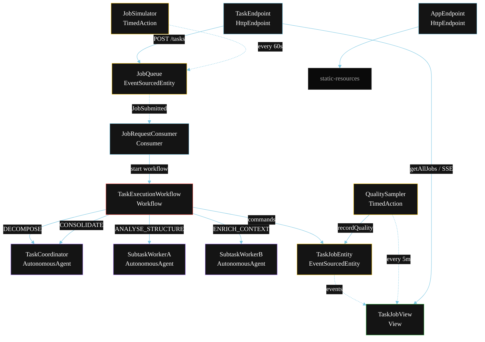
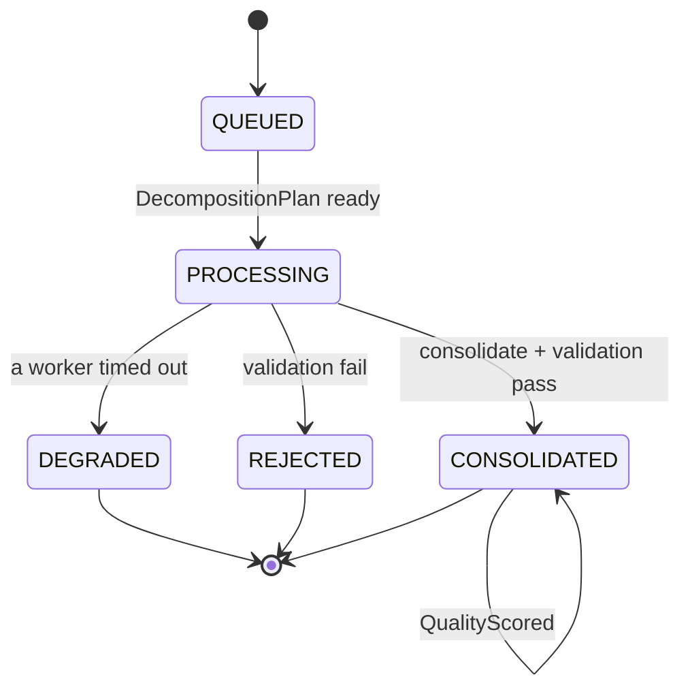
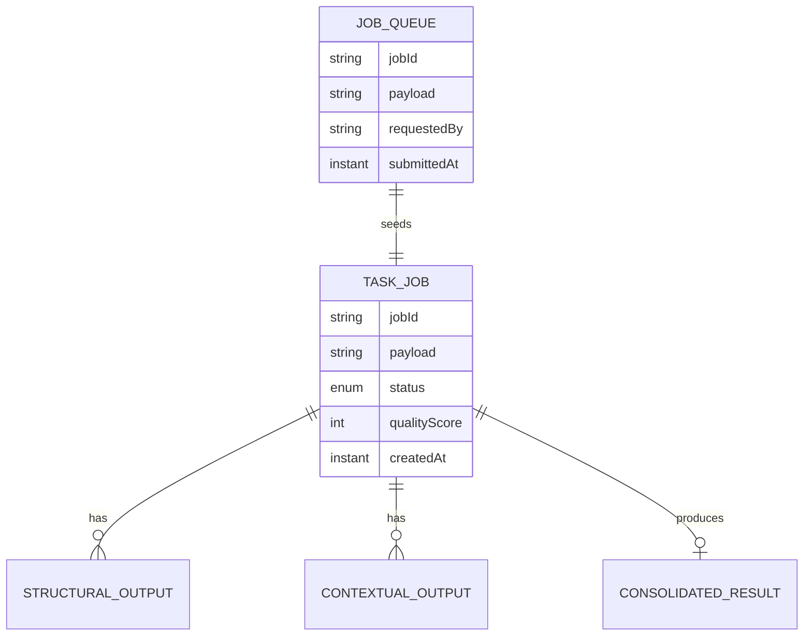

# PLAN — Parallel Task Decomposition

Architectural sketch for `/akka:specify`. Mirrors `SPEC.md` Section 4 component names exactly. Mermaid sources here are rendered on the Architecture tab of the embedded UI; carry the Lesson 24 CSS overrides into the generated `index.html`.

## Component graph



Solid arrows: synchronous commands. Dashed arrows: event subscriptions. Dotted arrows: scheduled ticks.

## Interaction sequence

```mermaid
sequenceDiagram
  participant U as User / Simulator
  participant TE as TaskEndpoint
  participant JQ as JobQueue
  participant WF as TaskExecutionWorkflow
  participant CO as TaskCoordinator
  participant WA as SubtaskWorkerA
  participant WB as SubtaskWorkerB
  participant JE as TaskJobEntity

  U->>TE: POST /api/tasks {payload}
  TE->>JQ: submitJob
  JQ-->>WF: JobRequestConsumer starts workflow
  WF->>JE: createJob (QUEUED)
  WF->>CO: DECOMPOSE -> DecompositionPlan
  WF->>JE: status PROCESSING
  par parallel fan-out
    WF->>WA: ANALYSE_STRUCTURE -> StructuralOutput
  and
    WF->>WB: ENRICH_CONTEXT -> ContextualOutput
  end
  Note over WF: join; if either step times out (60s) -> degradeStep
  WF->>CO: CONSOLIDATE(structural, contextual) -> ConsolidatedResult
  WF->>WF: validateStep vets the result
  alt validation passes
    WF->>JE: consolidate (CONSOLIDATED)
  else validation fails
    WF->>JE: reject (REJECTED)
  end
```

## State machine



## Entity model



## Component table

| Component | Akka primitive | File path |
|---|---|---|
| `TaskCoordinator` | AutonomousAgent | `application/TaskCoordinator.java` |
| `SubtaskWorkerA` | AutonomousAgent | `application/SubtaskWorkerA.java` |
| `SubtaskWorkerB` | AutonomousAgent | `application/SubtaskWorkerB.java` |
| `TaskTasks` | Task constants | `application/TaskTasks.java` |
| `TaskExecutionWorkflow` | Workflow | `application/TaskExecutionWorkflow.java` |
| `TaskJobEntity` | EventSourcedEntity | `domain/TaskJobEntity.java` |
| `JobQueue` | EventSourcedEntity | `domain/JobQueue.java` |
| `TaskJobView` | View | `application/TaskJobView.java` |
| `JobRequestConsumer` | Consumer | `application/JobRequestConsumer.java` |
| `JobSimulator` | TimedAction | `application/JobSimulator.java` |
| `QualitySampler` | TimedAction | `application/QualitySampler.java` |
| `TaskEndpoint` | HttpEndpoint | `api/TaskEndpoint.java` |
| `AppEndpoint` | HttpEndpoint | `api/AppEndpoint.java` |

## Concurrency notes

- **Step timeouts (Lesson 4):** `structuralStep` and `contextualStep` get 60s; `consolidateStep` gets 90s. The 5s default fails every LLM call. `WorkflowSettings` is nested inside `Workflow` — no import.
- **Parallel fan-out:** `structuralStep` and `contextualStep` run concurrently via `CompletionStage` zip, not two sequential step calls.
- **Idempotency:** the workflow id is the `jobId`. Re-delivery of the same `JobSubmitted` event resolves to the same workflow instance — no duplicate job.
- **Degrade path (compensation):** if either worker times out, `defaultStepRecovery` routes to `degradeStep`, which consolidates from whichever partial output exists and ends with `JobDegraded`. No infinite retry.
- **Quality sampling:** `QualitySampler` reads `TaskJobView.getAllJobs` (no enum WHERE clause — Lesson 2) and filters client-side for the oldest `CONSOLIDATED` job lacking a `qualityScore`.
