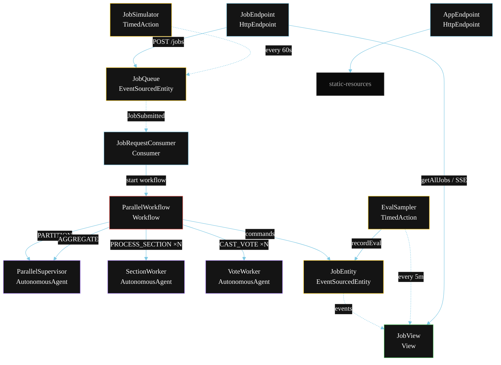
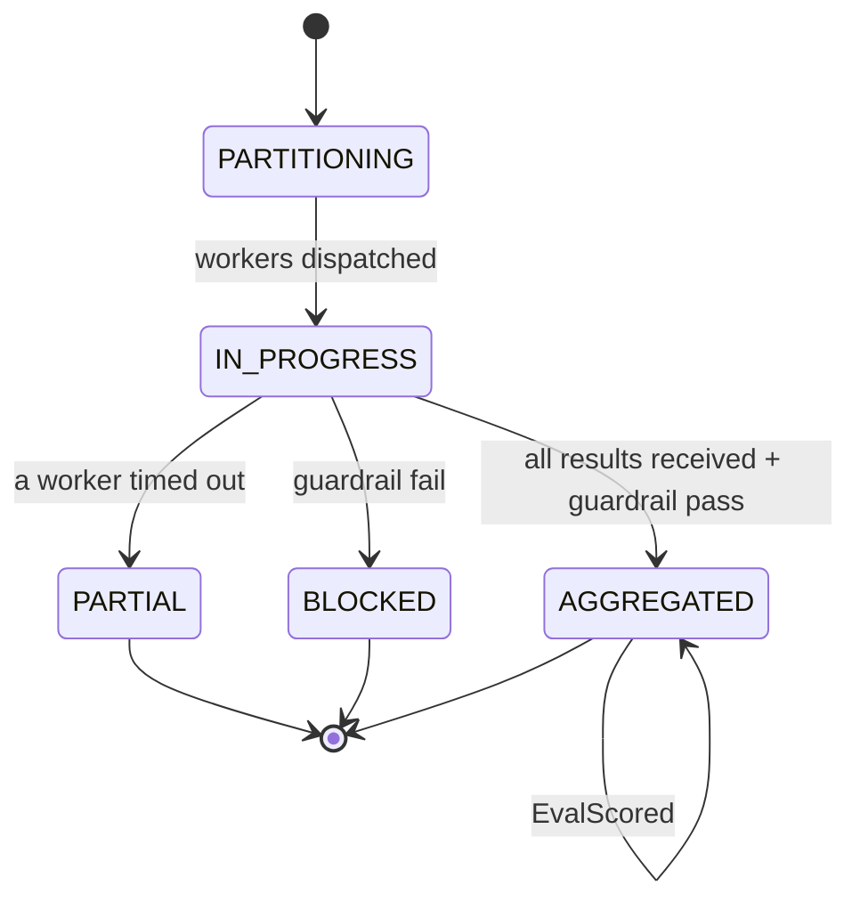
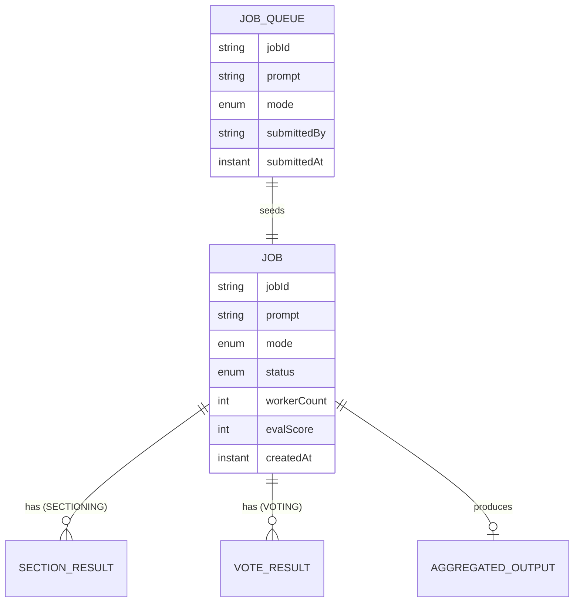

# PLAN — Parallelization Workflow (Sectioning + Voting)

Architectural sketch for `/akka:specify`. Mirrors `SPEC.md` Section 4 component names exactly. Mermaid sources here are rendered on the Architecture tab of the embedded UI; carry the Lesson 24 CSS overrides into the generated `index.html`.

## Component graph



Solid arrows: synchronous commands. Dashed arrows: event subscriptions / scheduler ticks. Worker fan-out multiplicity (×N) depends on the job's `workerCount` field, set by the Supervisor during PARTITION.

## Interaction sequence

```mermaid
sequenceDiagram
  participant U as User / Simulator
  participant JE as JobEndpoint
  participant JQ as JobQueue
  participant WF as ParallelWorkflow
  participant PS as ParallelSupervisor
  participant SW as SectionWorker
  participant VW as VoteWorker
  participant JEnt as JobEntity

  U->>JE: POST /api/jobs {prompt, mode}
  JE->>JQ: enqueueJob
  JQ-->>WF: JobRequestConsumer starts workflow
  WF->>JEnt: createJob (PARTITIONING)
  WF->>PS: PARTITION -> Partition or VotePlan
  WF->>JEnt: dispatchWorkers (IN_PROGRESS)
  alt SECTIONING mode
    par parallel fan-out
      WF->>SW: PROCESS_SECTION(section 0)
    and
      WF->>SW: PROCESS_SECTION(section 1)
    and
      WF->>SW: PROCESS_SECTION(section N-1)
    end
  else VOTING mode
    par parallel fan-out
      WF->>VW: CAST_VOTE(worker 0)
    and
      WF->>VW: CAST_VOTE(worker 1)
    and
      WF->>VW: CAST_VOTE(worker N-1)
    end
  end
  Note over WF: join all; if any step times out (60s) -> partialStep
  WF->>PS: AGGREGATE(all results) -> AggregatedOutput
  WF->>WF: guardrailStep vets aggregated output
  alt guardrail passes
    WF->>JEnt: aggregate (AGGREGATED)
  else guardrail fails
    WF->>JEnt: block (BLOCKED)
  end
```

## State machine



## Entity model



## Component table

| Component | Akka primitive | File path |
|---|---|---|
| `ParallelSupervisor` | AutonomousAgent | `application/ParallelSupervisor.java` |
| `SectionWorker` | AutonomousAgent | `application/SectionWorker.java` |
| `VoteWorker` | AutonomousAgent | `application/VoteWorker.java` |
| `ParallelTasks` | Task constants | `application/ParallelTasks.java` |
| `ParallelWorkflow` | Workflow | `application/ParallelWorkflow.java` |
| `JobEntity` | EventSourcedEntity | `domain/JobEntity.java` |
| `JobQueue` | EventSourcedEntity | `domain/JobQueue.java` |
| `JobView` | View | `application/JobView.java` |
| `JobRequestConsumer` | Consumer | `application/JobRequestConsumer.java` |
| `JobSimulator` | TimedAction | `application/JobSimulator.java` |
| `EvalSampler` | TimedAction | `application/EvalSampler.java` |
| `JobEndpoint` | HttpEndpoint | `api/JobEndpoint.java` |
| `AppEndpoint` | HttpEndpoint | `api/AppEndpoint.java` |

## Concurrency notes

- **Step timeouts (Lesson 4):** each worker step (PROCESS_SECTION, CAST_VOTE) gets 60s; aggregateStep gets 90s. The 5s default fails every LLM call. `WorkflowSettings` is nested inside `Workflow` — no import.
- **Parallel fan-out:** all worker calls for a given job run concurrently via `CompletionStage` allOf / zip. The number of concurrent workers is set by `Partition.workerCount` (SECTIONING) or `VotePlan.workerCount` (VOTING).
- **Idempotency:** the workflow id is the `jobId`. Re-delivery of the same `JobSubmitted` event resolves to the same workflow instance — no duplicate job.
- **Partial path (compensation):** if any worker times out, `defaultStepRecovery` routes to `partialStep`, which aggregates from whatever results arrived and ends with `JobPartial`. No infinite retry.
- **Eval sampling:** `EvalSampler` reads `JobView.getAllJobs` (no enum WHERE clause) and filters client-side for the oldest `AGGREGATED` job lacking an `evalScore`.
