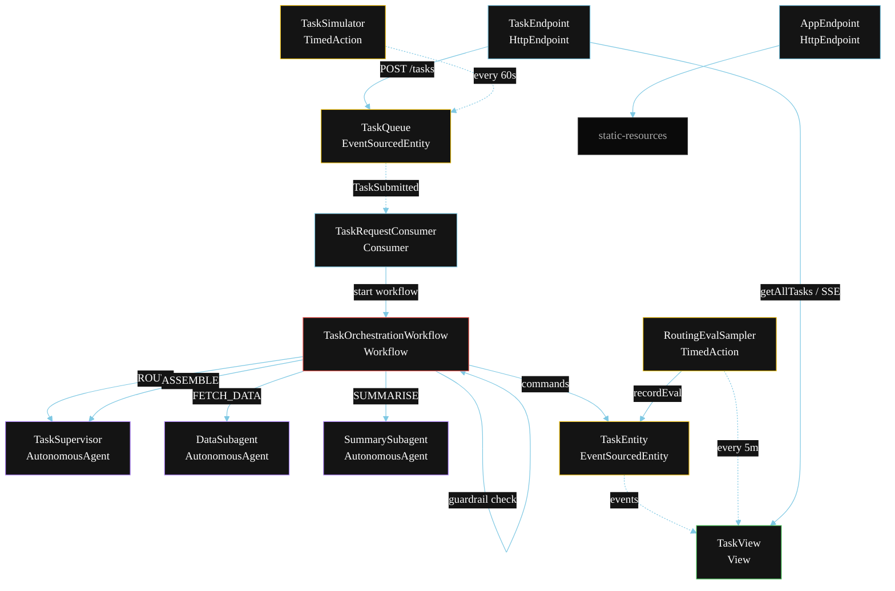
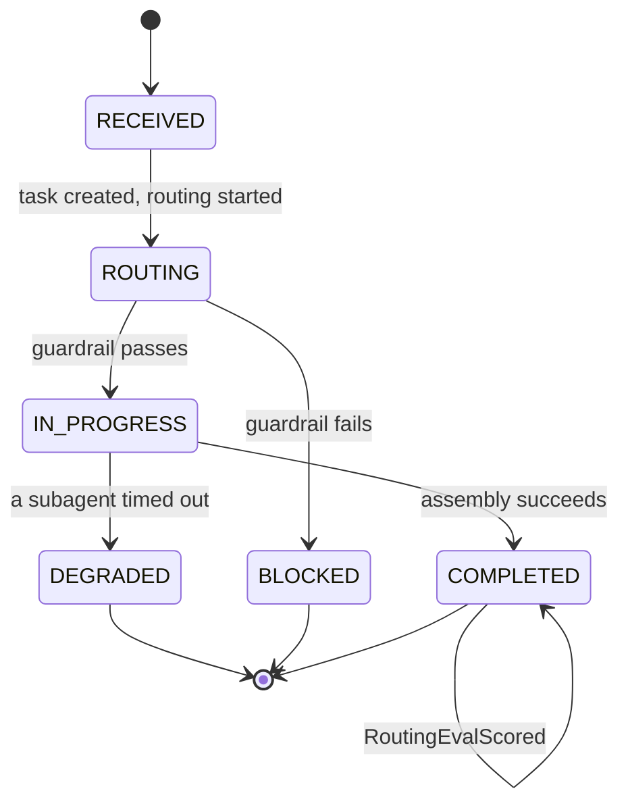
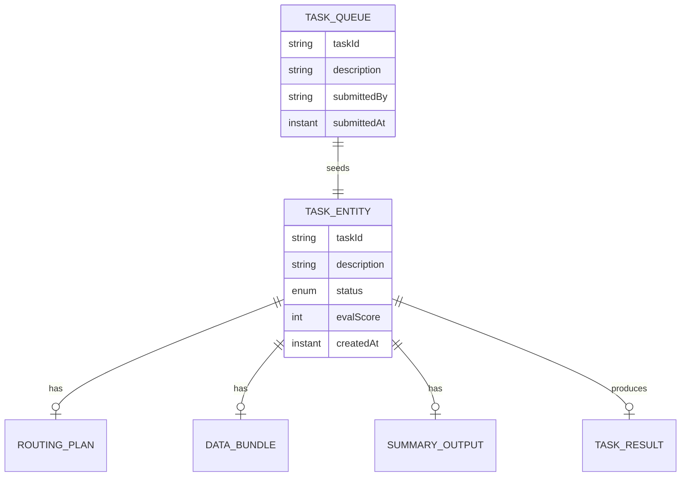

# PLAN — Supervisor with Subagents

Architectural sketch for `/akka:specify`. Mirrors `SPEC.md` Section 4 component names exactly. Mermaid sources here are rendered on the Architecture tab of the embedded UI; carry the Lesson 24 CSS overrides into the generated `index.html`.

## Component graph



Solid arrows: synchronous commands. Dashed arrows: event subscriptions. Dotted arrows: scheduled ticks.

## Interaction sequence

```mermaid
sequenceDiagram
  participant U as User / Simulator
  participant TE as TaskEndpoint
  participant TQ as TaskQueue
  participant WF as TaskOrchestrationWorkflow
  participant SV as TaskSupervisor
  participant DA as DataSubagent
  participant SA as SummarySubagent
  participant TX as TaskEntity

  U->>TE: POST /api/tasks {description}
  TE->>TQ: submitTask
  TQ-->>WF: TaskRequestConsumer starts workflow
  WF->>TX: createTask (RECEIVED)
  WF->>SV: ROUTE -> RoutingPlan
  WF->>TX: status ROUTING
  WF->>WF: guardrailStep checks RoutingPlan
  alt guardrail fails
    WF->>TX: block (BLOCKED)
  else guardrail passes
    WF->>TX: status IN_PROGRESS
    par parallel fan-out
      WF->>DA: FETCH_DATA -> DataBundle
    and
      WF->>SA: SUMMARISE -> SummaryOutput
    end
    Note over WF: join; if either step times out (60s) -> degradeStep
    WF->>SV: ASSEMBLE(data, summary) -> TaskResult
    WF->>TX: completeTask (COMPLETED)
  end
```

## State machine



## Entity model



## Component table

| Component | Akka primitive | File path |
|---|---|---|
| `TaskSupervisor` | AutonomousAgent | `application/TaskSupervisor.java` |
| `DataSubagent` | AutonomousAgent | `application/DataSubagent.java` |
| `SummarySubagent` | AutonomousAgent | `application/SummarySubagent.java` |
| `SupervisorTasks` | Task constants | `application/SupervisorTasks.java` |
| `TaskOrchestrationWorkflow` | Workflow | `application/TaskOrchestrationWorkflow.java` |
| `TaskEntity` | EventSourcedEntity | `domain/TaskEntity.java` |
| `TaskQueue` | EventSourcedEntity | `domain/TaskQueue.java` |
| `TaskView` | View | `application/TaskView.java` |
| `TaskRequestConsumer` | Consumer | `application/TaskRequestConsumer.java` |
| `TaskSimulator` | TimedAction | `application/TaskSimulator.java` |
| `RoutingEvalSampler` | TimedAction | `application/RoutingEvalSampler.java` |
| `TaskEndpoint` | HttpEndpoint | `api/TaskEndpoint.java` |
| `AppEndpoint` | HttpEndpoint | `api/AppEndpoint.java` |

## Concurrency notes

- **Step timeouts (Lesson 4):** `fetchDataStep` and `summariseStep` get 60s; `assembleStep` gets 90s. The 5s default fails every LLM call. `WorkflowSettings` is nested inside `Workflow` — no import.
- **Parallel fan-out:** `fetchDataStep` and `summariseStep` run concurrently via `CompletionStage` zip, not two sequential step calls.
- **Guardrail placement:** `guardrailStep` runs after `routeStep` and before the parallel fan-out. If the routing plan is rejected, neither subagent is invoked — the task is blocked immediately, avoiding wasted compute.
- **Idempotency:** the workflow id is the `taskId`. Re-delivery of the same `TaskSubmitted` event resolves to the same workflow instance — no duplicate task.
- **Degrade path (compensation):** if either subagent times out, `defaultStepRecovery` routes to `degradeStep`, which assembles from whichever partial output exists and ends with `TaskDegraded`. No infinite retry.
- **Eval sampling:** `RoutingEvalSampler` reads `TaskView.getAllTasks` (no enum WHERE clause — Lesson 2) and filters client-side for the oldest `COMPLETED` task lacking an `evalScore`.
