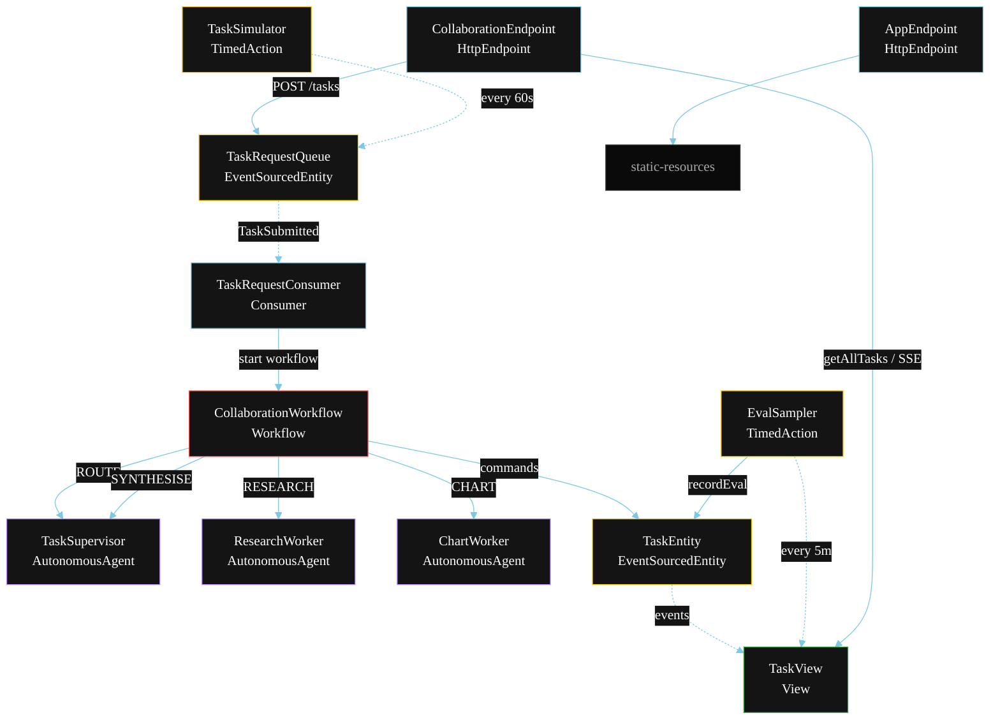
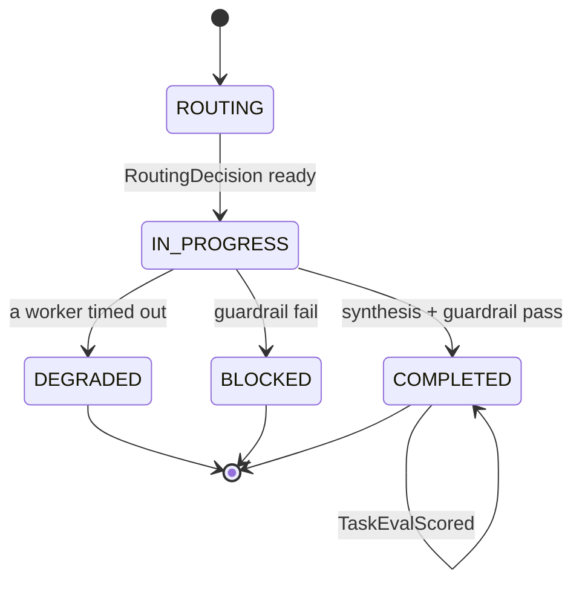
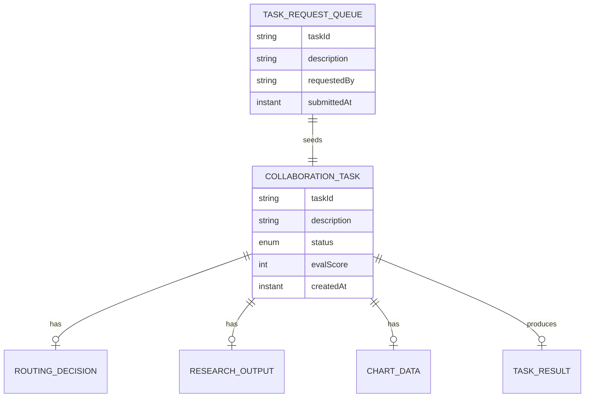

# PLAN — Multi-Agent Collaboration (Supervisor)

Architectural sketch for `/akka:specify`. Mirrors `SPEC.md` Section 4 component names exactly. Mermaid sources here are rendered on the Architecture tab of the embedded UI; carry the Lesson 24 CSS overrides into the generated `index.html`.

## Component graph



Solid arrows: synchronous commands. Dashed arrows: event subscriptions. Dotted arrows: scheduled ticks.

## Interaction sequence

```mermaid
sequenceDiagram
  participant U as User / Simulator
  participant CE as CollaborationEndpoint
  participant TQ as TaskRequestQueue
  participant WF as CollaborationWorkflow
  participant SV as TaskSupervisor
  participant RW as ResearchWorker
  participant CW as ChartWorker
  participant TE as TaskEntity

  U->>CE: POST /api/tasks {description}
  CE->>TQ: enqueueTask
  TQ-->>WF: TaskRequestConsumer starts workflow
  WF->>TE: createTask (ROUTING)
  WF->>SV: ROUTE -> RoutingDecision
  WF->>TE: routeTask (IN_PROGRESS)
  par parallel fan-out
    WF->>RW: RESEARCH -> ResearchOutput
  and
    WF->>CW: CHART -> ChartData
  end
  Note over WF: join; if either step times out (60s) -> degradeStep
  WF->>SV: SYNTHESISE(research, chart) -> TaskResult
  WF->>WF: guardrailStep checks tool calls
  alt guardrail passes
    WF->>TE: completeTask (COMPLETED)
  else guardrail fails
    WF->>TE: blockTask (BLOCKED)
  end
```

## State machine



## Entity model



## Component table

| Component | Akka primitive | File path |
|---|---|---|
| `TaskSupervisor` | AutonomousAgent | `application/TaskSupervisor.java` |
| `ResearchWorker` | AutonomousAgent | `application/ResearchWorker.java` |
| `ChartWorker` | AutonomousAgent | `application/ChartWorker.java` |
| `WorkerTasks` | Task constants | `application/WorkerTasks.java` |
| `CollaborationWorkflow` | Workflow | `application/CollaborationWorkflow.java` |
| `TaskEntity` | EventSourcedEntity | `domain/TaskEntity.java` |
| `TaskRequestQueue` | EventSourcedEntity | `domain/TaskRequestQueue.java` |
| `TaskView` | View | `application/TaskView.java` |
| `TaskRequestConsumer` | Consumer | `application/TaskRequestConsumer.java` |
| `TaskSimulator` | TimedAction | `application/TaskSimulator.java` |
| `EvalSampler` | TimedAction | `application/EvalSampler.java` |
| `CollaborationEndpoint` | HttpEndpoint | `api/CollaborationEndpoint.java` |
| `AppEndpoint` | HttpEndpoint | `api/AppEndpoint.java` |

## Concurrency notes

- **Step timeouts (Lesson 4):** `researchStep` and `chartStep` get 60s; `synthesiseStep` gets 90s. The 5s default fails every LLM call. `WorkflowSettings` is nested inside `Workflow` — no import.
- **Parallel fan-out:** `researchStep` and `chartStep` run concurrently via `CompletionStage` zip, not two sequential step calls.
- **Idempotency:** the workflow id is the `taskId`. Re-delivery of the same `TaskSubmitted` event resolves to the same workflow instance — no duplicate task.
- **Degrade path (compensation):** if either worker times out, `defaultStepRecovery` routes to `degradeStep`, which synthesises from whichever partial output exists and ends with `TaskDegraded`. No infinite retry.
- **Eval sampling:** `EvalSampler` reads `TaskView.getAllTasks` (no enum WHERE clause — Lesson 2) and filters client-side for the oldest `COMPLETED` task lacking an `evalScore`.
- **Before-tool-call guardrail:** runs on `TaskSupervisor` before any tool invocation. The permitted list is `[SEARCH, CHART_GENERATE]`; any other tool call causes an immediate block.
