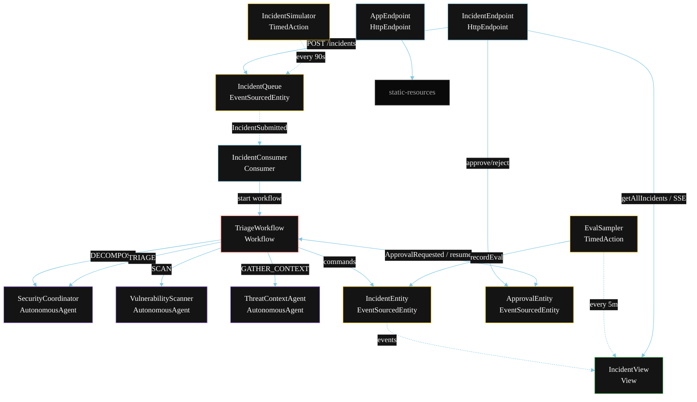
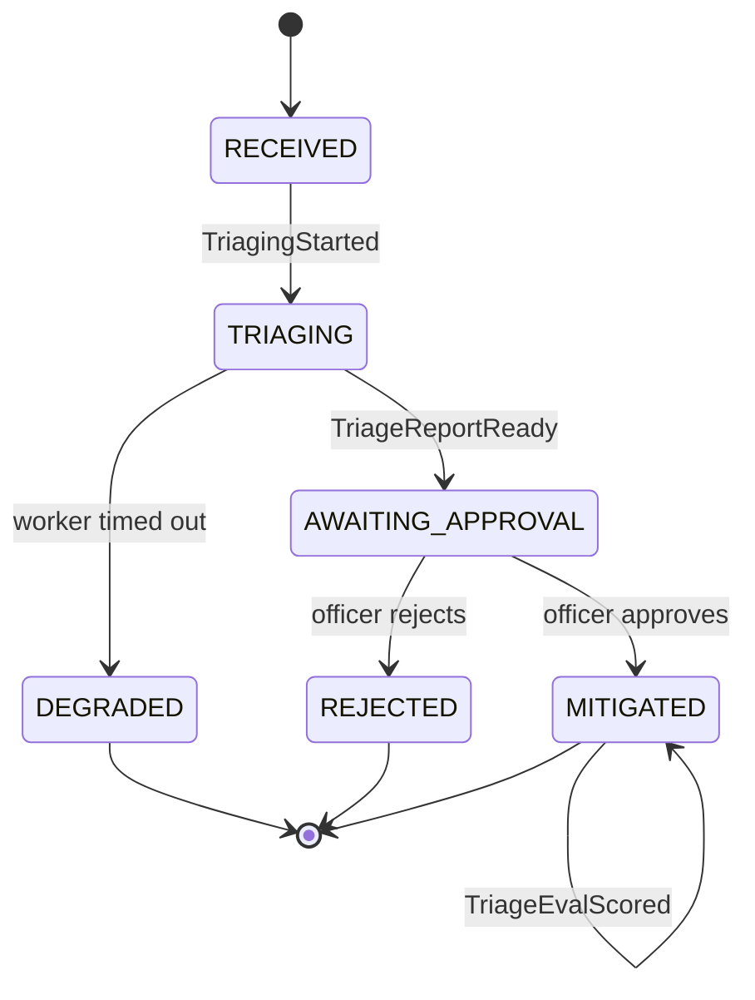
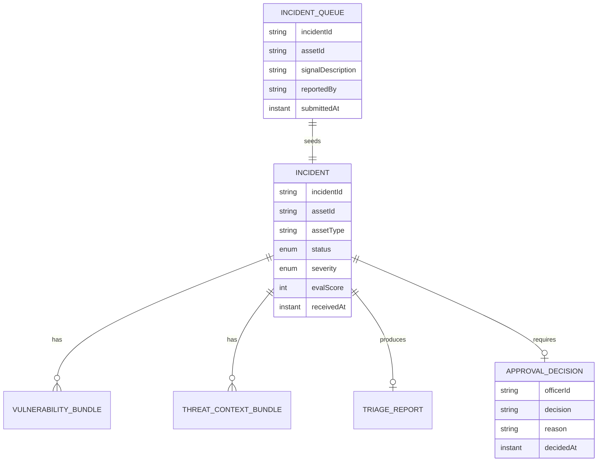

# PLAN — AI Security Triage Agent

Architectural sketch for `/akka:specify`. Mirrors `SPEC.md` Section 4 component names exactly. Mermaid sources here are rendered on the Architecture tab of the embedded UI; carry the Lesson 24 CSS overrides into the generated `index.html`.

## Component graph



Solid arrows: synchronous commands. Dashed arrows: event subscriptions. Double-headed arrows: workflow parks and resumes on external command.

## Interaction sequence

```mermaid
sequenceDiagram
  participant U as User / Simulator
  participant IE as IncidentEndpoint
  participant IQ as IncidentQueue
  participant WF as TriageWorkflow
  participant SC as SecurityCoordinator
  participant VS as VulnerabilityScanner
  participant TC as ThreatContextAgent
  participant APE as ApprovalEntity
  participant INE as IncidentEntity

  U->>IE: POST /api/incidents {signal}
  IE->>IQ: submitIncident
  IQ-->>WF: IncidentConsumer starts workflow
  WF->>INE: receiveIncident (RECEIVED)
  WF->>SC: DECOMPOSE -> ScanPlan
  WF->>INE: startTriaging (TRIAGING)
  par parallel fan-out
    WF->>VS: SCAN -> VulnerabilityBundle
  and
    WF->>TC: GATHER_CONTEXT -> ThreatContextBundle
  end
  Note over WF: join; if either step times out (60s) -> degradeStep
  WF->>SC: TRIAGE(vulnerabilities, threatContext) -> TriageReport
  WF->>INE: awaitApproval (AWAITING_APPROVAL)
  WF->>APE: requestApproval
  Note over WF,APE: workflow parks here
  U->>IE: POST /api/incidents/{id}/approve {officerId}
  IE->>APE: approve
  APE-->>WF: resume signal
  alt approval granted
    WF->>INE: mitigate (MITIGATED)
  else approval denied
    WF->>INE: reject (REJECTED)
  end
```

## State machine



## Entity model



## Component table

| Component | Akka primitive | File path |
|---|---|---|
| `SecurityCoordinator` | AutonomousAgent | `application/SecurityCoordinator.java` |
| `VulnerabilityScanner` | AutonomousAgent | `application/VulnerabilityScanner.java` |
| `ThreatContextAgent` | AutonomousAgent | `application/ThreatContextAgent.java` |
| `SecurityTasks` | Task constants | `application/SecurityTasks.java` |
| `TriageWorkflow` | Workflow | `application/TriageWorkflow.java` |
| `IncidentEntity` | EventSourcedEntity | `domain/IncidentEntity.java` |
| `ApprovalEntity` | EventSourcedEntity | `domain/ApprovalEntity.java` |
| `IncidentQueue` | EventSourcedEntity | `domain/IncidentQueue.java` |
| `IncidentView` | View | `application/IncidentView.java` |
| `IncidentConsumer` | Consumer | `application/IncidentConsumer.java` |
| `IncidentSimulator` | TimedAction | `application/IncidentSimulator.java` |
| `EvalSampler` | TimedAction | `application/EvalSampler.java` |
| `IncidentEndpoint` | HttpEndpoint | `api/IncidentEndpoint.java` |
| `AppEndpoint` | HttpEndpoint | `api/AppEndpoint.java` |

## Concurrency notes

- **Step timeouts (Lesson 4):** `scanStep` and `contextStep` get 60s; `triageStep` gets 90s. The 5s default fails every LLM call. `WorkflowSettings` is nested inside `Workflow` — no import.
- **Parallel fan-out:** `scanStep` and `contextStep` run concurrently via `CompletionStage` zip, not two sequential step calls.
- **Approval gate:** the workflow uses a dedicated step that pauses execution and subscribes to the `ApprovalEntity` for a resume signal. The workflow id matches the `incidentId`; the endpoint routes `approve`/`reject` to the correct `ApprovalEntity` and that entity triggers the workflow to resume.
- **Idempotency:** the workflow id is the `incidentId`. Re-delivery of the same `IncidentSubmitted` event resolves to the same workflow instance — no duplicate incident.
- **Degrade path (compensation):** if either worker times out, `defaultStepRecovery` routes to `degradeStep`, which triages from whichever partial output exists and ends with `IncidentDegraded`. No infinite retry.
- **Eval sampling:** `EvalSampler` reads `IncidentView.getAllIncidents` (no enum WHERE clause — Lesson 2) and filters client-side for the oldest `MITIGATED` incident lacking an `evalScore`.
