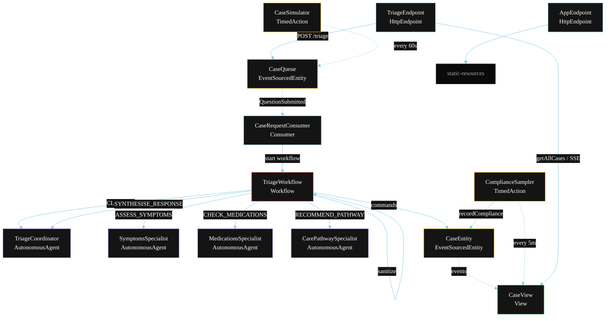
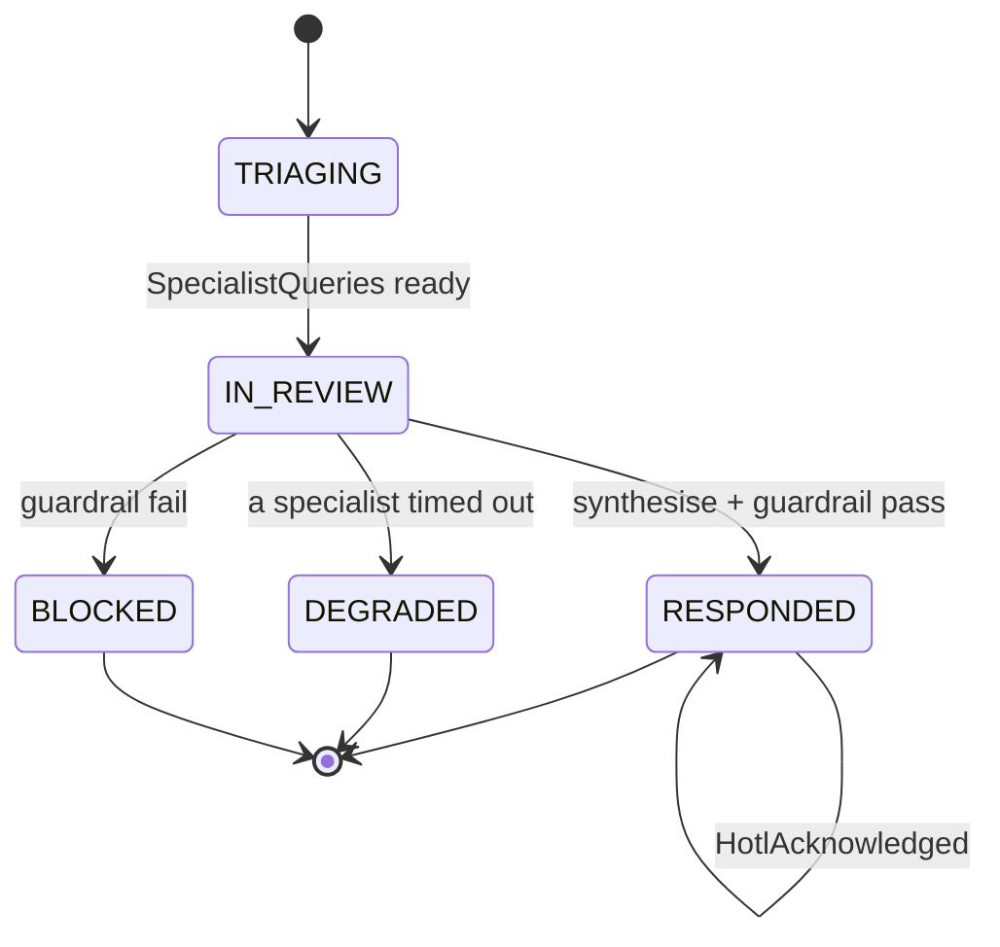
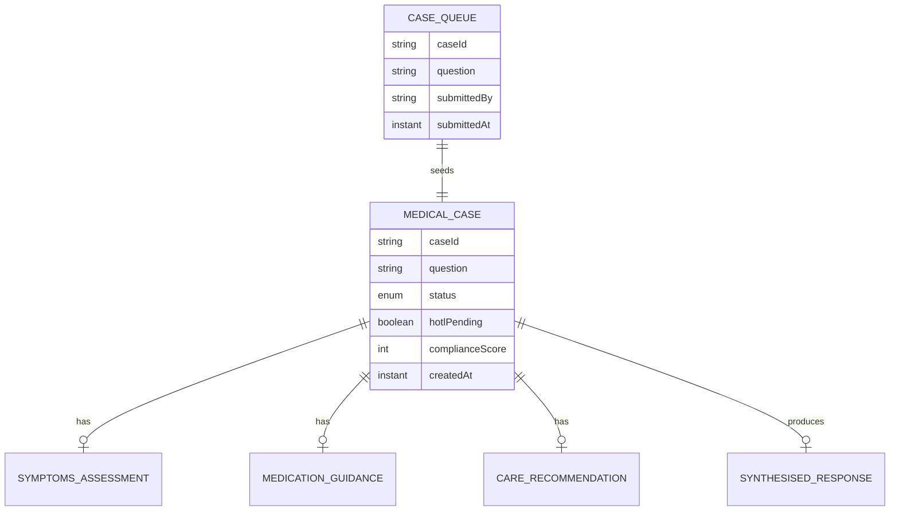

# PLAN — Medical Agent Delegation

Architectural sketch for `/akka:specify`. Mirrors `SPEC.md` Section 4 component names exactly. Mermaid sources here are rendered on the Architecture tab of the embedded UI; carry the Lesson 24 CSS overrides into the generated `index.html`.

## Component graph



Solid arrows: synchronous commands. Dashed arrows: event subscriptions. Dotted arrows: scheduled ticks.

## Interaction sequence

```mermaid
sequenceDiagram
  participant U as User / Simulator
  participant TE as TriageEndpoint
  participant CQ as CaseQueue
  participant WF as TriageWorkflow
  participant TC as TriageCoordinator
  participant SS as SymptomsSpecialist
  participant MS as MedicationsSpecialist
  participant CS as CarePathwaySpecialist
  participant CE as CaseEntity

  U->>TE: POST /api/triage {question}
  TE->>CQ: enqueueQuestion
  CQ-->>WF: CaseRequestConsumer starts workflow
  WF->>CE: createCase (TRIAGING)
  WF->>WF: sanitizeStep (strip PII)
  WF->>TC: CLASSIFY -> SpecialistQueries
  WF->>CE: status IN_REVIEW
  par parallel fan-out
    WF->>SS: ASSESS_SYMPTOMS -> SymptomsAssessment
  and
    WF->>MS: CHECK_MEDICATIONS -> MedicationGuidance
  and
    WF->>CS: RECOMMEND_PATHWAY -> CareRecommendation
  end
  Note over WF: join; if any step times out (60s) -> degradeStep
  WF->>TC: SYNTHESISE_RESPONSE(assessments) -> SynthesisedResponse
  WF->>WF: guardrailStep vets the response
  alt guardrail passes
    WF->>CE: respond (RESPONDED)
    WF->>CE: flagHotl (hotlPending=true)
  else guardrail fails
    WF->>CE: block (BLOCKED)
  end
```

## State machine



## Entity model



## Component table

| Component | Akka primitive | File path |
|---|---|---|
| `TriageCoordinator` | AutonomousAgent | `application/TriageCoordinator.java` |
| `SymptomsSpecialist` | AutonomousAgent | `application/SymptomsSpecialist.java` |
| `MedicationsSpecialist` | AutonomousAgent | `application/MedicationsSpecialist.java` |
| `CarePathwaySpecialist` | AutonomousAgent | `application/CarePathwaySpecialist.java` |
| `MedicalTriageTasks` | Task constants | `application/MedicalTriageTasks.java` |
| `TriageWorkflow` | Workflow | `application/TriageWorkflow.java` |
| `CaseEntity` | EventSourcedEntity | `domain/CaseEntity.java` |
| `CaseQueue` | EventSourcedEntity | `domain/CaseQueue.java` |
| `CaseView` | View | `application/CaseView.java` |
| `CaseRequestConsumer` | Consumer | `application/CaseRequestConsumer.java` |
| `CaseSimulator` | TimedAction | `application/CaseSimulator.java` |
| `ComplianceSampler` | TimedAction | `application/ComplianceSampler.java` |
| `TriageEndpoint` | HttpEndpoint | `api/TriageEndpoint.java` |
| `AppEndpoint` | HttpEndpoint | `api/AppEndpoint.java` |

## Concurrency notes

- **Step timeouts (Lesson 4):** `symptomsStep`, `medicationsStep`, and `carePathwayStep` each get 60s; `synthesiseStep` gets 90s. The 5s default fails every LLM call. `WorkflowSettings` is nested inside `Workflow` — no import.
- **Parallel fan-out:** all three specialist steps run concurrently via a `CompletionStage` zip of three, not sequential step calls.
- **Idempotency:** the workflow id is the `caseId`. Re-delivery of the same `QuestionSubmitted` event resolves to the same workflow instance — no duplicate case.
- **Degrade path (compensation):** if any specialist times out, `defaultStepRecovery` routes to `degradeStep`, which synthesises from whichever partial outputs exist and ends with `CaseDegraded`. The summary notes which specialist output was missing.
- **Sanitizer step:** `sanitizeStep` is a deterministic in-process step (no LLM call) that removes PII patterns and GDPR special-category markers before the question reaches any agent. It runs synchronously before `classifyStep`.
- **Hotl step:** `hotlStep` emits `HotlFlagged` on `CaseEntity` after every successful `RESPONDED` transition, setting `hotlPending = true`. A compliance reviewer calls `acknowledgeHotl` to clear the flag.
- **Compliance sampling:** `ComplianceSampler` reads `CaseView.getAllCases` (no enum WHERE clause) and filters client-side for the oldest `RESPONDED` case lacking a `complianceScore`.
