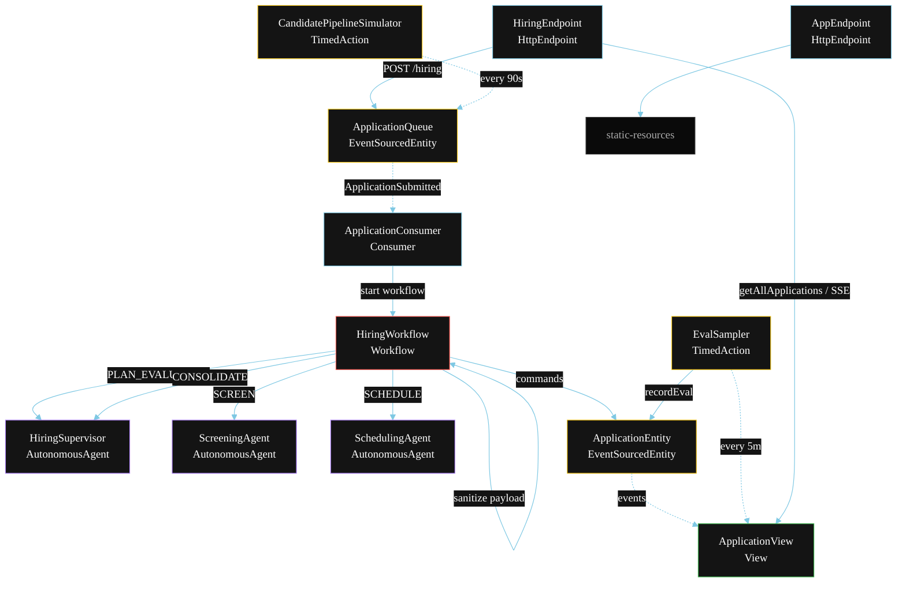
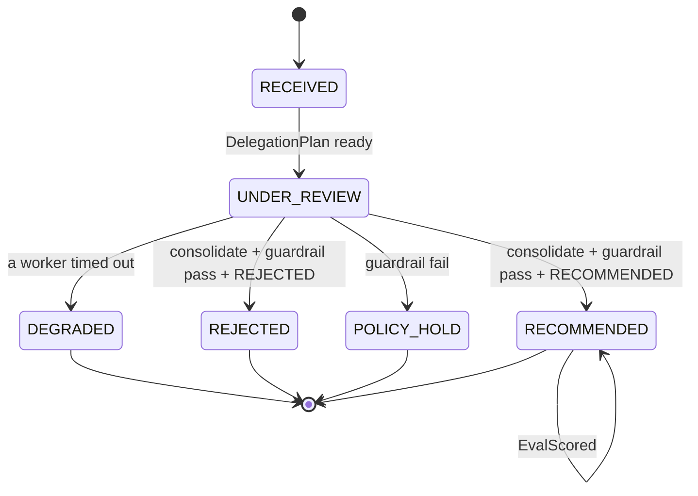
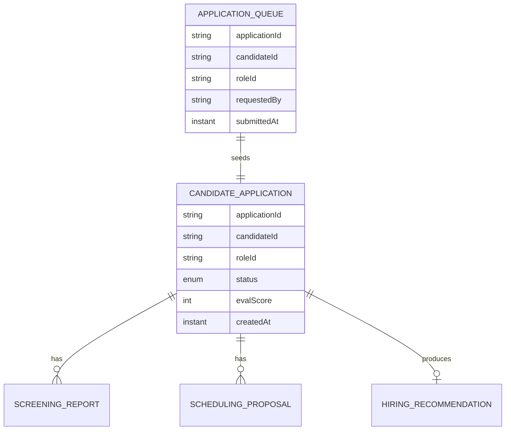

# PLAN — Hiring Supervisor Orchestration

Architectural sketch for `/akka:specify`. Mirrors `SPEC.md` Section 4 component names exactly. Mermaid sources here are rendered on the Architecture tab of the embedded UI; carry the Lesson 24 CSS overrides into the generated `index.html`.

## Component graph



Solid arrows: synchronous commands. Dashed arrows: event subscriptions. Dotted arrows: scheduled ticks.

## Interaction sequence

```mermaid
sequenceDiagram
  participant U as User / Simulator
  participant HE as HiringEndpoint
  participant AQ as ApplicationQueue
  participant WF as HiringWorkflow
  participant HS as HiringSupervisor
  participant SC as ScreeningAgent
  participant SH as SchedulingAgent
  participant AE as ApplicationEntity

  U->>HE: POST /api/hiring {candidateId, roleId, resumeText, availabilityWindow}
  HE->>AQ: submitApplication
  AQ-->>WF: ApplicationConsumer starts workflow
  WF->>AE: receiveApplication (RECEIVED)
  WF->>WF: sanitizeStep — strip special-category fields
  WF->>HS: PLAN_EVALUATION (guardrail fires) -> DelegationPlan
  WF->>AE: startReview (UNDER_REVIEW)
  par parallel fan-out
    WF->>SC: SCREEN -> ScreeningReport
  and
    WF->>SH: SCHEDULE -> SchedulingProposal
  end
  Note over WF: join; if either step times out (60s) -> degradeStep
  WF->>HS: CONSOLIDATE(screeningReport, schedulingProposal) -> HiringRecommendation
  WF->>WF: guardrailCheckStep vets recommendation
  alt guardrail passes + decision RECOMMENDED
    WF->>AE: recommend (RECOMMENDED)
  else guardrail passes + decision REJECTED
    WF->>AE: reject (REJECTED)
  else guardrail fails
    WF->>AE: policyHold (POLICY_HOLD)
  end
```

## State machine



## Entity model



## Component table

| Component | Akka primitive | File path |
|---|---|---|
| `HiringSupervisor` | AutonomousAgent | `application/HiringSupervisor.java` |
| `ScreeningAgent` | AutonomousAgent | `application/ScreeningAgent.java` |
| `SchedulingAgent` | AutonomousAgent | `application/SchedulingAgent.java` |
| `HiringTasks` | Task constants | `application/HiringTasks.java` |
| `HiringWorkflow` | Workflow | `application/HiringWorkflow.java` |
| `ApplicationEntity` | EventSourcedEntity | `domain/ApplicationEntity.java` |
| `ApplicationQueue` | EventSourcedEntity | `domain/ApplicationQueue.java` |
| `ApplicationView` | View | `application/ApplicationView.java` |
| `ApplicationConsumer` | Consumer | `application/ApplicationConsumer.java` |
| `CandidatePipelineSimulator` | TimedAction | `application/CandidatePipelineSimulator.java` |
| `EvalSampler` | TimedAction | `application/EvalSampler.java` |
| `HiringEndpoint` | HttpEndpoint | `api/HiringEndpoint.java` |
| `AppEndpoint` | HttpEndpoint | `api/AppEndpoint.java` |

## Concurrency notes

- **Step timeouts (Lesson 4):** `screenStep` and `scheduleStep` get 60s; `consolidateStep` gets 90s. The 5s default fails every LLM call. `WorkflowSettings` is nested inside `Workflow` — no import.
- **Parallel fan-out:** `screenStep` and `scheduleStep` run concurrently via `CompletionStage` zip, not two sequential step calls.
- **Sanitization before agents:** `sanitizeStep` runs before any agent invocation; no protected-attribute field reaches `HiringSupervisor`, `ScreeningAgent`, or `SchedulingAgent`.
- **Idempotency:** the workflow id is the `applicationId`. Re-delivery of the same `ApplicationSubmitted` event resolves to the same workflow instance — no duplicate application.
- **Degrade path (compensation):** if either worker times out, `defaultStepRecovery` routes to `degradeStep`, which consolidates from whichever partial output exists and ends with `ApplicationDegraded`. No infinite retry.
- **Eval sampling:** `EvalSampler` reads `ApplicationView.getAllApplications` (no enum WHERE clause) and filters client-side for the oldest `RECOMMENDED` application lacking an `evalScore`.
