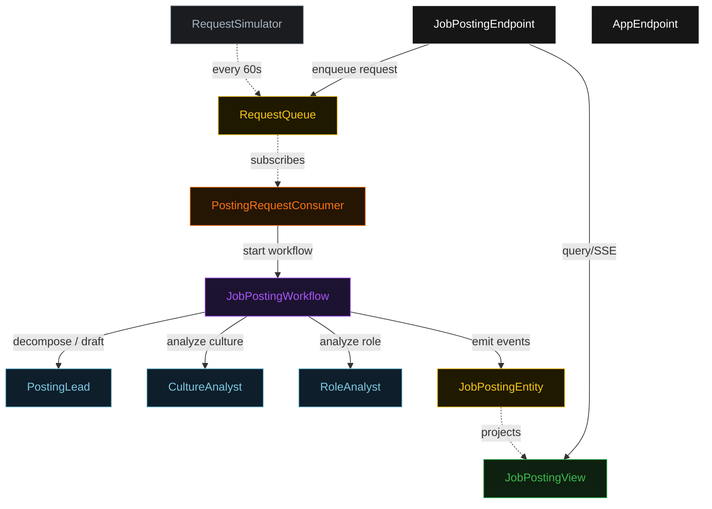
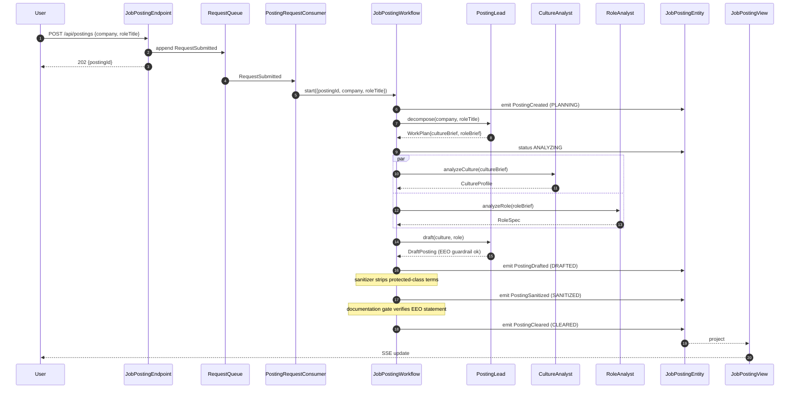
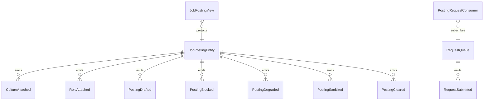

# PLAN — job-posting-eeo

Architectural sketch consumed by `/akka:plan` (or skipped if `/akka:specify` covers it). Diagrams are rendered on the generated system's Architecture tab.

---

## Component graph

## Interaction sequence — J1 (happy path)

## State machine — `JobPostingEntity`

```mermaid
stateDiagram-v2
  [*] --> PLANNING
  PLANNING --> ANALYZING: PostingCreated done, workers dispatched
  ANALYZING --> DRAFTED: both workers returned; EEO guardrail OK
  ANALYZING --> BLOCKED: guardrail flagged discriminatory language
  ANALYZING --> DEGRADED: one worker timed out
  DRAFTED --> SANITIZED: protected-class terms removed
  SANITIZED --> CLEARED: documentation gate passed
  CLEARED --> [*]
  BLOCKED --> [*]
  DEGRADED --> [*]
```

## Entity model

## Component table — Java file targets

| Component | Path (generated) |
|---|---|
| `PostingLead` | `application/PostingLead.java` |
| `CultureAnalyst` | `application/CultureAnalyst.java` |
| `RoleAnalyst` | `application/RoleAnalyst.java` |
| `JobPostingWorkflow` | `application/JobPostingWorkflow.java` |
| `JobPostingEntity` | `application/JobPostingEntity.java` (state in `domain/JobPosting.java`, events in `domain/JobPostingEvent.java`) |
| `RequestQueue` | `application/RequestQueue.java` |
| `JobPostingView` | `application/JobPostingView.java` |
| `PostingRequestConsumer` | `application/PostingRequestConsumer.java` |
| `RequestSimulator` | `application/RequestSimulator.java` |
| `JobPostingEndpoint` | `api/JobPostingEndpoint.java` |
| `AppEndpoint` | `api/AppEndpoint.java` |
| `JobPostingTasks` | `application/JobPostingTasks.java` |
| Bootstrap | `Bootstrap.java` |

## Concurrency notes

- **Workflow step timeouts:** wrap `CultureAnalyst`, `RoleAnalyst`, and `PostingLead` draft calls in `WorkflowSettings.builder().stepTimeout(Duration.ofSeconds(60))`. `WorkflowSettings` is nested in `Workflow` — no import. On timeout, transition to `DEGRADED` rather than failing the whole workflow.
- **Parallel fork:** `cultureStep` and `roleStep` use a CompletionStage zip. Both worker calls are initiated before either is awaited.
- **Idempotency:** `JobPostingEndpoint.submit` uses `(company, roleTitle, requestedBy)` over a 10 s window to deduplicate `POST /api/postings`.
- **Guardrail / sanitizer ordering:** the EEO guardrail runs inside `draftStep` (blocking, before the draft is persisted as `DRAFTED`); the sanitizer runs in the following `sanitizeStep` (transforms, then emits `PostingSanitized`). The documentation gate runs last in `complianceStep`.
- **No compensation needed:** all transitions are forward-only; terminal states (`CLEARED`, `BLOCKED`, `DEGRADED`) are absorbing.
