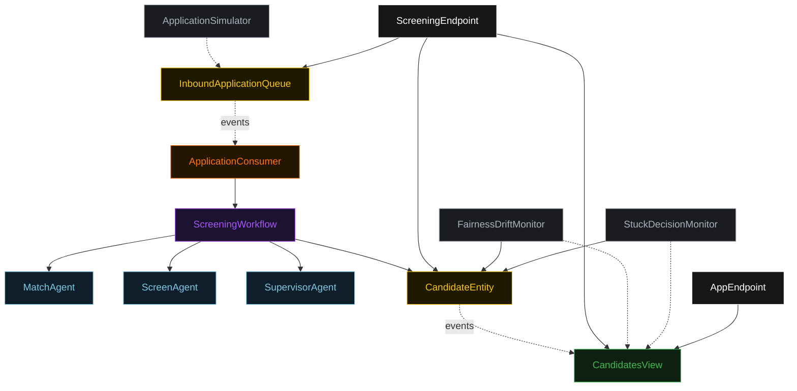
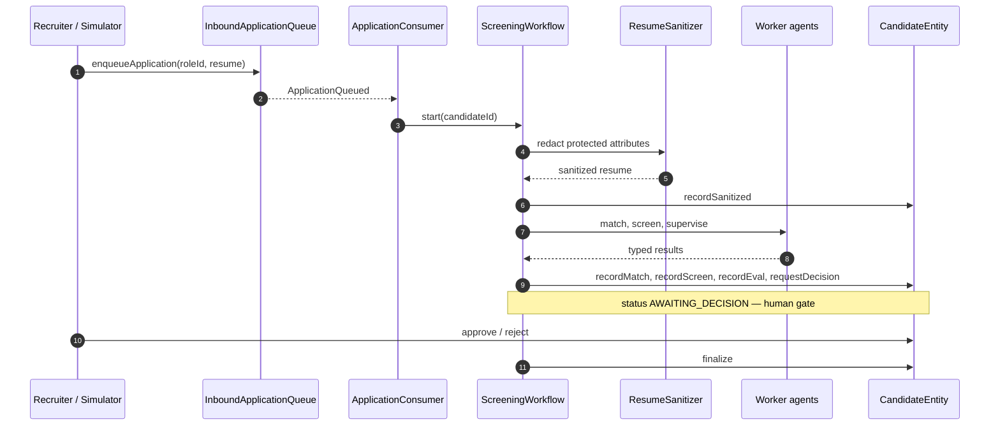
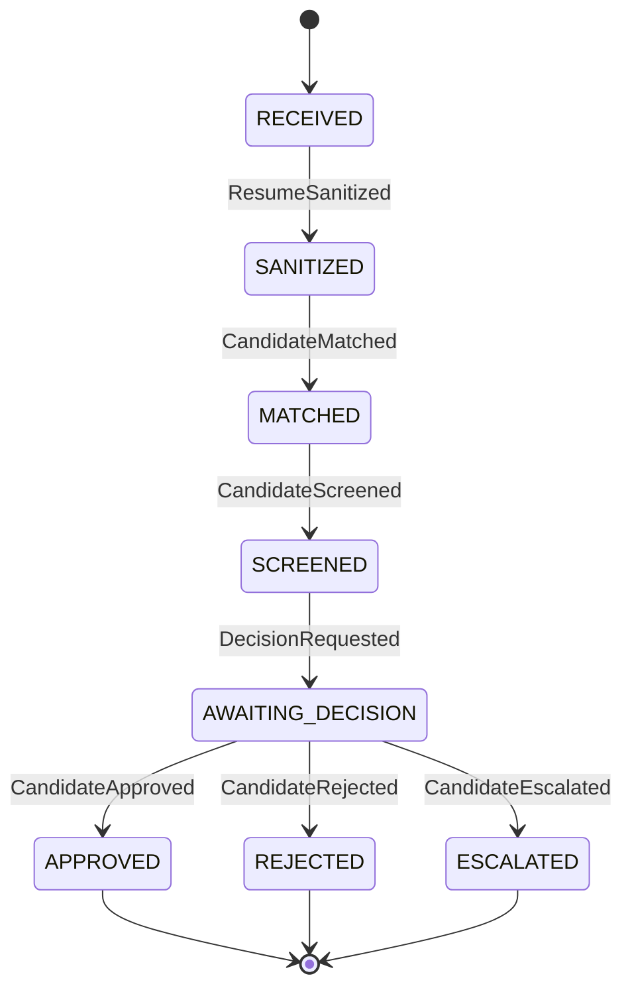
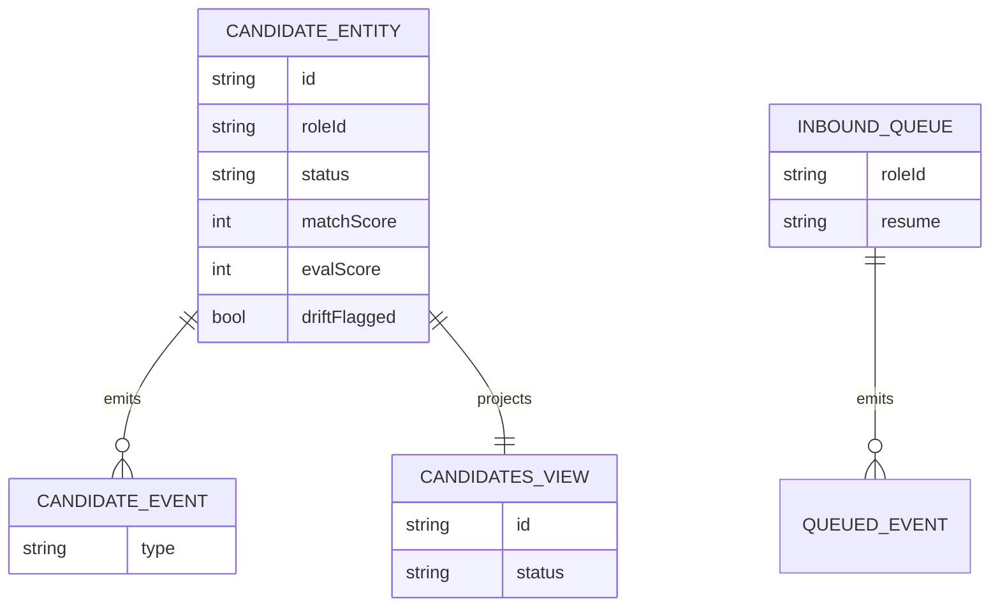

# PLAN — `recruitment-team`

Architectural sketch for the delegation-supervisor-workers × hr-recruiting cell. All four mermaid diagrams render on the Architecture tab with the Lesson 24 CSS overrides applied.

---

## Component graph

## Interaction sequence

## State machine

## Entity model

## Component table

| Component | Path (generated) |
|---|---|
| `MatchAgent` | `application/MatchAgent.java` |
| `ScreenAgent` | `application/ScreenAgent.java` |
| `SupervisorAgent` | `application/SupervisorAgent.java` |
| `ScreeningTasks` | `application/ScreeningTasks.java` |
| `ResumeSanitizer` | `application/ResumeSanitizer.java` |
| `ScreeningWorkflow` | `application/ScreeningWorkflow.java` |
| `CandidateEntity` | `application/CandidateEntity.java` |
| `InboundApplicationQueue` | `application/InboundApplicationQueue.java` |
| `CandidatesView` | `application/CandidatesView.java` |
| `ApplicationConsumer` | `application/ApplicationConsumer.java` |
| `ApplicationSimulator` | `application/ApplicationSimulator.java` |
| `FairnessDriftMonitor` | `application/FairnessDriftMonitor.java` |
| `StuckDecisionMonitor` | `application/StuckDecisionMonitor.java` |
| `ScreeningEndpoint` | `api/ScreeningEndpoint.java` |
| `AppEndpoint` | `api/AppEndpoint.java` |
| `Candidate`, records | `domain/*.java` |

## Concurrency notes

- **Step timeouts.** `matchStep`, `screenStep`, `superviseStep` each set `stepTimeout(60s)` because they call agents; the default 5 s would fail (Lesson 4). `sanitizeStep` is in-process and uses the default.
- **Recovery.** `defaultStepRecovery(maxRetries(2).failoverTo(errorStep))`.
- **Idempotency.** The workflow id is the candidate id; `ApplicationConsumer` derives a deterministic candidate id per queued application so replays do not start duplicate workflows.
- **Await loop.** `awaitDecisionStep` self-schedules a 5 s resume timer while in `AWAITING_DECISION`; the human command and the `StuckDecisionMonitor` escalation are the two exits.
- **No saga.** No cross-service compensation; all state is in `CandidateEntity`.
