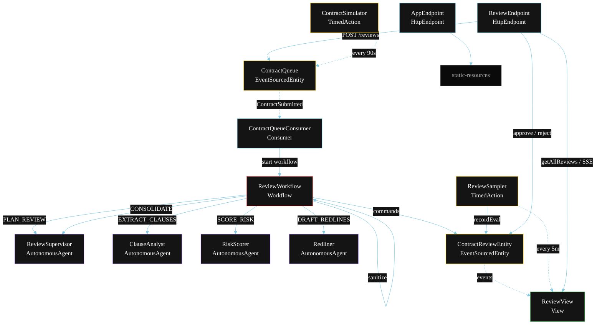
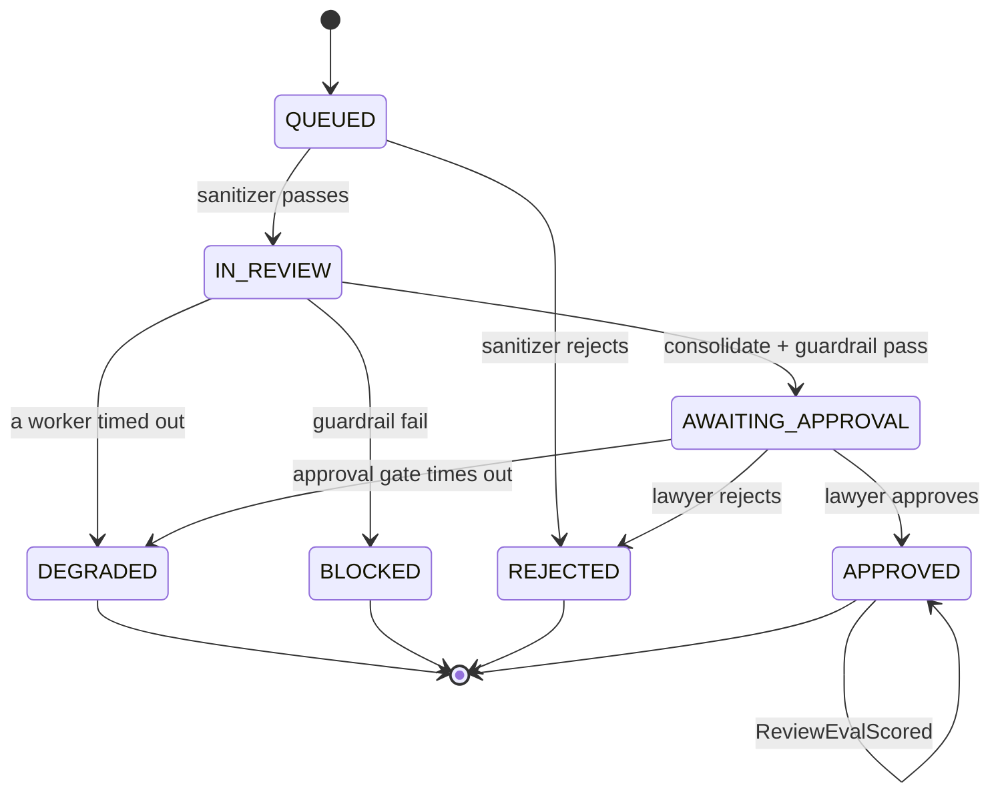
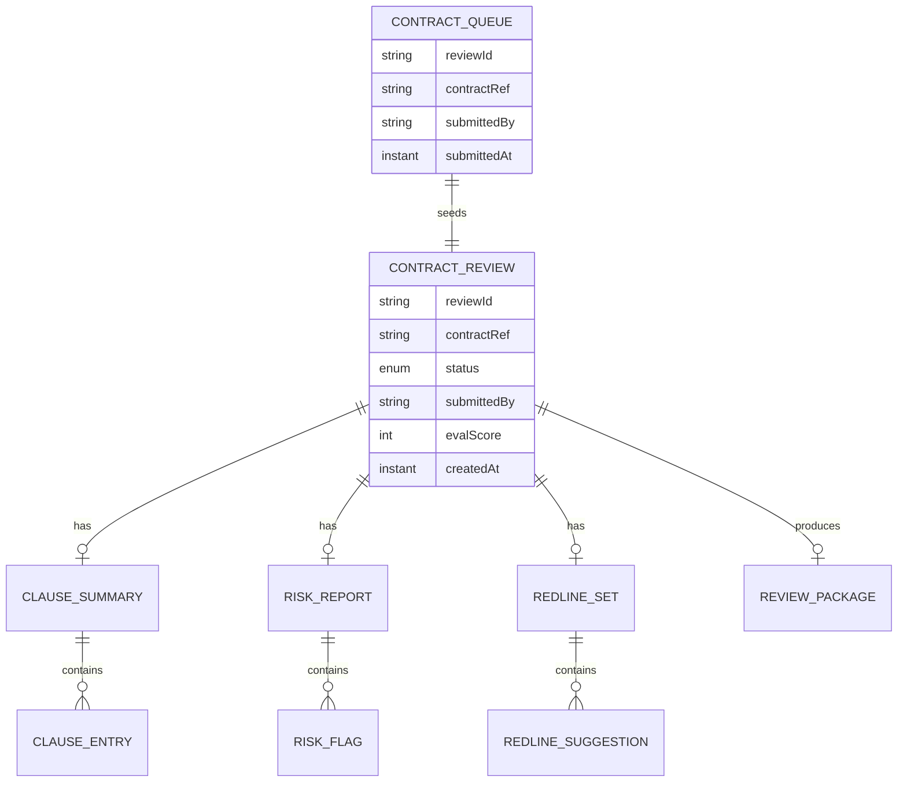

# PLAN — Contract Assistant (Multi-Agent)

Architectural sketch for `/akka:specify`. Mirrors `SPEC.md` Section 4 component names exactly. Mermaid sources here are rendered on the Architecture tab of the embedded UI; carry the Lesson 24 CSS overrides into the generated `index.html`.

## Component graph



Solid arrows: synchronous commands. Dashed arrows: event subscriptions. Dotted arrows: scheduled ticks.

## Interaction sequence

```mermaid
sequenceDiagram
  participant U as User / Simulator
  participant RE as ReviewEndpoint
  participant CQ as ContractQueue
  participant WF as ReviewWorkflow
  participant RS as ReviewSupervisor
  participant CA as ClauseAnalyst
  participant RI as RiskScorer
  participant RL as Redliner
  participant CE as ContractReviewEntity
  participant L as Lawyer

  U->>RE: POST /api/reviews {contractRef, contractText}
  RE->>CQ: enqueueContract
  CQ-->>WF: ContractQueueConsumer starts workflow
  WF->>CE: createReview (QUEUED)
  WF->>WF: sanitizeStep (legal-sector filter)
  alt sanitizer rejects
    WF->>CE: rejectBySanitizer (REJECTED)
  else sanitizer passes
    WF->>RS: PLAN_REVIEW -> ReviewPlan
    WF->>CE: status IN_REVIEW
    par parallel fan-out
      WF->>CA: EXTRACT_CLAUSES -> ClauseSummary
    and
      WF->>RI: SCORE_RISK -> RiskReport
    and
      WF->>RL: DRAFT_REDLINES -> RedlineSet
    end
    Note over WF: join; if any step times out (60s) -> degradeStep
    WF->>RS: CONSOLIDATE(clauseSummary, riskReport, redlines) -> ReviewPackage
    WF->>WF: guardrailStep vets the package
    alt guardrail passes
      WF->>CE: consolidate (AWAITING_APPROVAL)
      WF->>WF: approvalStep (waits up to 24h)
      L->>RE: POST /api/reviews/{id}/approve or /reject
      RE->>CE: approve (APPROVED) or rejectByLawyer (REJECTED)
    else guardrail fails
      WF->>CE: block (BLOCKED)
    end
  end
```

## State machine



## Entity model



## Component table

| Component | Akka primitive | File path |
|---|---|---|
| `ReviewSupervisor` | AutonomousAgent | `application/ReviewSupervisor.java` |
| `ClauseAnalyst` | AutonomousAgent | `application/ClauseAnalyst.java` |
| `RiskScorer` | AutonomousAgent | `application/RiskScorer.java` |
| `Redliner` | AutonomousAgent | `application/Redliner.java` |
| `ReviewTasks` | Task constants | `application/ReviewTasks.java` |
| `ReviewWorkflow` | Workflow | `application/ReviewWorkflow.java` |
| `ContractReviewEntity` | EventSourcedEntity | `domain/ContractReviewEntity.java` |
| `ContractQueue` | EventSourcedEntity | `domain/ContractQueue.java` |
| `ReviewView` | View | `application/ReviewView.java` |
| `ContractQueueConsumer` | Consumer | `application/ContractQueueConsumer.java` |
| `ContractSimulator` | TimedAction | `application/ContractSimulator.java` |
| `ReviewSampler` | TimedAction | `application/ReviewSampler.java` |
| `ReviewEndpoint` | HttpEndpoint | `api/ReviewEndpoint.java` |
| `AppEndpoint` | HttpEndpoint | `api/AppEndpoint.java` |

## Concurrency notes

- **Step timeouts (Lesson 4):** `extractStep`, `scoreStep`, and `redlineStep` each get 60s; `consolidateStep` gets 90s; `approvalStep` gets 86400s. The 5s default fails every LLM call. `WorkflowSettings` is nested inside `Workflow` — no import.
- **Parallel fan-out:** `extractStep`, `scoreStep`, and `redlineStep` run concurrently via `CompletionStage` allOf, not three sequential step calls.
- **Idempotency:** the workflow id is the `reviewId`. Re-delivery of the same `ContractSubmitted` event resolves to the same workflow instance — no duplicate review.
- **Degrade path (compensation):** if any worker times out, `defaultStepRecovery` routes to `degradeStep`, which consolidates from whichever partial outputs exist and ends with `ReviewDegraded`. No infinite retry.
- **HITL gate:** `approvalStep` suspends the workflow; the step has a 24-hour timeout to cover normal business hours. Timeout produces `ReviewDegraded` (approval window lapsed).
- **Eval sampling:** `ReviewSampler` reads `ReviewView.getAllReviews` (no enum WHERE clause) and filters client-side for the oldest `APPROVED` review lacking an `evalScore`.
