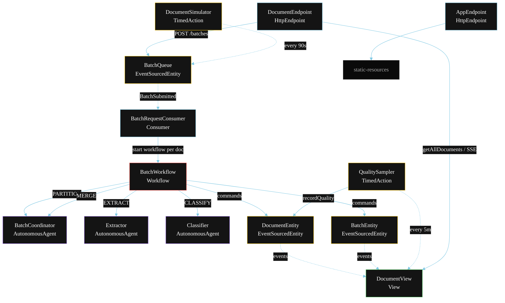
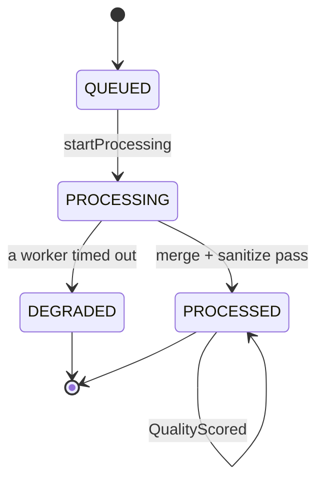
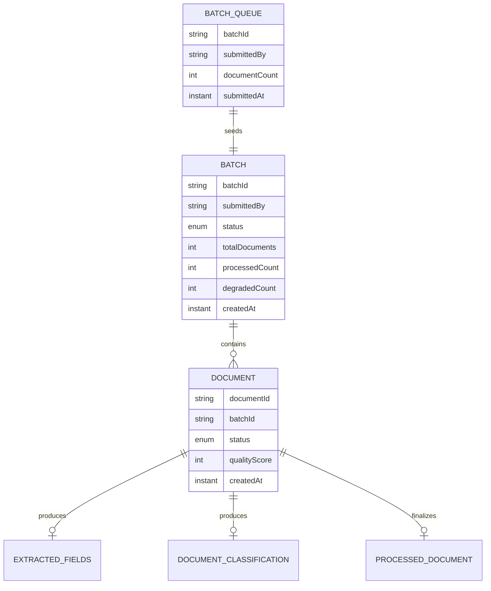

# PLAN — High-Volume Document Analyzer

Architectural sketch for `/akka:specify`. Mirrors `SPEC.md` Section 4 component names exactly. Mermaid sources here are rendered on the Architecture tab of the embedded UI; carry the Lesson 24 CSS overrides into the generated `index.html`.

## Component graph



Solid arrows: synchronous commands. Dashed arrows: event subscriptions. Dotted arrows: scheduled ticks.

## Interaction sequence

```mermaid
sequenceDiagram
  participant U as User / Simulator
  participant DE as DocumentEndpoint
  participant BQ as BatchQueue
  participant WF as BatchWorkflow
  participant CO as BatchCoordinator
  participant EX as Extractor
  participant CL as Classifier
  participant DOC as DocumentEntity
  participant BAT as BatchEntity

  U->>DE: POST /api/documents/batches {rawDocuments}
  DE->>BQ: submitBatch
  BQ-->>WF: BatchRequestConsumer starts one workflow per doc
  WF->>BAT: createBatch + startBatch (PENDING → IN_PROGRESS)
  WF->>DOC: queueDocument (QUEUED)
  WF->>CO: PARTITION -> WorkPartition
  WF->>DOC: startProcessing (PROCESSING)
  par parallel fan-out
    WF->>EX: EXTRACT -> ExtractedFields
  and
    WF->>CL: CLASSIFY -> DocumentClassification
  end
  Note over WF: join; if either step times out (60s) -> degradeStep
  WF->>CO: MERGE(fields, classification) -> ProcessedDocument
  WF->>WF: sanitizeStep scans sanitizedText for PII
  WF->>DOC: markProcessed (PROCESSED)
  WF->>BAT: documentDone -> BatchComplete or BatchPartiallyComplete
```

## State machine



## Entity model



## Component table

| Component | Akka primitive | File path |
|---|---|---|
| `BatchCoordinator` | AutonomousAgent | `application/BatchCoordinator.java` |
| `Extractor` | AutonomousAgent | `application/Extractor.java` |
| `Classifier` | AutonomousAgent | `application/Classifier.java` |
| `DocumentTasks` | Task constants | `application/DocumentTasks.java` |
| `BatchWorkflow` | Workflow | `application/BatchWorkflow.java` |
| `DocumentEntity` | EventSourcedEntity | `domain/DocumentEntity.java` |
| `BatchEntity` | EventSourcedEntity | `domain/BatchEntity.java` |
| `BatchQueue` | EventSourcedEntity | `domain/BatchQueue.java` |
| `DocumentView` | View | `application/DocumentView.java` |
| `BatchRequestConsumer` | Consumer | `application/BatchRequestConsumer.java` |
| `DocumentSimulator` | TimedAction | `application/DocumentSimulator.java` |
| `QualitySampler` | TimedAction | `application/QualitySampler.java` |
| `DocumentEndpoint` | HttpEndpoint | `api/DocumentEndpoint.java` |
| `AppEndpoint` | HttpEndpoint | `api/AppEndpoint.java` |

## Concurrency notes

- **Step timeouts (Lesson 4):** `extractStep` and `classifyStep` each get 60s; `mergeStep` gets 90s. The 5s default fails every LLM call. `WorkflowSettings` is nested inside `Workflow` — no import.
- **Parallel fan-out:** `extractStep` and `classifyStep` run concurrently via `CompletionStage` zip, not two sequential step calls.
- **Idempotency:** the workflow id is the `documentId`. Re-delivery of the same `BatchSubmitted` event resolves to the same workflow instance per document — no duplicate processing.
- **Degrade path (compensation):** if either worker times out, `defaultStepRecovery` routes to `degradeStep`, which merges from whichever partial output exists and ends with `DocumentDegraded`. No infinite retry. The batch continues with remaining documents.
- **Quality sampling:** `QualitySampler` reads `DocumentView.getAllDocuments` (no enum WHERE clause — Lesson 2) and filters client-side for the oldest `PROCESSED` document lacking a `qualityScore`.
- **Batch completion:** `BatchEntity` receives a `documentDone` command for each finished document (PROCESSED or DEGRADED). When `processedCount + degradedCount == totalDocuments`, it emits `BatchComplete` if `degradedCount == 0`, else `BatchPartiallyComplete`.
