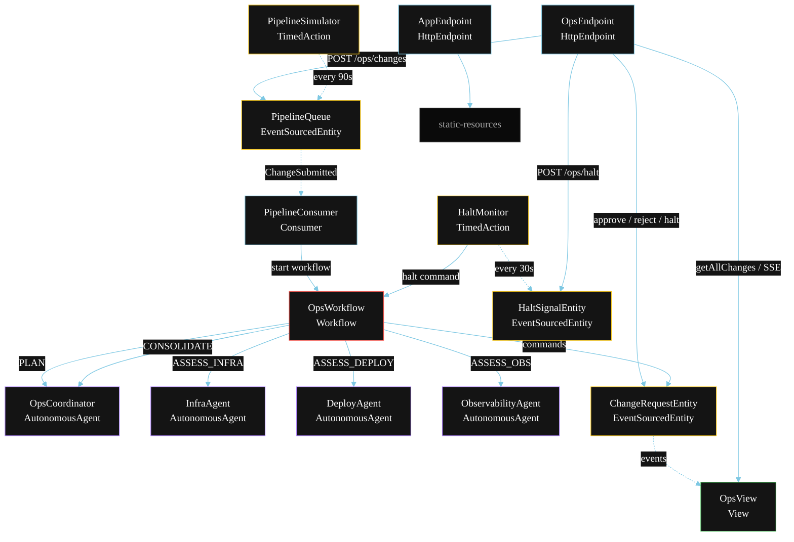
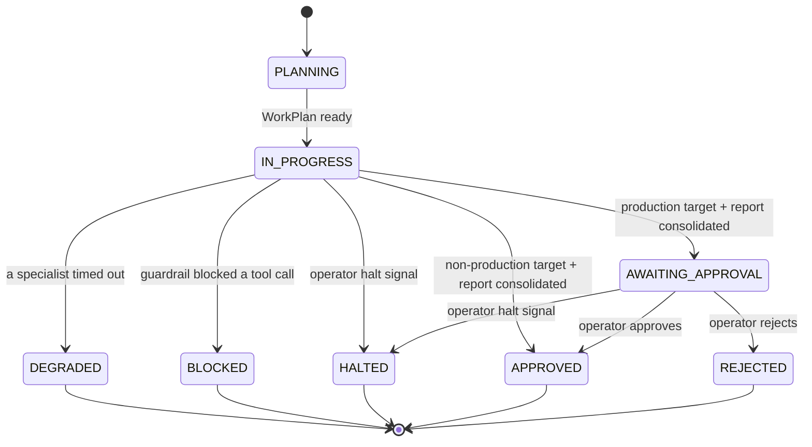
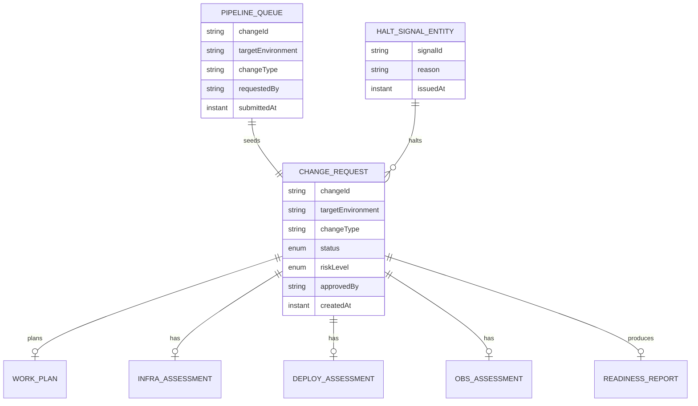

# PLAN — DevOps Multi-Agent

Architectural sketch for `/akka:specify`. Mirrors `SPEC.md` Section 4 component names exactly. Mermaid sources here are rendered on the Architecture tab of the embedded UI; carry the Lesson 24 CSS overrides into the generated `index.html`.

## Component graph



Solid arrows: synchronous commands. Dashed arrows: event subscriptions or scheduled ticks.

## Interaction sequence

```mermaid
sequenceDiagram
  participant U as User / Simulator
  participant OE as OpsEndpoint
  participant PQ as PipelineQueue
  participant WF as OpsWorkflow
  participant CO as OpsCoordinator
  participant IA as InfraAgent
  participant DA as DeployAgent
  participant OA as ObservabilityAgent
  participant CE as ChangeRequestEntity

  U->>OE: POST /api/ops/changes {env, type, description}
  OE->>PQ: submitChange
  PQ-->>WF: PipelineConsumer starts workflow
  WF->>CE: createChange (PLANNING)
  WF->>CO: PLAN -> WorkPlan
  WF->>CE: workPlanEmitted (IN_PROGRESS)
  par parallel fan-out
    WF->>IA: ASSESS_INFRA -> InfraAssessment
  and
    WF->>DA: ASSESS_DEPLOY -> DeployAssessment
  and
    WF->>OA: ASSESS_OBS -> ObsAssessment
  end
  Note over WF: join; if any step times out (60s) -> degradeStep
  WF->>CO: CONSOLIDATE(infra, deploy, obs) -> ReadinessReport
  WF->>WF: guardStep — before-tool-call blocklist check
  alt production target
    WF->>CE: requestApproval (AWAITING_APPROVAL)
    U->>OE: POST /approve
    WF->>CE: approve (APPROVED)
  else non-production target
    WF->>CE: approve (APPROVED)
  end
```

## State machine



## Entity model



## Component table

| Component | Akka primitive | File path |
|---|---|---|
| `OpsCoordinator` | AutonomousAgent | `application/OpsCoordinator.java` |
| `InfraAgent` | AutonomousAgent | `application/InfraAgent.java` |
| `DeployAgent` | AutonomousAgent | `application/DeployAgent.java` |
| `ObservabilityAgent` | AutonomousAgent | `application/ObservabilityAgent.java` |
| `OpsTasks` | Task constants | `application/OpsTasks.java` |
| `OpsWorkflow` | Workflow | `application/OpsWorkflow.java` |
| `ChangeRequestEntity` | EventSourcedEntity | `domain/ChangeRequestEntity.java` |
| `PipelineQueue` | EventSourcedEntity | `domain/PipelineQueue.java` |
| `HaltSignalEntity` | EventSourcedEntity | `domain/HaltSignalEntity.java` |
| `OpsView` | View | `application/OpsView.java` |
| `PipelineConsumer` | Consumer | `application/PipelineConsumer.java` |
| `PipelineSimulator` | TimedAction | `application/PipelineSimulator.java` |
| `HaltMonitor` | TimedAction | `application/HaltMonitor.java` |
| `OpsEndpoint` | HttpEndpoint | `api/OpsEndpoint.java` |
| `AppEndpoint` | HttpEndpoint | `api/AppEndpoint.java` |

## Concurrency notes

- **Step timeouts (Lesson 4):** `infraStep`, `deployStep`, and `obsStep` each get 60s; `consolidateStep` gets 90s. The 5s default fails every LLM call. `WorkflowSettings` is nested inside `Workflow` — no import.
- **Parallel fan-out:** `infraStep`, `deployStep`, and `obsStep` run concurrently via `CompletionStage` zip over three futures, not sequential calls.
- **Idempotency:** the workflow id is the `changeId`. Re-delivery of the same `ChangeSubmitted` event resolves to the same workflow instance — no duplicate change request.
- **Degrade path (compensation):** if any specialist times out, `defaultStepRecovery` routes to `degradeStep`, which consolidates from whichever assessments returned and ends with `ChangeDegraded`. No infinite retry.
- **Halt path:** `HaltMonitor` reads `HaltSignalEntity`; active signals cause halt commands to in-flight workflows. The workflow checks for halt at each step boundary and calls `ChangeRequestEntity.halt` on detection.
- **Approval gate:** the workflow pauses after `ApprovalRequested` and waits for an external resume. The endpoint's approve/reject handlers call the workflow's resume with the operator's decision.
