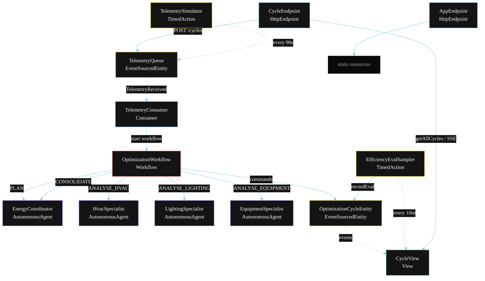
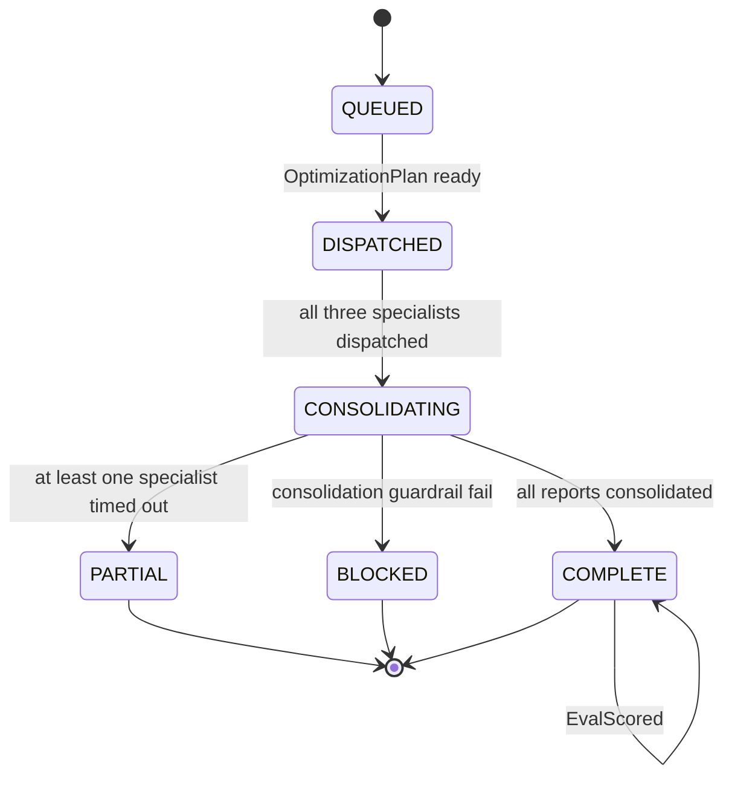
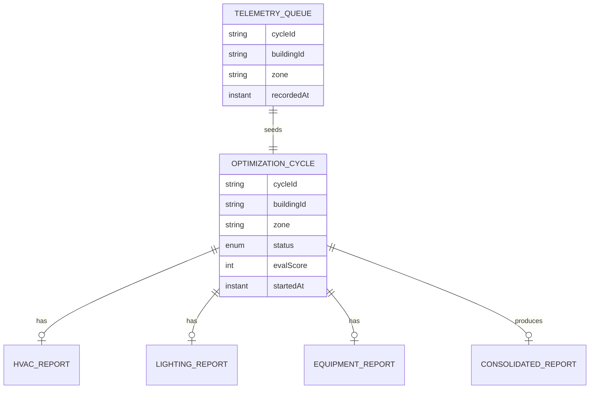

# PLAN — Energy Efficiency Management Agent

Architectural sketch for `/akka:specify`. Mirrors `SPEC.md` Section 4 component names exactly. Mermaid sources here are rendered on the Architecture tab of the embedded UI; carry the Lesson 24 CSS overrides into the generated `index.html`.

## Component graph



Solid arrows: synchronous commands. Dashed arrows: event subscriptions. Dotted arrows: scheduled ticks.

## Interaction sequence

```mermaid
sequenceDiagram
  participant U as User / Simulator
  participant CE as CycleEndpoint
  participant TQ as TelemetryQueue
  participant WF as OptimizationWorkflow
  participant EC as EnergyCoordinator
  participant HS as HvacSpecialist
  participant LS as LightingSpecialist
  participant ES as EquipmentSpecialist
  participant OC as OptimizationCycleEntity

  U->>CE: POST /api/cycles {buildingId, zone}
  CE->>TQ: receiveTelemetry
  TQ-->>WF: TelemetryConsumer starts workflow
  WF->>OC: startCycle (QUEUED → DISPATCHED)
  WF->>EC: PLAN -> OptimizationPlan
  WF->>OC: status DISPATCHED → CONSOLIDATING (pre-fan-out)
  par parallel fan-out
    WF->>HS: ANALYSE_HVAC -> HvacReport
  and
    WF->>LS: ANALYSE_LIGHTING -> LightingReport
  and
    WF->>ES: ANALYSE_EQUIPMENT -> EquipmentReport
  end
  Note over HS,ES: before-tool-call guardrail gates each control action
  Note over WF: join; if any step times out (90s) -> partialStep
  WF->>EC: CONSOLIDATE(hvac, lighting, equipment) -> ConsolidatedReport
  alt all reports arrived
    WF->>OC: consolidate (COMPLETE)
  else at least one timed out
    WF->>OC: markPartial (PARTIAL)
  end
```

## State machine



## Entity model



## Component table

| Component | Akka primitive | File path |
|---|---|---|
| `EnergyCoordinator` | AutonomousAgent | `application/EnergyCoordinator.java` |
| `HvacSpecialist` | AutonomousAgent | `application/HvacSpecialist.java` |
| `LightingSpecialist` | AutonomousAgent | `application/LightingSpecialist.java` |
| `EquipmentSpecialist` | AutonomousAgent | `application/EquipmentSpecialist.java` |
| `EnergyTasks` | Task constants | `application/EnergyTasks.java` |
| `OptimizationWorkflow` | Workflow | `application/OptimizationWorkflow.java` |
| `OptimizationCycleEntity` | EventSourcedEntity | `domain/OptimizationCycleEntity.java` |
| `TelemetryQueue` | EventSourcedEntity | `domain/TelemetryQueue.java` |
| `CycleView` | View | `application/CycleView.java` |
| `TelemetryConsumer` | Consumer | `application/TelemetryConsumer.java` |
| `TelemetrySimulator` | TimedAction | `application/TelemetrySimulator.java` |
| `EfficiencyEvalSampler` | TimedAction | `application/EfficiencyEvalSampler.java` |
| `CycleEndpoint` | HttpEndpoint | `api/CycleEndpoint.java` |
| `AppEndpoint` | HttpEndpoint | `api/AppEndpoint.java` |

## Concurrency notes

- **Step timeouts (Lesson 4):** `hvacStep`, `lightingStep`, and `equipmentStep` each get 90s; `consolidateStep` gets 120s. The 5s default fails every LLM call. `WorkflowSettings` is nested inside `Workflow` — no import.
- **Parallel fan-out:** `hvacStep`, `lightingStep`, and `equipmentStep` run concurrently via `CompletionStage` zip of all three, not three sequential step calls.
- **Idempotency:** the workflow id is the `cycleId`. Re-delivery of the same `TelemetryReceived` event resolves to the same workflow instance — no duplicate cycle.
- **Partial path (compensation):** if any specialist times out, `defaultStepRecovery` routes to `partialStep`, which consolidates from whichever reports arrived and ends with `CyclePartial`. No infinite retry.
- **Eval sampling:** `EfficiencyEvalSampler` reads `CycleView.getAllCycles` (no enum WHERE clause — Lesson 2) and filters client-side for the oldest `COMPLETE` cycle lacking an `evalScore`.
- **Guardrail placement:** the before-tool-call guardrail is registered per specialist agent. It runs inside the agent's tool-call boundary, so the workflow step never sees a rejected action — the specialist's report marks it `blockedByGuardrail = true` and the action is not forwarded for physical execution.
