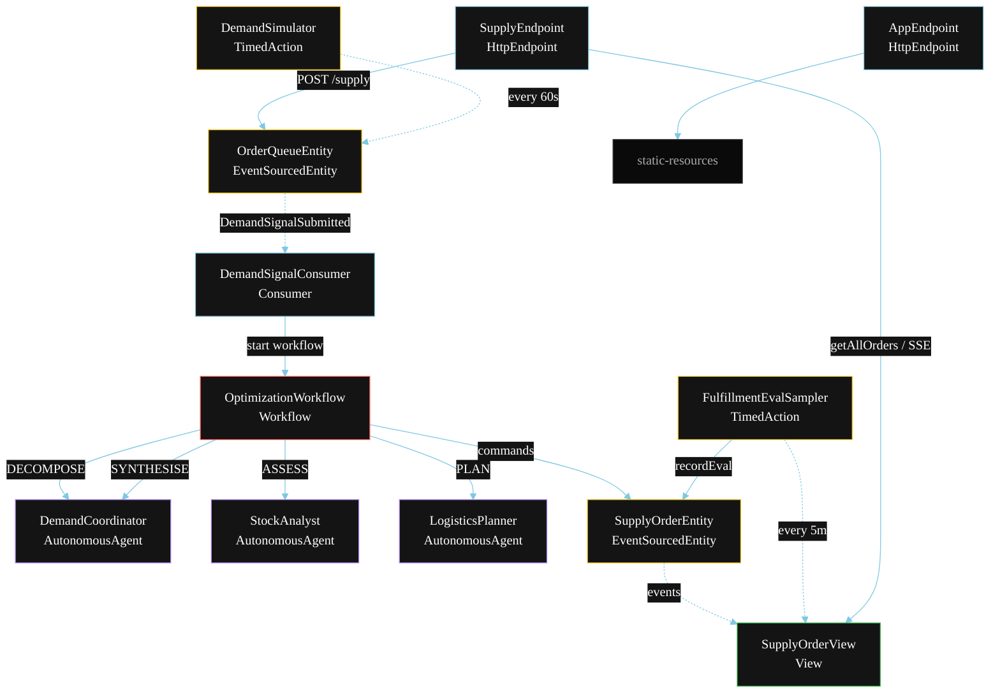
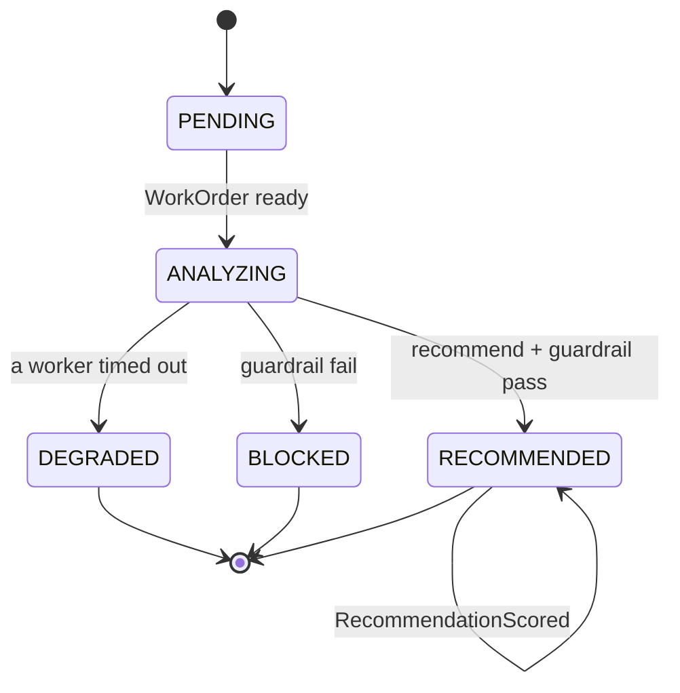
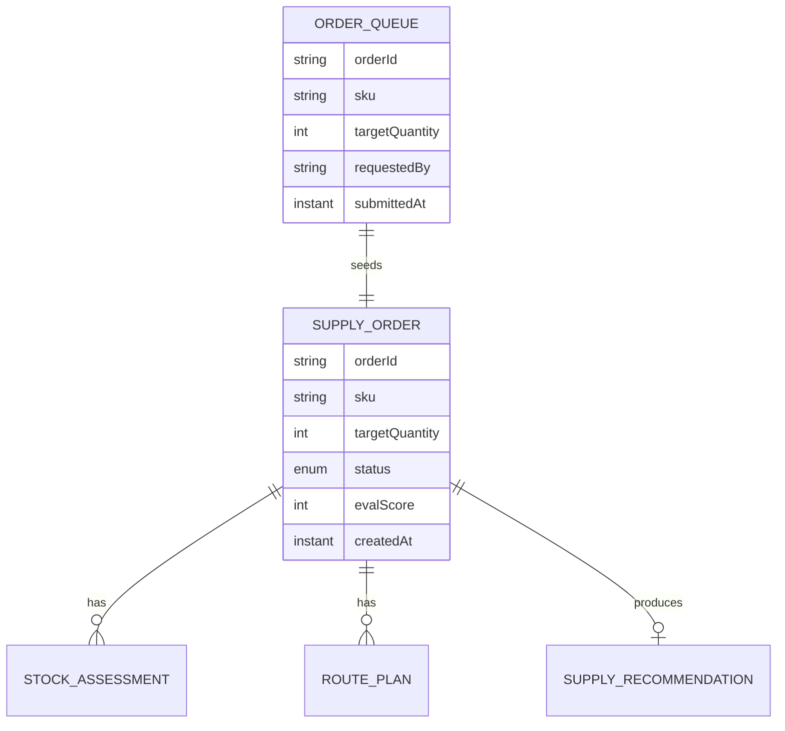

# PLAN — Multi-Agent Supply Chain Optimizer

Architectural sketch for `/akka:specify`. Mirrors `SPEC.md` Section 4 component names exactly. Mermaid sources here are rendered on the Architecture tab of the embedded UI; carry the Lesson 24 CSS overrides into the generated `index.html`.

## Component graph



Solid arrows: synchronous commands. Dashed arrows: event subscriptions. Dotted arrows: scheduled ticks.

## Interaction sequence

```mermaid
sequenceDiagram
  participant U as User / Simulator
  participant SE as SupplyEndpoint
  participant OQ as OrderQueueEntity
  participant WF as OptimizationWorkflow
  participant CO as DemandCoordinator
  participant SA as StockAnalyst
  participant LP as LogisticsPlanner
  participant OE as SupplyOrderEntity

  U->>SE: POST /api/supply {sku, targetQuantity}
  SE->>OQ: enqueueSignal
  OQ-->>WF: DemandSignalConsumer starts workflow
  WF->>OE: createOrder (PENDING)
  WF->>CO: DECOMPOSE -> WorkOrder
  WF->>OE: status ANALYZING
  par parallel fan-out
    WF->>SA: ASSESS -> StockAssessment
  and
    WF->>LP: PLAN -> RoutePlan
  end
  Note over WF: join; if either step times out (60s) -> degradeStep
  WF->>CO: SYNTHESISE(stockAssessment, routePlan) -> SupplyRecommendation
  WF->>WF: guardrailStep vets the recommendation
  alt guardrail passes
    WF->>OE: recommend (RECOMMENDED)
  else guardrail fails
    WF->>OE: block (BLOCKED)
  end
```

## State machine



## Entity model



## Component table

| Component | Akka primitive | File path |
|---|---|---|
| `DemandCoordinator` | AutonomousAgent | `application/DemandCoordinator.java` |
| `StockAnalyst` | AutonomousAgent | `application/StockAnalyst.java` |
| `LogisticsPlanner` | AutonomousAgent | `application/LogisticsPlanner.java` |
| `SupplyTasks` | Task constants | `application/SupplyTasks.java` |
| `OptimizationWorkflow` | Workflow | `application/OptimizationWorkflow.java` |
| `SupplyOrderEntity` | EventSourcedEntity | `domain/SupplyOrderEntity.java` |
| `OrderQueueEntity` | EventSourcedEntity | `domain/OrderQueueEntity.java` |
| `SupplyOrderView` | View | `application/SupplyOrderView.java` |
| `DemandSignalConsumer` | Consumer | `application/DemandSignalConsumer.java` |
| `DemandSimulator` | TimedAction | `application/DemandSimulator.java` |
| `FulfillmentEvalSampler` | TimedAction | `application/FulfillmentEvalSampler.java` |
| `SupplyEndpoint` | HttpEndpoint | `api/SupplyEndpoint.java` |
| `AppEndpoint` | HttpEndpoint | `api/AppEndpoint.java` |

## Concurrency notes

- **Step timeouts (Lesson 4):** `assessStep` and `planStep` get 60s; `synthesiseStep` gets 90s. The 5s default fails every LLM call. `WorkflowSettings` is nested inside `Workflow` — no import.
- **Parallel fan-out:** `assessStep` and `planStep` run concurrently via `CompletionStage` zip, not two sequential step calls.
- **Idempotency:** the workflow id is the `orderId`. Re-delivery of the same `DemandSignalSubmitted` event resolves to the same workflow instance — no duplicate order.
- **Degrade path (compensation):** if either worker times out, `defaultStepRecovery` routes to `degradeStep`, which synthesises from whichever partial output exists and ends with `OrderDegraded`. No infinite retry.
- **Eval sampling:** `FulfillmentEvalSampler` reads `SupplyOrderView.getAllOrders` (no enum WHERE clause — Lesson 2) and filters client-side for the oldest `RECOMMENDED` order lacking an `evalScore`.
