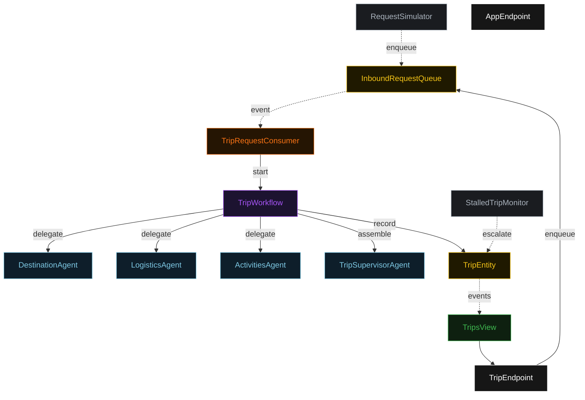
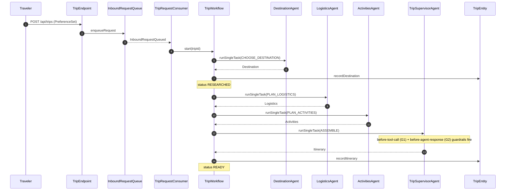
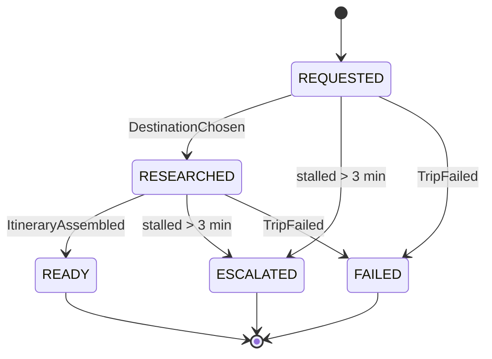
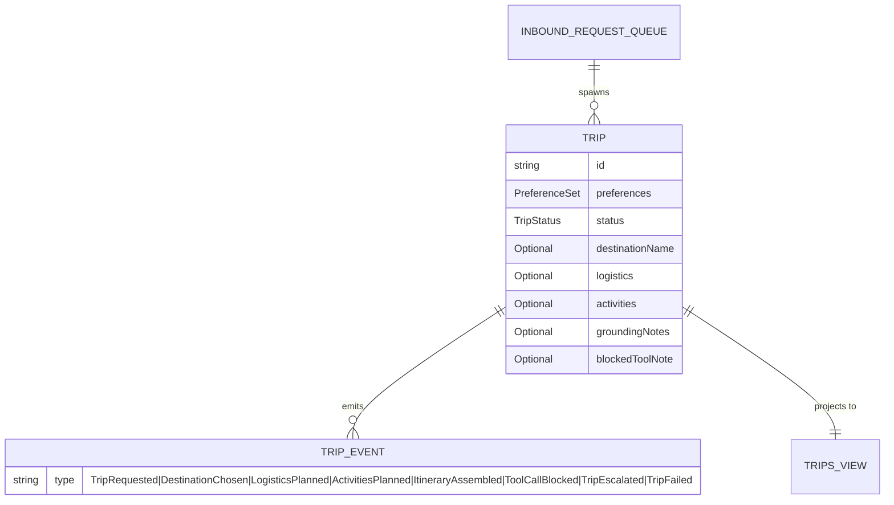

# PLAN — surprise-trip-planner

Architectural sketch for the delegation-supervisor-workers x planning-travel cell. All four mermaid diagrams and the component table are below.

---

## Component graph

## Interaction sequence

## State machine

## Entity model

## Component table

| Component | Path (generated) |
|---|---|
| TripSupervisorAgent | `application/TripSupervisorAgent.java` |
| DestinationAgent | `application/DestinationAgent.java` |
| LogisticsAgent | `application/LogisticsAgent.java` |
| ActivitiesAgent | `application/ActivitiesAgent.java` |
| SupervisorTasks | `application/SupervisorTasks.java` |
| TripWorkflow | `application/TripWorkflow.java` |
| TripEntity | `domain/TripEntity.java` |
| InboundRequestQueue | `domain/InboundRequestQueue.java` |
| TripsView | `application/TripsView.java` |
| TripRequestConsumer | `application/TripRequestConsumer.java` |
| RequestSimulator | `application/RequestSimulator.java` |
| StalledTripMonitor | `application/StalledTripMonitor.java` |
| TripEndpoint | `api/TripEndpoint.java` |
| AppEndpoint | `api/AppEndpoint.java` |

## Concurrency notes

- **Step timeouts:** every agent-calling workflow step sets `stepTimeout(60s)` (Lesson 4); the default 5s timeout fails on LLM calls.
- **Idempotency:** `TripWorkflow` is keyed by a fresh UUID per inbound request; the consumer derives the workflow id from the queued event so replays do not double-start.
- **Failover:** `defaultStepRecovery(maxRetries(2).failoverTo(error))` routes exhausted steps to a terminal `FAILED` state via `TripEntity.markFailed`.
- **Compensation:** no irreversible external effect; assembly happens only after all three worker results are present, so a mid-plan failure leaves the trip in `REQUESTED`/`RESEARCHED` for the monitor to escalate rather than a partially-published itinerary.
- **Guardrail placement:** G1 runs before each worker's external-tool call; G2 runs before the supervisor's assembled response is persisted.
