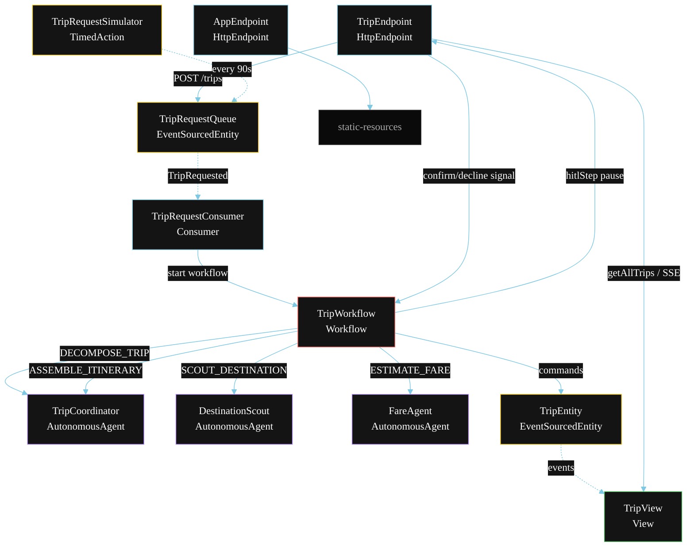
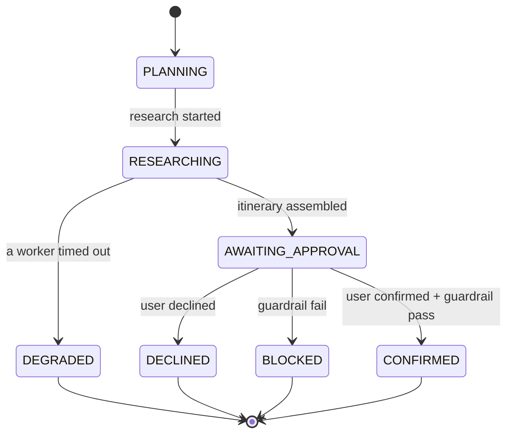
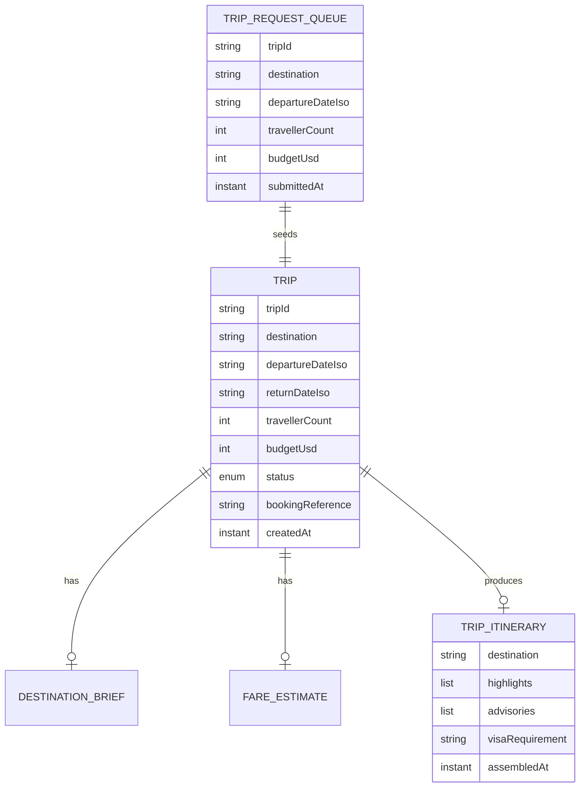

# PLAN — Travel Concierge

Architectural sketch for `/akka:specify`. Mirrors `SPEC.md` Section 4 component names exactly. Mermaid sources here are rendered on the Architecture tab of the embedded UI; carry the Lesson 24 CSS overrides into the generated `index.html`.

## Component graph



Solid arrows: synchronous commands. Dashed arrows: event subscriptions or scheduled ticks. The confirm/decline signal is a REST call that resumes the paused workflow.

## Interaction sequence

```mermaid
sequenceDiagram
  participant U as User / Simulator
  participant TE as TripEndpoint
  participant TRQ as TripRequestQueue
  participant WF as TripWorkflow
  participant CO as TripCoordinator
  participant DS as DestinationScout
  participant FA as FareAgent
  participant TR as TripEntity

  U->>TE: POST /api/trips {TripRequest}
  TE->>TRQ: enqueueTripRequest
  TRQ-->>WF: TripRequestConsumer starts workflow
  WF->>TR: createTrip (PLANNING)
  WF->>CO: DECOMPOSE_TRIP -> TripPlan
  WF->>TR: startResearch (RESEARCHING)
  par parallel fan-out
    WF->>DS: SCOUT_DESTINATION -> DestinationBrief
  and
    WF->>FA: ESTIMATE_FARE -> FareEstimate
  end
  Note over WF: join; if either step times out (60s) -> degradeStep
  WF->>CO: ASSEMBLE_ITINERARY(brief, fare) -> TripItinerary
  WF->>TR: assembleItinerary (AWAITING_APPROVAL)
  WF->>WF: hitlStep — pause and wait for user signal
  U->>TE: POST /api/trips/{id}/confirm
  TE->>WF: resume with confirm signal
  WF->>WF: guardrailStep vets booking payload
  alt guardrail passes
    WF->>TR: confirmTrip (CONFIRMED)
  else guardrail fails
    WF->>TR: blockTrip (BLOCKED)
  end
```

## State machine



## Entity model



## Component table

| Component | Akka primitive | File path |
|---|---|---|
| `TripCoordinator` | AutonomousAgent | `application/TripCoordinator.java` |
| `DestinationScout` | AutonomousAgent | `application/DestinationScout.java` |
| `FareAgent` | AutonomousAgent | `application/FareAgent.java` |
| `TripTasks` | Task constants | `application/TripTasks.java` |
| `TripWorkflow` | Workflow | `application/TripWorkflow.java` |
| `TripEntity` | EventSourcedEntity | `domain/TripEntity.java` |
| `TripRequestQueue` | EventSourcedEntity | `domain/TripRequestQueue.java` |
| `TripView` | View | `application/TripView.java` |
| `TripRequestConsumer` | Consumer | `application/TripRequestConsumer.java` |
| `TripRequestSimulator` | TimedAction | `application/TripRequestSimulator.java` |
| `TripEndpoint` | HttpEndpoint | `api/TripEndpoint.java` |
| `AppEndpoint` | HttpEndpoint | `api/AppEndpoint.java` |

## Concurrency notes

- **Step timeouts (Lesson 4):** `scoutStep` and `fareStep` get 60 s; `assembleStep` gets 90 s. The 5 s default fails every LLM call. `WorkflowSettings` is nested inside `Workflow` — no import.
- **Parallel fan-out:** `scoutStep` and `fareStep` run concurrently via `CompletionStage` zip, not two sequential step calls.
- **HITL pause:** `hitlStep` suspends the workflow by emitting `ApprovalRequested` on `TripEntity` and yielding a `Workflow.pause()`. The endpoint's confirm/decline handlers call the workflow's resume signal. The workflow holds state durably — a service restart does not lose the pending HITL.
- **Guardrail placement:** the before-tool-call guardrail runs in `guardrailStep`, after user confirmation. The tool call (booking) is never issued unless this step passes. Failures end the workflow with `TripBlocked`.
- **Idempotency:** the workflow id is the `tripId`. Re-delivery of the same `TripRequested` event resolves to the same workflow instance — no duplicate trip.
- **Degrade path:** if either worker times out, `defaultStepRecovery` routes to `degradeStep`, which assembles from whichever partial output exists and ends with `TripDegraded`. No infinite retry.
