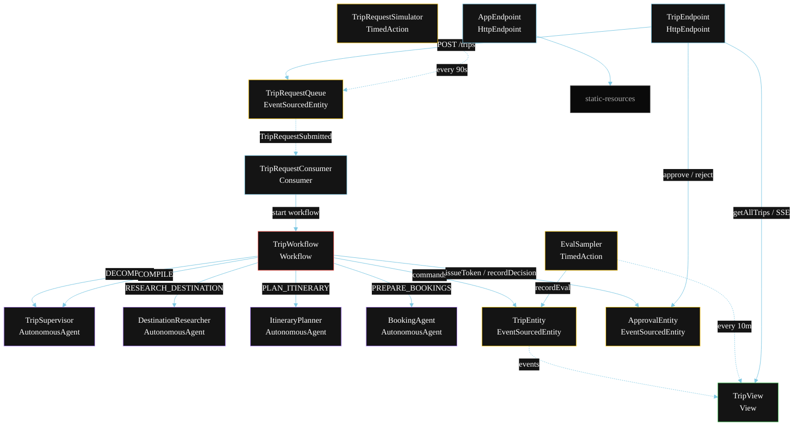
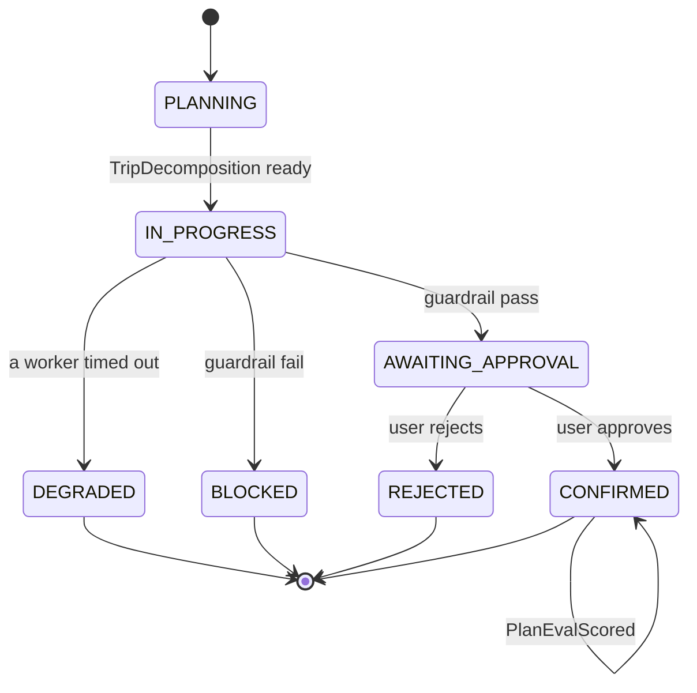
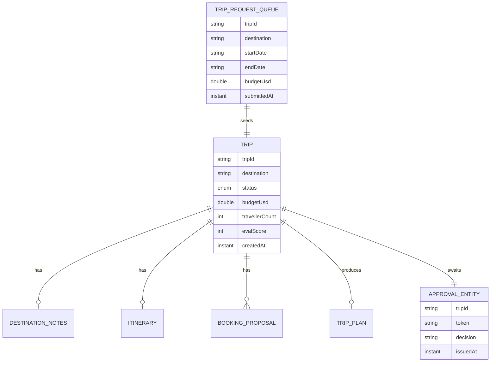

# PLAN — Trip Planner Multi-Agent

Architectural sketch for `/akka:specify`. Mirrors `SPEC.md` Section 4 component names exactly. Mermaid sources here are rendered on the Architecture tab of the embedded UI; carry the Lesson 24 CSS overrides into the generated `index.html`.

## Component graph



Solid arrows: synchronous commands. Dashed arrows: event subscriptions. Dotted arrows: scheduled ticks.

## Interaction sequence

```mermaid
sequenceDiagram
  participant U as User / Simulator
  participant TE as TripEndpoint
  participant TRQ as TripRequestQueue
  participant WF as TripWorkflow
  participant SUP as TripSupervisor
  participant DR as DestinationResearcher
  participant IP as ItineraryPlanner
  participant BA as BookingAgent
  participant TRIP as TripEntity
  participant APR as ApprovalEntity

  U->>TE: POST /api/trips {destination, dates, budget}
  TE->>TRQ: enqueueRequest
  TRQ-->>WF: TripRequestConsumer starts workflow
  WF->>TRIP: createTrip (PLANNING)
  WF->>SUP: DECOMPOSE -> TripDecomposition
  WF->>TRIP: status IN_PROGRESS
  par parallel fan-out
    WF->>DR: RESEARCH_DESTINATION -> DestinationNotes
  and
    WF->>IP: PLAN_ITINERARY -> Itinerary
  and
    WF->>BA: PREPARE_BOOKINGS -> List<BookingProposal>
  end
  Note over WF: join; if any step times out (60s) -> degradeStep
  WF->>SUP: COMPILE(notes, itinerary, proposals) -> TripPlan
  WF->>WF: guardrailStep checks proposals vs budget
  alt guardrail passes
    WF->>TRIP: requestApproval (AWAITING_APPROVAL)
    WF->>APR: issueToken
    Note over WF: workflow pauses; waits for approve/reject
    U->>TE: POST /api/trips/{id}/approve {token}
    TE->>APR: recordDecision(approve)
    WF->>TRIP: confirmTrip (CONFIRMED)
  else guardrail fails
    WF->>TRIP: block (BLOCKED)
  end
```

## State machine



## Entity model



## Component table

| Component | Akka primitive | File path |
|---|---|---|
| `TripSupervisor` | AutonomousAgent | `application/TripSupervisor.java` |
| `DestinationResearcher` | AutonomousAgent | `application/DestinationResearcher.java` |
| `ItineraryPlanner` | AutonomousAgent | `application/ItineraryPlanner.java` |
| `BookingAgent` | AutonomousAgent | `application/BookingAgent.java` |
| `TripTasks` | Task constants | `application/TripTasks.java` |
| `TripWorkflow` | Workflow | `application/TripWorkflow.java` |
| `TripEntity` | EventSourcedEntity | `domain/TripEntity.java` |
| `ApprovalEntity` | EventSourcedEntity | `domain/ApprovalEntity.java` |
| `TripRequestQueue` | EventSourcedEntity | `domain/TripRequestQueue.java` |
| `TripView` | View | `application/TripView.java` |
| `TripRequestConsumer` | Consumer | `application/TripRequestConsumer.java` |
| `TripRequestSimulator` | TimedAction | `application/TripRequestSimulator.java` |
| `EvalSampler` | TimedAction | `application/EvalSampler.java` |
| `TripEndpoint` | HttpEndpoint | `api/TripEndpoint.java` |
| `AppEndpoint` | HttpEndpoint | `api/AppEndpoint.java` |

## Concurrency notes

- **Step timeouts (Lesson 4):** `researchStep`, `planStep`, and `bookStep` each get 60s; `compileStep` gets 90s. The 5s default fails every LLM call. `WorkflowSettings` is nested inside `Workflow` — no import.
- **Parallel fan-out:** `researchStep`, `planStep`, and `bookStep` run concurrently via `CompletionStage` allOf, not three sequential step calls.
- **Idempotency:** the workflow id is the `tripId`. Re-delivery of the same `TripRequestSubmitted` event resolves to the same workflow instance — no duplicate trip.
- **Degrade path (compensation):** if any worker times out, `defaultStepRecovery` routes to `degradeStep`, which compiles from whichever partial outputs exist and ends with `TripDegraded`. No infinite retry.
- **HITL pause:** `approvalStep` stores the token in `ApprovalEntity` and calls a suspend-style workflow step. The workflow resumes only when the endpoint delivers the decision — no polling.
- **Eval sampling:** `EvalSampler` reads `TripView.getAllTrips` (no enum WHERE clause — Lesson 2) and filters client-side for the oldest `CONFIRMED` trip lacking an `evalScore`.
