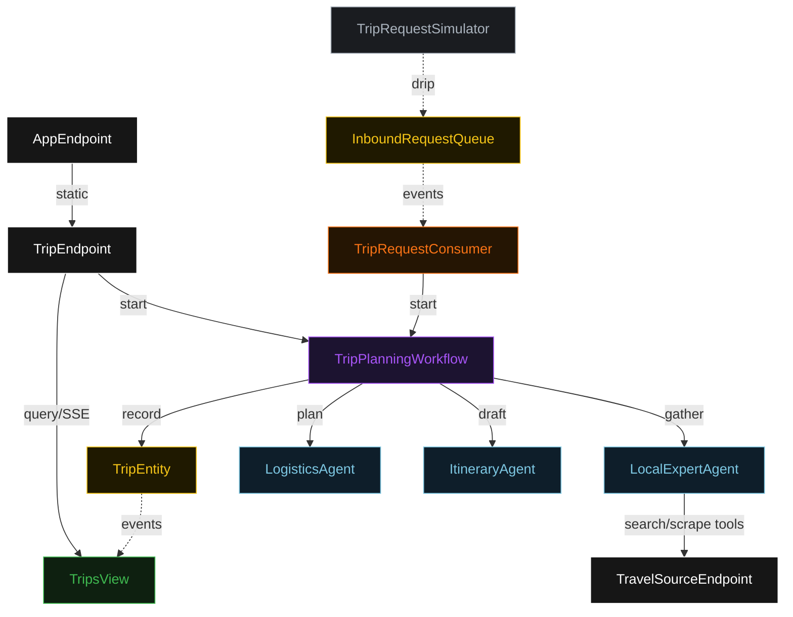
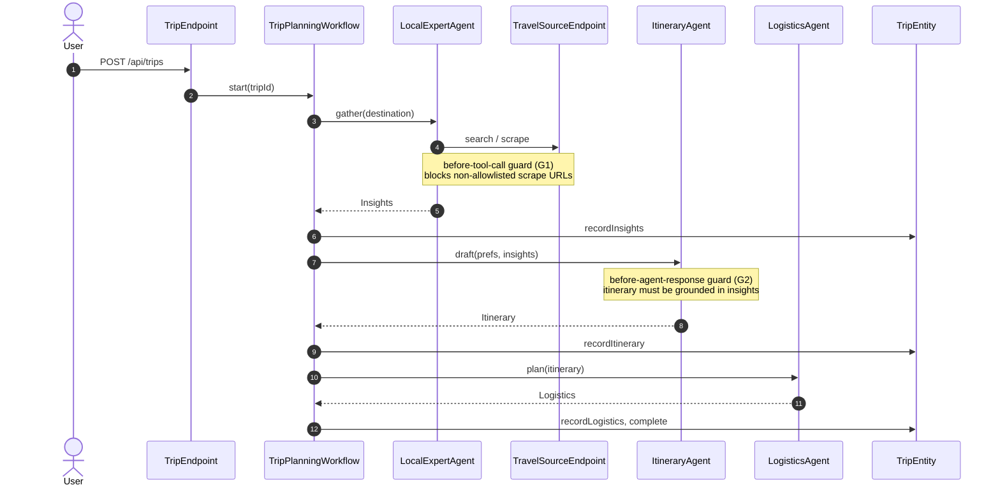
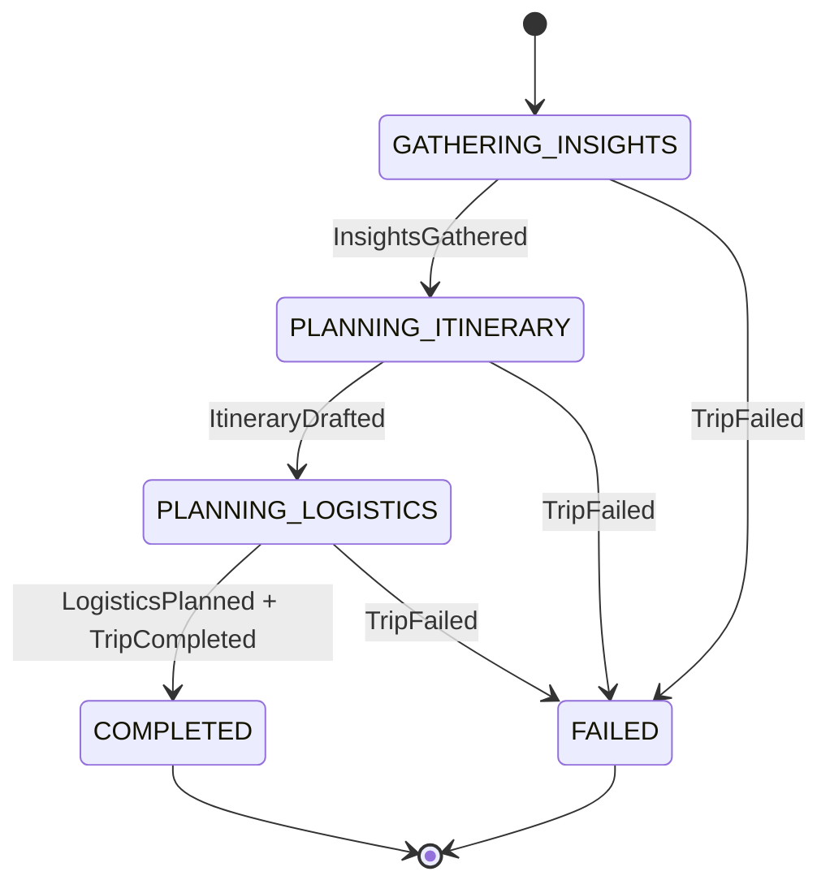
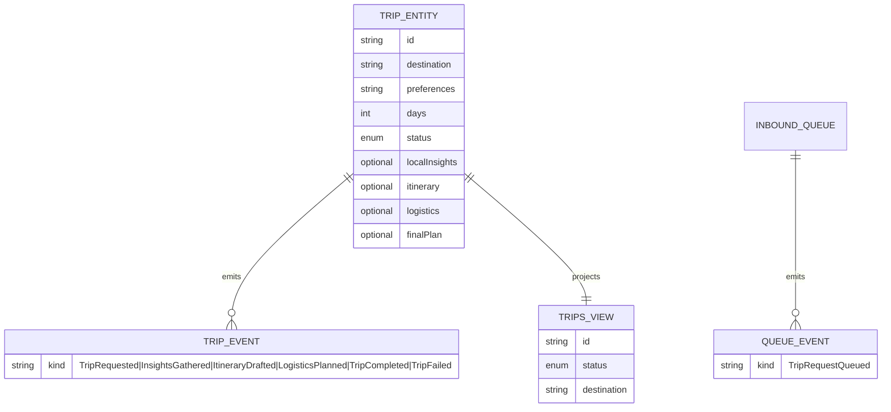

# PLAN — trip-planner-team

Architectural sketch for the delegation-supervisor-workers × planning-travel cell. All four mermaid diagrams + the component table are required. The generated system renders these on the Architecture tab with the Lesson 24 state-label CSS overrides.

---

## Component graph

Solid arrows are synchronous commands, dashed arrows are event subscriptions, dotted arrows are scheduled ticks.

## Interaction sequence

## State machine

## Entity model

## Component table

| Component | Path (generated) |
|---|---|
| `TripPlanningWorkflow` | `application/TripPlanningWorkflow.java` |
| `LocalExpertAgent` | `application/LocalExpertAgent.java` |
| `ItineraryAgent` | `application/ItineraryAgent.java` |
| `LogisticsAgent` | `application/LogisticsAgent.java` |
| `TripEntity` | `application/TripEntity.java` |
| `InboundRequestQueue` | `application/InboundRequestQueue.java` |
| `TripsView` | `application/TripsView.java` |
| `TripRequestConsumer` | `application/TripRequestConsumer.java` |
| `TripRequestSimulator` | `application/TripRequestSimulator.java` |
| `TripEndpoint` | `api/TripEndpoint.java` |
| `TravelSourceEndpoint` | `api/TravelSourceEndpoint.java` |
| `AppEndpoint` | `api/AppEndpoint.java` |
| `TripPlan`, events, `TripStatus` | `domain/` |

## Concurrency notes

- Every agent-calling workflow step sets `stepTimeout(60s)` (Lesson 4); LLM calls exceed the 5s default.
- `defaultStepRecovery(maxRetries(2).failoverTo(TripPlanningWorkflow::fail))` so a worker failure ends the trip in `FAILED` rather than retrying forever.
- The workflow id is the `tripId`; restarting the same id is idempotent because each step writes a distinct event the entity applier folds once.
- The G2 grounding rejection triggers a step retry (bounded by maxRetries); a persistently ungrounded itinerary fails the trip rather than looping.
- No saga/compensation: the simulated publish surface has no irreversible side effect, so a failed trip needs no rollback beyond the `TripFailed` event.
