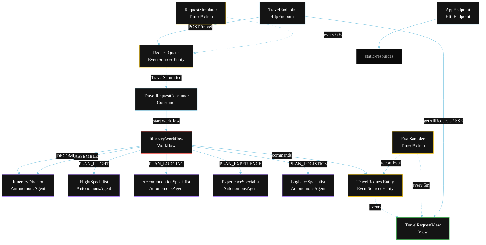
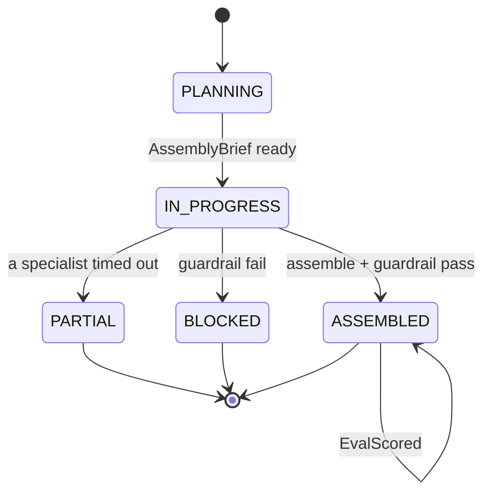
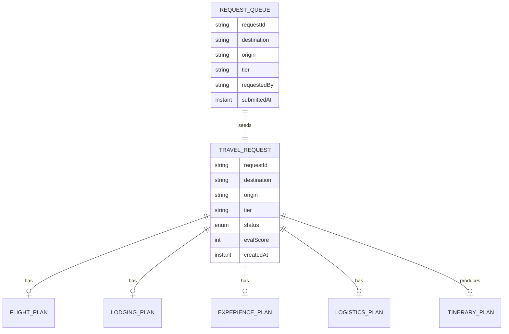

# PLAN — Voyage Virtuoso Multi-Agent

Architectural sketch for `/akka:specify`. Mirrors `SPEC.md` Section 4 component names exactly. Mermaid sources here are rendered on the Architecture tab of the embedded UI; carry the Lesson 24 CSS overrides into the generated `index.html`.

## Component graph



Solid arrows: synchronous commands. Dashed arrows: event subscriptions. Dotted arrows: scheduled ticks.

## Interaction sequence

```mermaid
sequenceDiagram
  participant U as User / Simulator
  participant TE as TravelEndpoint
  participant RQ as RequestQueue
  participant WF as ItineraryWorkflow
  participant ID as ItineraryDirector
  participant FS as FlightSpecialist
  participant AS as AccommodationSpecialist
  participant ES as ExperienceSpecialist
  participant LS as LogisticsSpecialist
  participant TRE as TravelRequestEntity

  U->>TE: POST /api/travel {destination, origin, tier, ...}
  TE->>RQ: enqueueTravel
  RQ-->>WF: TravelRequestConsumer starts workflow
  WF->>TRE: createRequest (PLANNING)
  WF->>ID: DECOMPOSE -> AssemblyBrief
  WF->>TRE: status IN_PROGRESS
  par parallel fan-out
    WF->>FS: PLAN_FLIGHT -> FlightPlan
  and
    WF->>AS: PLAN_LODGING -> LodgingPlan
  and
    WF->>ES: PLAN_EXPERIENCE -> ExperiencePlan
  and
    WF->>LS: PLAN_LOGISTICS -> LogisticsPlan
  end
  Note over WF: join; if any specialist times out (60s) -> partialStep
  WF->>ID: ASSEMBLE(flight, lodging, experience, logistics) -> ItineraryPlan
  WF->>WF: guardrailStep vets the itinerary
  alt guardrail passes
    WF->>TRE: assemble (ASSEMBLED)
  else guardrail fails
    WF->>TRE: block (BLOCKED)
  end
```

## State machine



## Entity model



## Component table

| Component | Akka primitive | File path |
|---|---|---|
| `ItineraryDirector` | AutonomousAgent | `application/ItineraryDirector.java` |
| `FlightSpecialist` | AutonomousAgent | `application/FlightSpecialist.java` |
| `AccommodationSpecialist` | AutonomousAgent | `application/AccommodationSpecialist.java` |
| `ExperienceSpecialist` | AutonomousAgent | `application/ExperienceSpecialist.java` |
| `LogisticsSpecialist` | AutonomousAgent | `application/LogisticsSpecialist.java` |
| `TravelTasks` | Task constants | `application/TravelTasks.java` |
| `ItineraryWorkflow` | Workflow | `application/ItineraryWorkflow.java` |
| `TravelRequestEntity` | EventSourcedEntity | `domain/TravelRequestEntity.java` |
| `RequestQueue` | EventSourcedEntity | `domain/RequestQueue.java` |
| `TravelRequestView` | View | `application/TravelRequestView.java` |
| `TravelRequestConsumer` | Consumer | `application/TravelRequestConsumer.java` |
| `RequestSimulator` | TimedAction | `application/RequestSimulator.java` |
| `EvalSampler` | TimedAction | `application/EvalSampler.java` |
| `TravelEndpoint` | HttpEndpoint | `api/TravelEndpoint.java` |
| `AppEndpoint` | HttpEndpoint | `api/AppEndpoint.java` |

## Concurrency notes

- **Step timeouts (Lesson 4):** `flightStep`, `lodgingStep`, `experienceStep`, and `logisticsStep` each get 60s; `assembleStep` gets 90s. The 5s default fails every LLM call. `WorkflowSettings` is nested inside `Workflow` — no import.
- **Parallel fan-out:** all four specialist steps run concurrently via `CompletionStage` allOf or a four-way combine, not sequential calls.
- **Idempotency:** the workflow id is the `requestId`. Re-delivery of the same `TravelSubmitted` event resolves to the same workflow instance — no duplicate request.
- **Partial path (compensation):** if any specialist times out, `defaultStepRecovery` routes to `partialStep`, which assembles from whichever pillar outputs arrived and ends with `ItineraryPartial`. No infinite retry.
- **Eval sampling:** `EvalSampler` reads `TravelRequestView.getAllRequests` (no enum WHERE clause — Lesson 2) and filters client-side for the oldest `ASSEMBLED` request lacking an `evalScore`.
