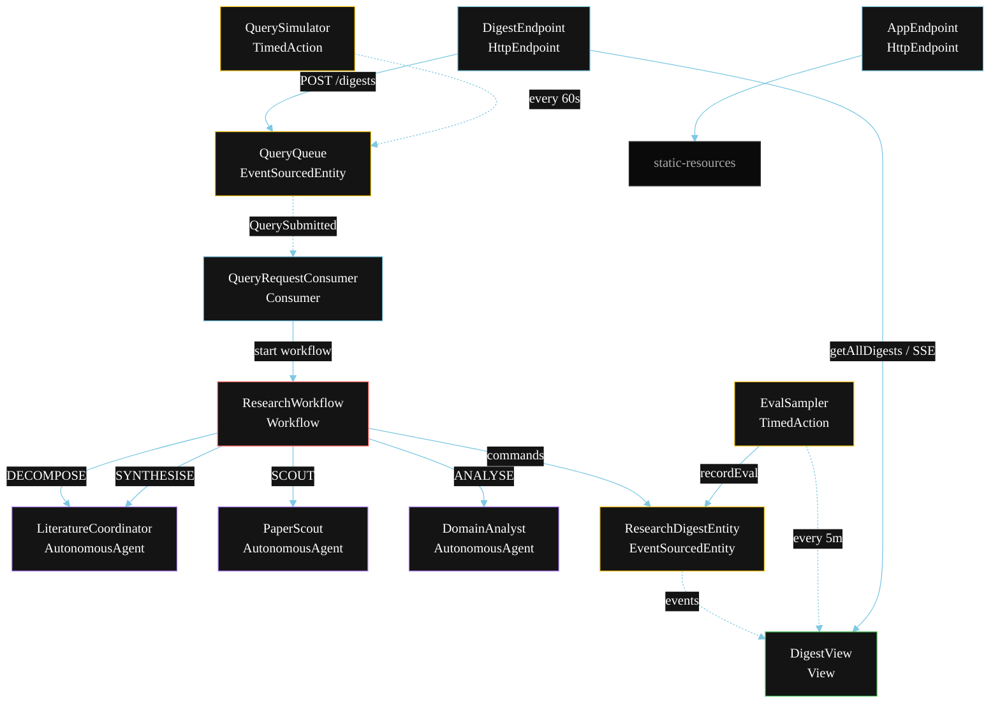
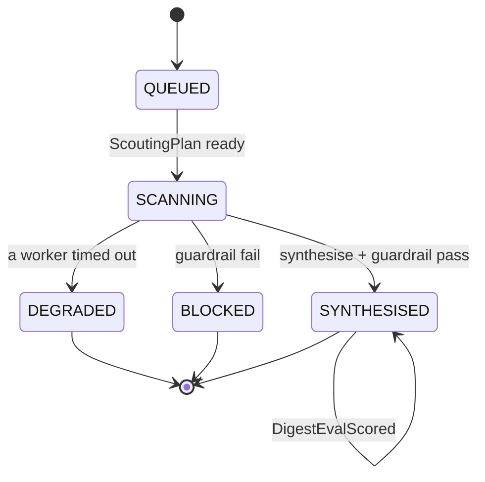
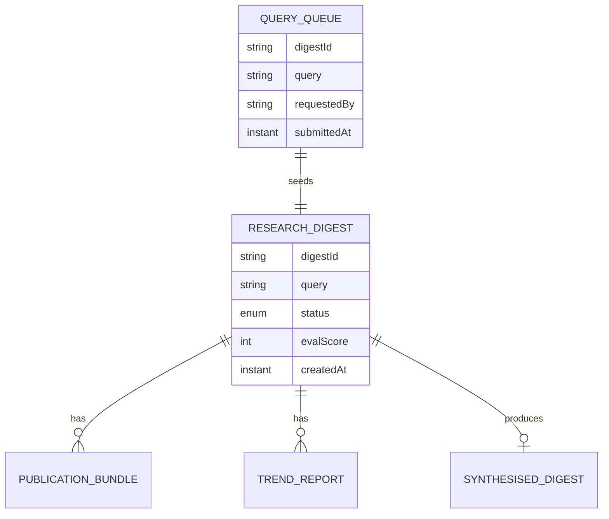

# PLAN — Academic Research Team

Architectural sketch for `/akka:specify`. Mirrors `SPEC.md` Section 4 component names exactly. Mermaid sources here are rendered on the Architecture tab of the embedded UI; carry the Lesson 24 CSS overrides into the generated `index.html`.

## Component graph



Solid arrows: synchronous commands. Dashed arrows: event subscriptions. Dotted arrows: scheduled ticks.

## Interaction sequence

```mermaid
sequenceDiagram
  participant U as User / Simulator
  participant DE as DigestEndpoint
  participant QQ as QueryQueue
  participant WF as ResearchWorkflow
  participant LC as LiteratureCoordinator
  participant PS as PaperScout
  participant DA as DomainAnalyst
  participant RDE as ResearchDigestEntity

  U->>DE: POST /api/digests {query}
  DE->>QQ: enqueueQuery
  QQ-->>WF: QueryRequestConsumer starts workflow
  WF->>RDE: createDigest (QUEUED)
  WF->>LC: DECOMPOSE -> ScoutingPlan
  WF->>RDE: status SCANNING
  par parallel fan-out
    WF->>PS: SCOUT -> PublicationBundle
  and
    WF->>DA: ANALYSE -> TrendReport
  end
  Note over WF: join; if either step times out (60s) -> degradeStep
  WF->>LC: SYNTHESISE(publications, trends) -> SynthesisedDigest
  WF->>WF: guardrailStep vets citations
  alt guardrail passes
    WF->>RDE: synthesise (SYNTHESISED)
  else guardrail fails
    WF->>RDE: block (BLOCKED)
  end
```

## State machine



## Entity model



## Component table

| Component | Akka primitive | File path |
|---|---|---|
| `LiteratureCoordinator` | AutonomousAgent | `application/LiteratureCoordinator.java` |
| `PaperScout` | AutonomousAgent | `application/PaperScout.java` |
| `DomainAnalyst` | AutonomousAgent | `application/DomainAnalyst.java` |
| `AcademicResearchTasks` | Task constants | `application/AcademicResearchTasks.java` |
| `ResearchWorkflow` | Workflow | `application/ResearchWorkflow.java` |
| `ResearchDigestEntity` | EventSourcedEntity | `domain/ResearchDigestEntity.java` |
| `QueryQueue` | EventSourcedEntity | `domain/QueryQueue.java` |
| `DigestView` | View | `application/DigestView.java` |
| `QueryRequestConsumer` | Consumer | `application/QueryRequestConsumer.java` |
| `QuerySimulator` | TimedAction | `application/QuerySimulator.java` |
| `EvalSampler` | TimedAction | `application/EvalSampler.java` |
| `DigestEndpoint` | HttpEndpoint | `api/DigestEndpoint.java` |
| `AppEndpoint` | HttpEndpoint | `api/AppEndpoint.java` |

## Concurrency notes

- **Step timeouts (Lesson 4):** `scoutStep` and `analyseStep` get 60s; `synthesiseStep` gets 90s. The 5s default fails every LLM call. `WorkflowSettings` is nested inside `Workflow` — no import.
- **Parallel fan-out:** `scoutStep` and `analyseStep` run concurrently via `CompletionStage` zip, not two sequential step calls.
- **Idempotency:** the workflow id is the `digestId`. Re-delivery of the same `QuerySubmitted` event resolves to the same workflow instance — no duplicate digest.
- **Degrade path (compensation):** if either worker times out, `defaultStepRecovery` routes to `degradeStep`, which synthesises from whichever partial output exists and ends with `DigestDegraded`. No infinite retry.
- **Eval sampling:** `EvalSampler` reads `DigestView.getAllDigests` (no enum WHERE clause — Lesson 2) and filters client-side for the oldest `SYNTHESISED` digest lacking an `evalScore`.
