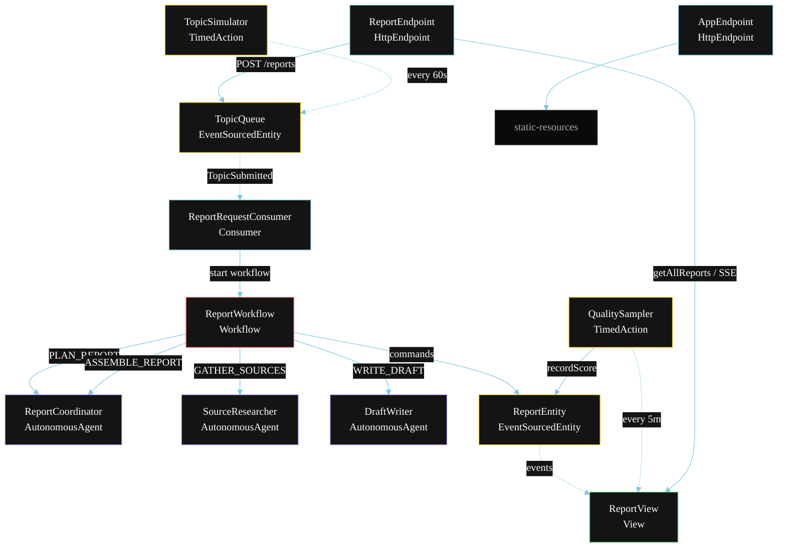
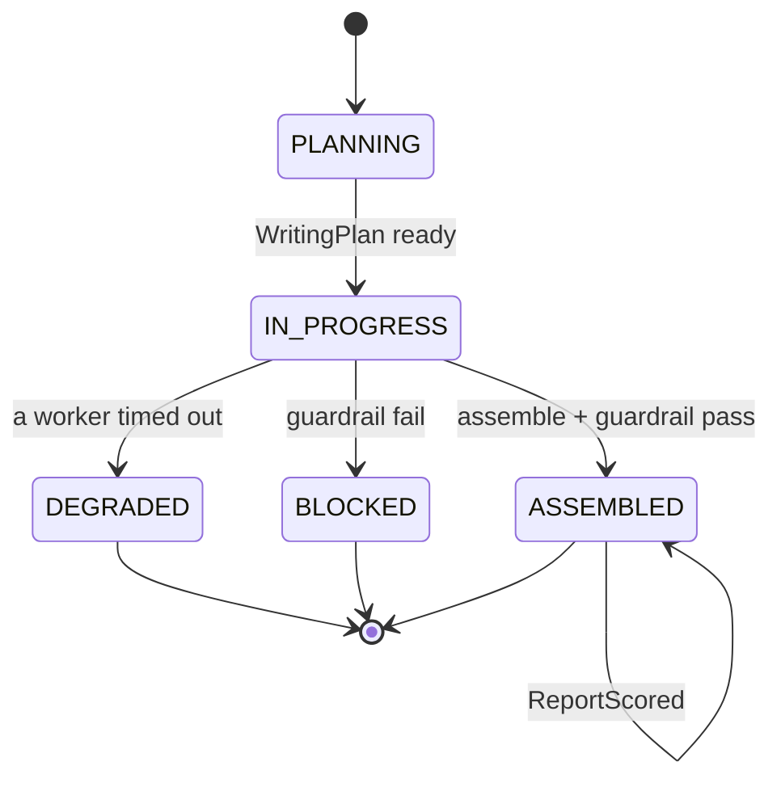
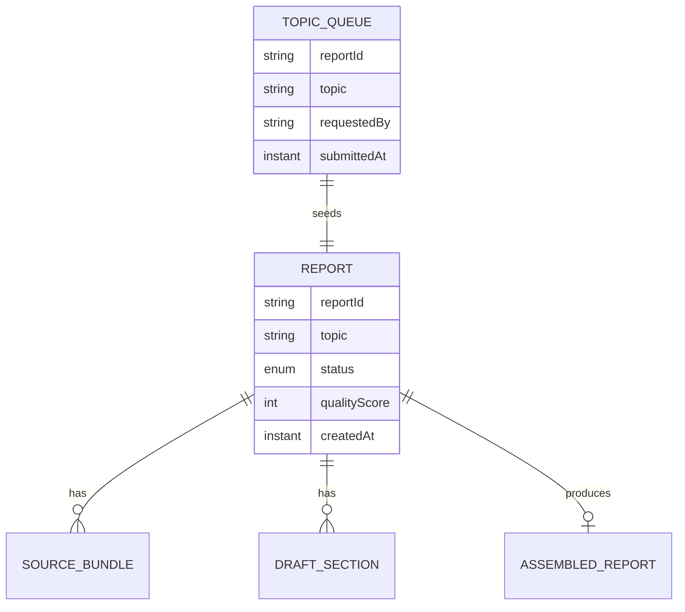

# PLAN — Concurrent Research Writer

Architectural sketch for `/akka:specify`. Mirrors `SPEC.md` Section 4 component names exactly. Mermaid sources here are rendered on the Architecture tab of the embedded UI; carry the Lesson 24 CSS overrides into the generated `index.html`.

## Component graph



Solid arrows: synchronous commands. Dashed arrows: event subscriptions. Dotted arrows: scheduled ticks.

## Interaction sequence

```mermaid
sequenceDiagram
  participant U as User / Simulator
  participant RE as ReportEndpoint
  participant TQ as TopicQueue
  participant WF as ReportWorkflow
  participant CO as ReportCoordinator
  participant SR as SourceResearcher
  participant DW as DraftWriter
  participant RE2 as ReportEntity

  U->>RE: POST /api/reports {topic}
  RE->>TQ: enqueueTopic
  TQ-->>WF: ReportRequestConsumer starts workflow
  WF->>RE2: createReport (PLANNING)
  WF->>CO: PLAN_REPORT -> WritingPlan
  WF->>RE2: status IN_PROGRESS
  par parallel fan-out
    WF->>SR: GATHER_SOURCES -> SourceBundle
  and
    WF->>DW: WRITE_DRAFT -> DraftSection
  end
  Note over WF: join; if either step times out (60s) -> degradeStep
  WF->>CO: ASSEMBLE_REPORT(sources, draft) -> AssembledReport
  WF->>WF: guardrailStep vets the report
  alt guardrail passes
    WF->>RE2: assemble (ASSEMBLED)
  else guardrail fails
    WF->>RE2: block (BLOCKED)
  end
```

## State machine



## Entity model



## Component table

| Component | Akka primitive | File path |
|---|---|---|
| `ReportCoordinator` | AutonomousAgent | `application/ReportCoordinator.java` |
| `SourceResearcher` | AutonomousAgent | `application/SourceResearcher.java` |
| `DraftWriter` | AutonomousAgent | `application/DraftWriter.java` |
| `ReportTasks` | Task constants | `application/ReportTasks.java` |
| `ReportWorkflow` | Workflow | `application/ReportWorkflow.java` |
| `ReportEntity` | EventSourcedEntity | `domain/ReportEntity.java` |
| `TopicQueue` | EventSourcedEntity | `domain/TopicQueue.java` |
| `ReportView` | View | `application/ReportView.java` |
| `ReportRequestConsumer` | Consumer | `application/ReportRequestConsumer.java` |
| `TopicSimulator` | TimedAction | `application/TopicSimulator.java` |
| `QualitySampler` | TimedAction | `application/QualitySampler.java` |
| `ReportEndpoint` | HttpEndpoint | `api/ReportEndpoint.java` |
| `AppEndpoint` | HttpEndpoint | `api/AppEndpoint.java` |

## Concurrency notes

- **Step timeouts (Lesson 4):** `researchStep` and `draftStep` each get 60s; `assembleStep` gets 90s. The 5s default fails every LLM call. `WorkflowSettings` is nested inside `Workflow` — no import.
- **Parallel fan-out:** `researchStep` and `draftStep` run concurrently via `CompletionStage` zip, not two sequential step calls.
- **Idempotency:** the workflow id is the `reportId`. Re-delivery of the same `TopicSubmitted` event resolves to the same workflow instance — no duplicate report.
- **Degrade path (compensation):** if either worker times out, `defaultStepRecovery` routes to `degradeStep`, which assembles from whichever partial output exists and ends with `ReportDegraded`. No infinite retry.
- **Quality sampling:** `QualitySampler` reads `ReportView.getAllReports` (no enum WHERE clause — Lesson 2) and filters client-side for the oldest `ASSEMBLED` report lacking a `qualityScore`.
