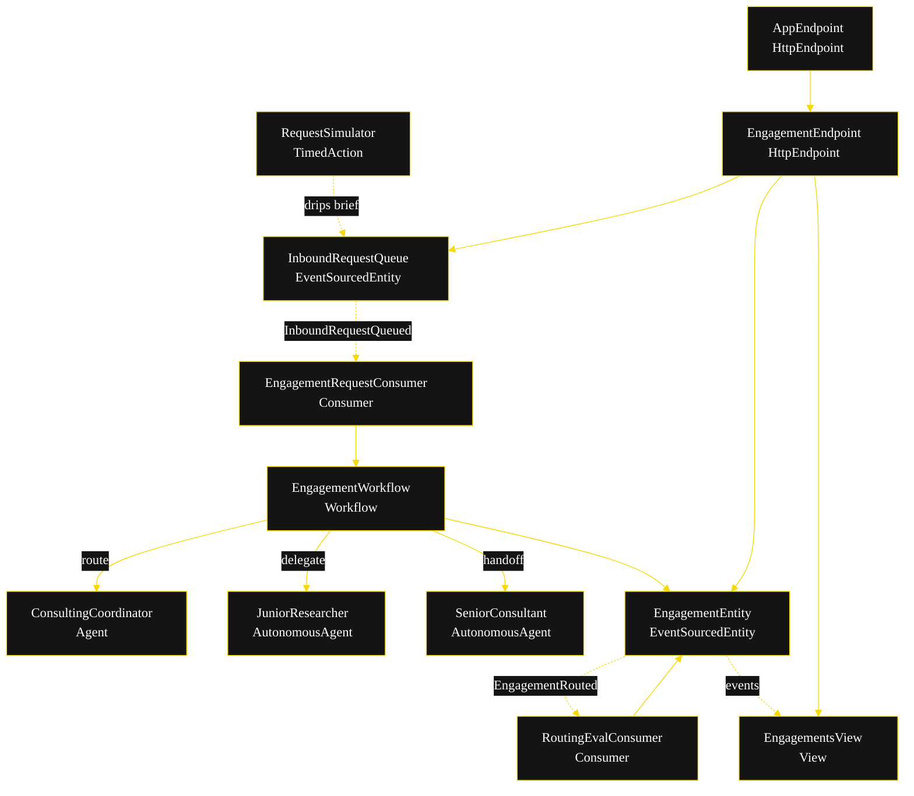
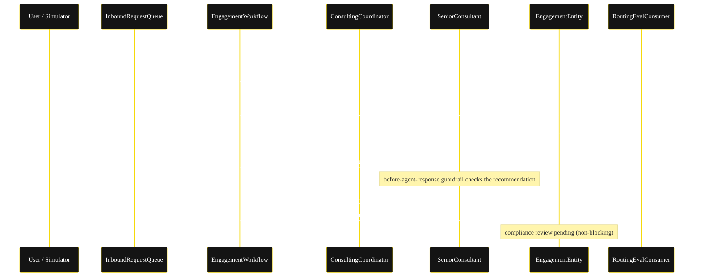
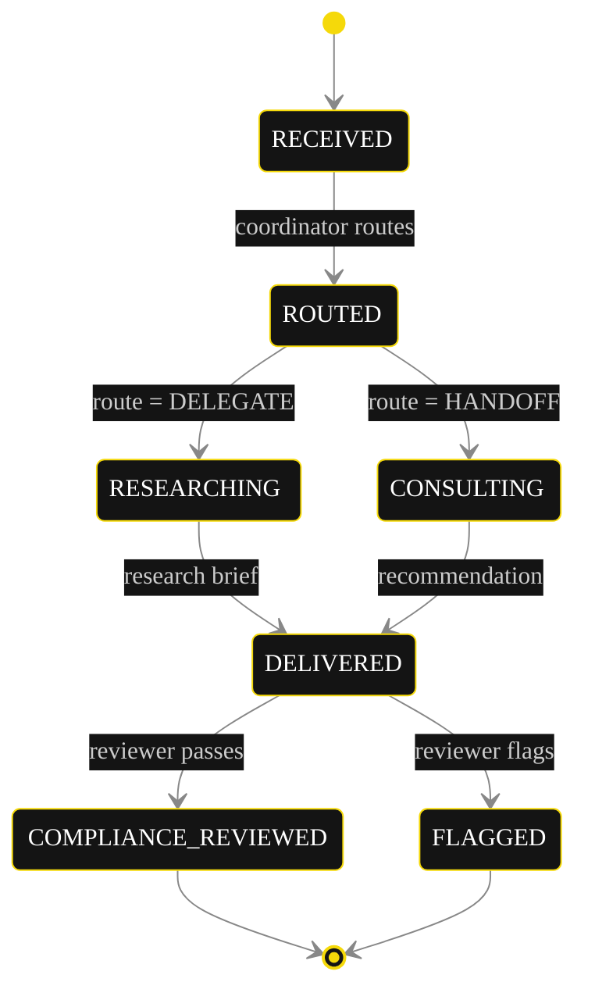
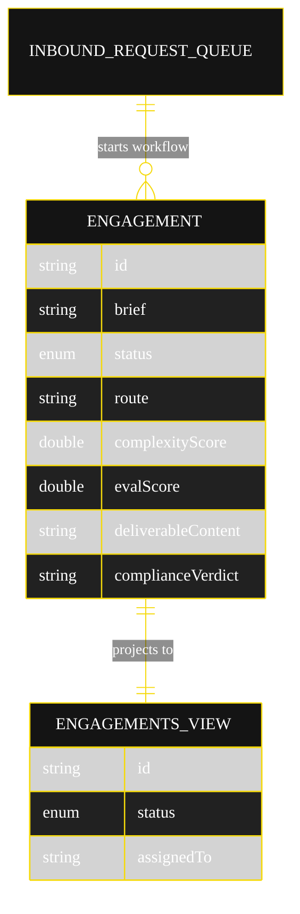

# Implementation Plan — `consulting`

The architecture [`SPEC.md`](./SPEC.md) resolves to once run through `/akka:specify` → `/akka:plan`. The diagrams below are rendered on the Architecture tab of the generated UI; reproduce the mermaid theme variables and the Lesson 24 CSS overrides verbatim in `static-resources/index.html`.

---

## Component inventory

| Component | Akka primitive | File | Purpose |
|---|---|---|---|
| `ConsultingCoordinator` | Agent | `application/ConsultingCoordinator.java` | Classifies a brief; returns `RoutingDecision`. |
| `JuniorResearcher` | AutonomousAgent | `application/JuniorResearcher.java` | Routine engagements; returns `ResearchBrief`. |
| `SeniorConsultant` | AutonomousAgent | `application/SeniorConsultant.java` | High-stakes engagements; returns `ConsultingRecommendation`. |
| `ConsultingTasks` | task definitions | `application/ConsultingTasks.java` | `RESEARCH`, `RECOMMEND` task constants. |
| `EngagementWorkflow` | Workflow | `application/EngagementWorkflow.java` | `routeStep` → `branchStep` → (`delegateStep` \| `handoffStep`) → `deliverStep`. |
| `EngagementEntity` | EventSourcedEntity | `application/EngagementEntity.java` | Durable per-engagement lifecycle. |
| `InboundRequestQueue` | EventSourcedEntity | `application/InboundRequestQueue.java` | Records inbound briefs; one command `enqueueRequest`. |
| `EngagementsView` | View | `application/EngagementsView.java` | Row type `Engagement`; one query `getAllEngagements`. |
| `EngagementRequestConsumer` | Consumer | `application/EngagementRequestConsumer.java` | Starts one workflow per inbound brief. |
| `RoutingEvalConsumer` | Consumer | `application/RoutingEvalConsumer.java` | Scores the routing decision on `EngagementRouted`. |
| `RequestSimulator` | TimedAction | `application/RequestSimulator.java` | Drips a brief from the JSONL every 30 s. |
| `EngagementEndpoint` | HttpEndpoint | `api/EngagementEndpoint.java` | `/api/*` REST + SSE + metadata. |
| `AppEndpoint` | HttpEndpoint | `api/AppEndpoint.java` | Serves `/` (redirect) and `/app/*`. |
| `Bootstrap` | service-setup | `Bootstrap.java` | Schedules `RequestSimulator`; initialises the queue. |

Akka component count: **2 http-endpoint · 1 timed-action · 1 view · 1 workflow · 1 service-setup · 1 agent · 2 autonomous-agent · 2 consumer · 2 event-sourced-entity**.

## 1 — Component graph



Solid arrows are synchronous command calls; dashed arrows are event subscriptions; dotted arrows are scheduled ticks.

## 2 — Interaction sequence (high-stakes handoff)



## 3 — Engagement state machine



State labels need the Lesson 24 CSS overrides in addition to the theme variables — theme variables alone leave the state names black-on-black and clip edge labels. Reproduce both fixes in `index.html`:

```css
.diagram-card .mermaid .nodeLabel,
.diagram-card .mermaid .stateLabel,
.diagram-card .mermaid g.statediagram-state .label,
.diagram-card .mermaid g.statediagram-state .label *,
.diagram-card .mermaid g.statediagram-state text,
.diagram-card .mermaid g.node text,
.diagram-card .mermaid .label foreignObject div,
.diagram-card .mermaid .label foreignObject p {
  color:#ffffff !important; fill:#ffffff !important;
}
.diagram-card .mermaid .edgeLabel foreignObject,
.diagram-card .mermaid g.edgeLabel foreignObject,
.diagram-card .mermaid g.edgeLabels foreignObject { overflow:visible !important; }
.diagram-card .mermaid .edgeLabel foreignObject > div {
  white-space:nowrap !important; overflow:visible !important; display:inline-block !important;
}
```

## 4 — Entity model



## Workflow steps and timeouts

`EngagementWorkflow` steps: `routeStep` → `branchStep` → (`delegateStep` | `handoffStep`) → `deliverStep`.

- `routeStep` calls `componentClient.forAgent().inSession(id).method(ConsultingCoordinator::route).invoke(brief)` and writes `EngagementRouted`.
- `branchStep` reads `route`: `DELEGATE` → `delegateStep`; `HANDOFF` → `handoffStep`.
- `delegateStep` / `handoffStep` call `forAutonomousAgent(...).runSingleTask(...)` then `forTask(taskId).result(...)`.
- `deliverStep` writes `ResearchDelivered` or `RecommendationDelivered`.

`WorkflowSettings` (nested in `Workflow`, no import):

```java
WorkflowSettings.builder()
  .stepTimeout(EngagementWorkflow::routeStep,    ofSeconds(60))
  .stepTimeout(EngagementWorkflow::delegateStep, ofSeconds(60))
  .stepTimeout(EngagementWorkflow::handoffStep,  ofSeconds(60))
  .defaultStepRecovery(maxRetries(2).failoverTo(EngagementWorkflow::error))
  .build();
```

## Concurrency notes

- Agent-calling steps set an explicit 60 s `stepTimeout` (Lesson 4) — the default 5 s would time out every LLM call.
- The workflow instance id is the engagement UUID; `EngagementRequestConsumer` derives it once per inbound event, giving idempotent start (a redelivered queue event resolves to the same workflow id).
- `RoutingEvalConsumer` is non-blocking and best-effort: a failed eval annotation does not roll back the engagement; it retries on consumer redelivery.
- Compliance review (H1) is non-blocking — `DELIVERED` is terminal for delivery; the compliance command only annotates. No saga or compensation is required because no step is irreversible in the simulation.
- `emptyState()` returns `Engagement.initial("")` with no `commandContext()` reference (Lesson 3).
- `EngagementsView` has a single `getAllEngagements` query with no `WHERE status` filter; status filtering is client-side in callers (Lesson 2 — enum columns are not auto-indexable).

## Resource files

```
src/main/resources/
├── application.conf                 ← http-port 9895 + model-provider blocks
├── metadata/{README.md, eval-matrix.yaml, risk-survey.yaml}
├── sample-events/engagements.jsonl  ← 8 canned briefs (routine + high-stakes)
├── mock-responses/{consulting-coordinator,junior-researcher,senior-consultant}.json
└── static-resources/index.html      ← single self-contained 5-tab UI (no build step)
```

## Build & run

In Claude Code, run `/akka:build` (Lesson 9 — canonical; `mvn akka:run` does not exist). The service listens on `http://localhost:9895/`.
