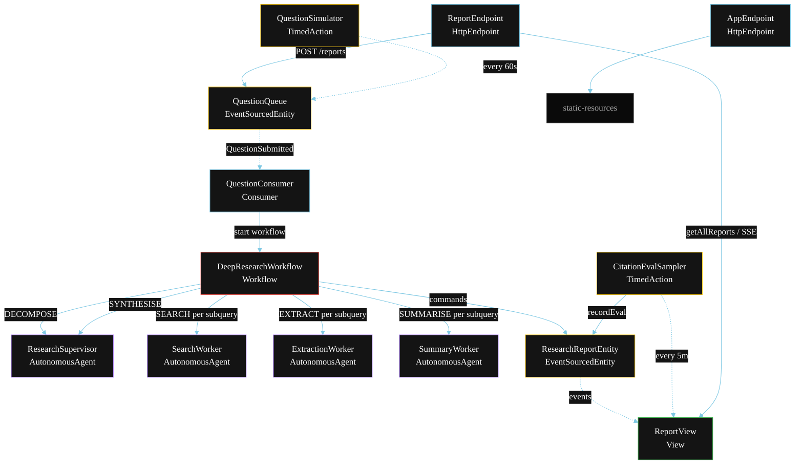
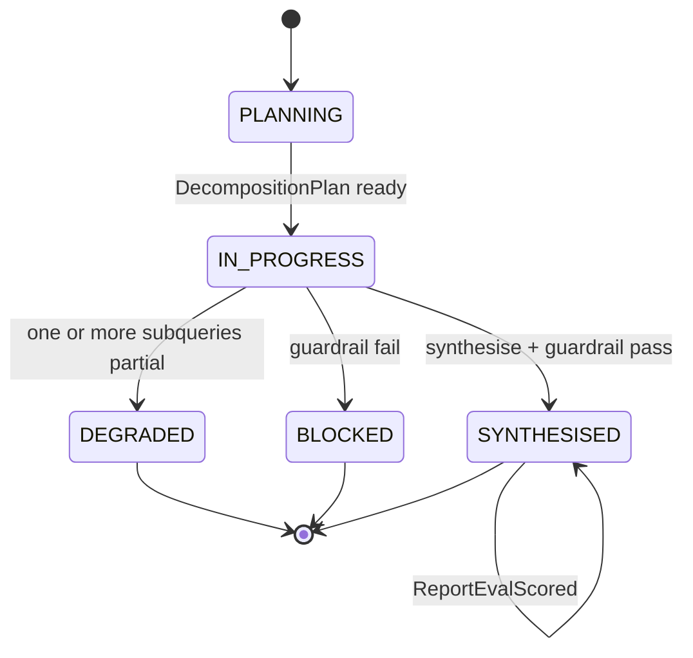
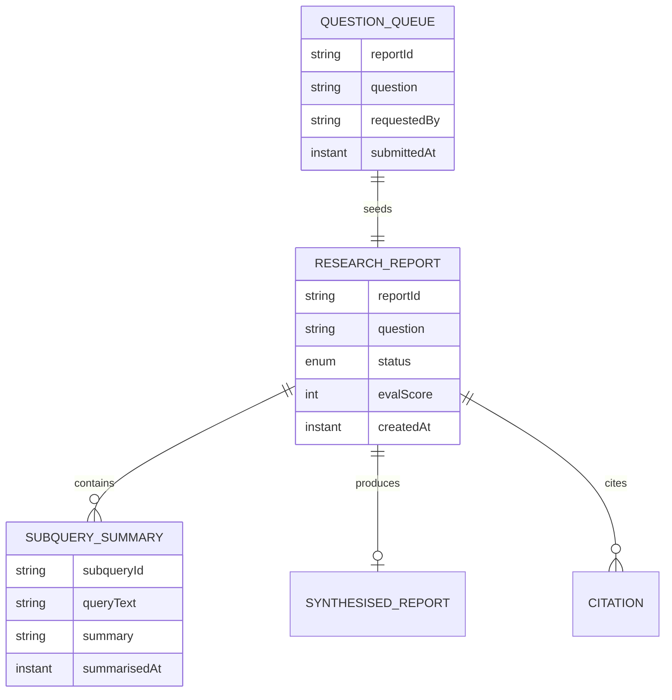

# PLAN — Deep Research Supervisor

Architectural sketch for `/akka:specify`. Mirrors `SPEC.md` Section 4 component names exactly. Mermaid sources here are rendered on the Architecture tab of the embedded UI; carry the Lesson 24 CSS overrides into the generated `index.html`.

## Component graph



Solid arrows: synchronous commands. Dashed arrows: event subscriptions. Dotted arrows: scheduled ticks.

## Interaction sequence

```mermaid
sequenceDiagram
  participant U as User / Simulator
  participant RE as ReportEndpoint
  participant QQ as QuestionQueue
  participant WF as DeepResearchWorkflow
  participant SU as ResearchSupervisor
  participant SW as SearchWorker
  participant EW as ExtractionWorker
  participant MW as SummaryWorker
  participant RRE as ResearchReportEntity

  U->>RE: POST /api/reports {question}
  RE->>QQ: enqueueQuestion
  QQ-->>WF: QuestionConsumer starts workflow
  WF->>RRE: createReport (PLANNING)
  WF->>SU: DECOMPOSE -> DecompositionPlan
  WF->>RRE: status IN_PROGRESS
  par per-subquery pipelines (parallel)
    WF->>SW: SEARCH subquery-1 -> PassageBundle
    WF->>EW: EXTRACT passages-1 -> ClaimsBundle
    WF->>MW: SUMMARISE claims-1 -> SubquerySummary
  and
    WF->>SW: SEARCH subquery-2 -> PassageBundle
    WF->>EW: EXTRACT passages-2 -> ClaimsBundle
    WF->>MW: SUMMARISE claims-2 -> SubquerySummary
  end
  Note over WF: join; if any searchStep times out (60s) -> partial path
  WF->>SU: SYNTHESISE(subquerySummaries) -> SynthesisedReport
  WF->>WF: guardrailStep vets the report
  alt guardrail passes
    WF->>RRE: synthesise (SYNTHESISED)
  else guardrail fails
    WF->>RRE: block (BLOCKED)
  end
```

## State machine



## Entity model



## Component table

| Component | Akka primitive | File path |
|---|---|---|
| `ResearchSupervisor` | AutonomousAgent | `application/ResearchSupervisor.java` |
| `SearchWorker` | AutonomousAgent | `application/SearchWorker.java` |
| `ExtractionWorker` | AutonomousAgent | `application/ExtractionWorker.java` |
| `SummaryWorker` | AutonomousAgent | `application/SummaryWorker.java` |
| `DeepResearchTasks` | Task constants | `application/DeepResearchTasks.java` |
| `DeepResearchWorkflow` | Workflow | `application/DeepResearchWorkflow.java` |
| `ResearchReportEntity` | EventSourcedEntity | `domain/ResearchReportEntity.java` |
| `QuestionQueue` | EventSourcedEntity | `domain/QuestionQueue.java` |
| `ReportView` | View | `application/ReportView.java` |
| `QuestionConsumer` | Consumer | `application/QuestionConsumer.java` |
| `QuestionSimulator` | TimedAction | `application/QuestionSimulator.java` |
| `CitationEvalSampler` | TimedAction | `application/CitationEvalSampler.java` |
| `ReportEndpoint` | HttpEndpoint | `api/ReportEndpoint.java` |
| `AppEndpoint` | HttpEndpoint | `api/AppEndpoint.java` |

## Concurrency notes

- **Step timeouts (Lesson 4):** `searchStep` gets 60s; `extractStep` and `summariseStep` each get 45s; `synthesiseStep` gets 120s. The 5s default fails every LLM call. `WorkflowSettings` is nested inside `Workflow` — no import.
- **Parallel fan-out:** per-subquery pipelines run concurrently via `CompletionStage` allOf across all subqueries. Within each subquery the three steps run sequentially (search → extract → summarise) because each step depends on the previous step's output.
- **Idempotency:** the workflow id is the `reportId`. Re-delivery of the same `QuestionSubmitted` event resolves to the same workflow instance — no duplicate report.
- **Degrade path (compensation):** if any `searchStep` times out, that subquery is marked partial and the workflow continues with the remaining subqueries. After synthesis, `defaultStepRecovery` routes to `degradeStep` which ends with `ReportDegraded`. No infinite retry.
- **Eval sampling:** `CitationEvalSampler` reads `ReportView.getAllReports` (no enum WHERE clause) and filters client-side for the oldest `SYNTHESISED` report lacking an `evalScore`.
