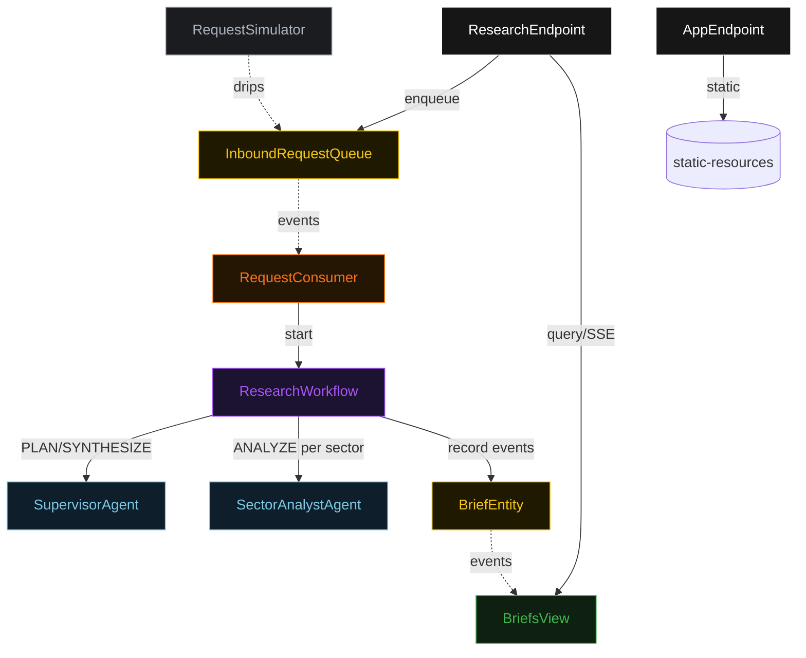
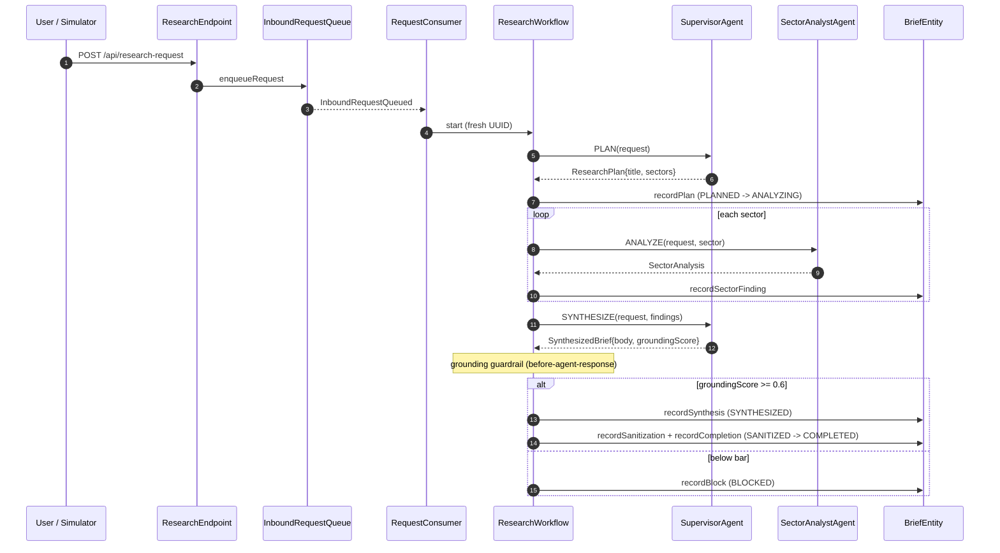
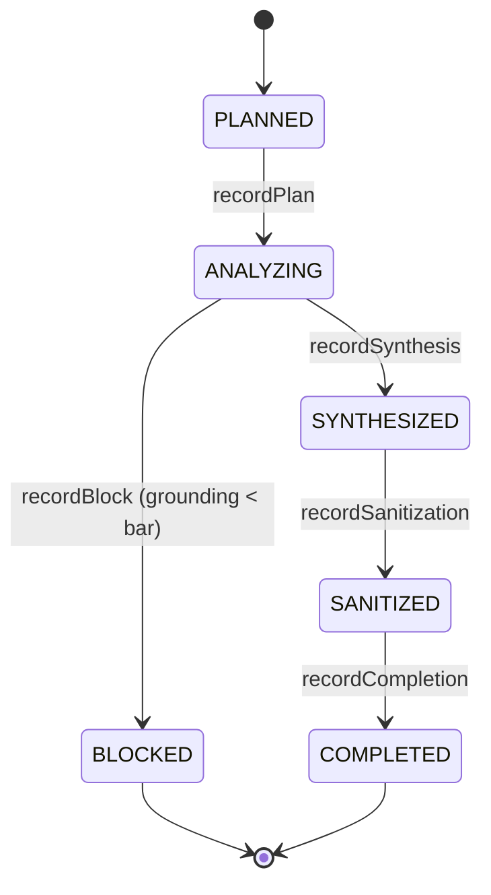
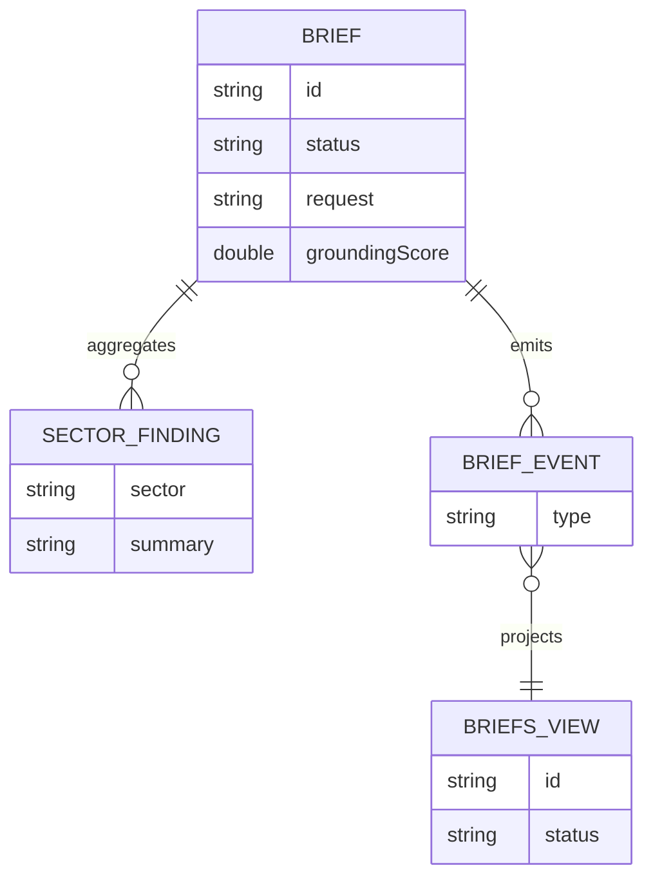

# PLAN — industry-research-team

Architectural sketch. All four mermaid diagrams + the component table.

---

## Component graph

## Interaction sequence

## State machine

## Entity model

## Component table

| Component | Path (generated) |
|---|---|
| SupervisorAgent | `application/SupervisorAgent.java` |
| SectorAnalystAgent | `application/SectorAnalystAgent.java` |
| IndustryResearchTasks | `application/IndustryResearchTasks.java` |
| ResearchWorkflow | `application/ResearchWorkflow.java` |
| BriefEntity | `application/BriefEntity.java` |
| InboundRequestQueue | `application/InboundRequestQueue.java` |
| BriefsView | `application/BriefsView.java` |
| RequestConsumer | `application/RequestConsumer.java` |
| RequestSimulator | `application/RequestSimulator.java` |
| ResearchEndpoint | `api/ResearchEndpoint.java` |
| AppEndpoint | `api/AppEndpoint.java` |
| Brief, SectorFinding, records | `domain/*.java` |

## Concurrency notes

- **Step timeouts:** `planStep`, `analyzeStep`, `synthesizeStep` each call an agent — set `stepTimeout(60s)` explicitly (Lesson 4). The default 5s timeout would fail every LLM call.
- **Idempotency:** `RequestConsumer` derives the workflow id from a fresh UUID per queued event; re-delivery of the same `InboundRequestQueued` event is tolerated because the workflow start is keyed on that id.
- **Fan-out:** `analyzeStep` processes sectors sequentially per brief; each `SectorAnalyzed` event is recorded as it returns, so a mid-loop failure leaves recorded findings intact.
- **Compensation:** a synthesis below the grounding bar is not a failure — it is a terminal `BLOCKED` transition recorded on the entity, not a retry. `defaultStepRecovery(maxRetries(2).failoverTo(errorStep))` covers transient agent errors only.
