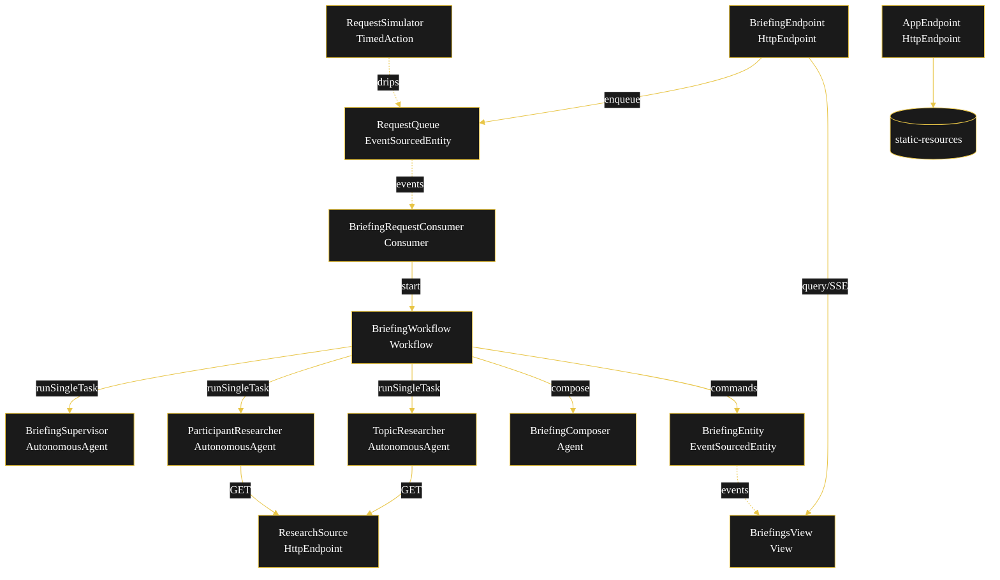
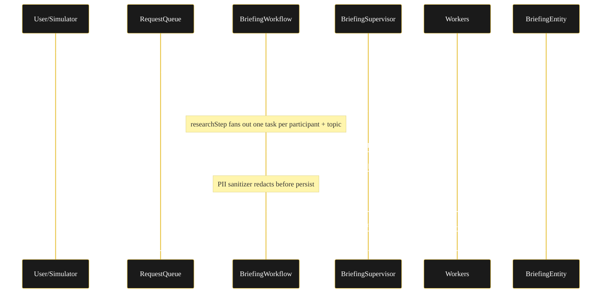
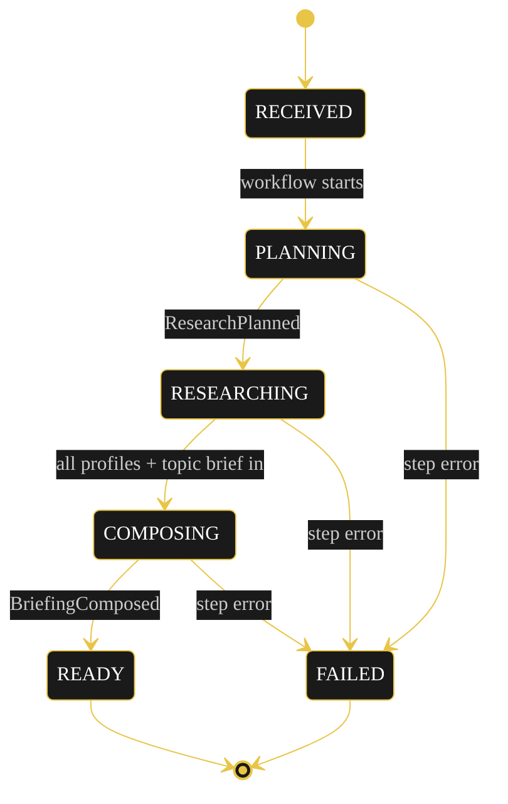
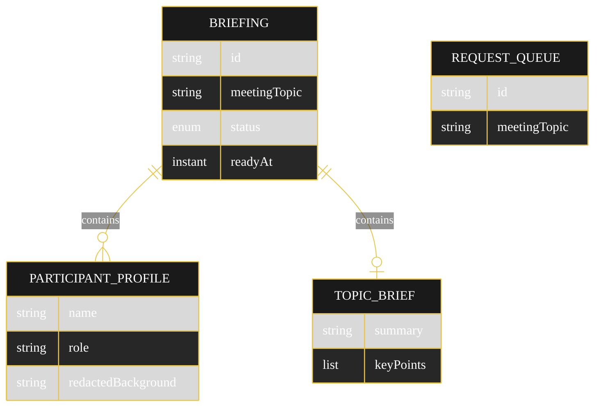

# PLAN — Meeting Prep Briefer

Architecture sketch for the delegation-supervisor-workers x research-intel cell. `/akka:plan` may regenerate this; it is authored here so the generator can verify against it.

## Component graph

Solid arrows are synchronous commands; dashed arrows are event subscriptions; dotted arrows are scheduled ticks.

## Interaction sequence

## State machine

State-label CSS overrides from Lesson 24 must accompany this diagram in the generated `index.html` (state names white-on-dark, edge labels `overflow:visible`).

## Entity model

## Component table

| Component | Akka primitive | File path |
|---|---|---|
| BriefingSupervisor | AutonomousAgent | `application/BriefingSupervisor.java` |
| ParticipantResearcher | AutonomousAgent | `application/ParticipantResearcher.java` |
| TopicResearcher | AutonomousAgent | `application/TopicResearcher.java` |
| BriefingComposer | Agent | `application/BriefingComposer.java` |
| BriefingTasks | Task constants | `application/BriefingTasks.java` |
| BriefingWorkflow | Workflow | `application/BriefingWorkflow.java` |
| BriefingEntity | EventSourcedEntity | `domain/BriefingEntity.java` |
| RequestQueue | EventSourcedEntity | `domain/RequestQueue.java` |
| BriefingsView | View | `application/BriefingsView.java` |
| BriefingRequestConsumer | Consumer | `application/BriefingRequestConsumer.java` |
| RequestSimulator | TimedAction | `application/RequestSimulator.java` |
| ResearchSource | HttpEndpoint | `api/ResearchSource.java` |
| BriefingEndpoint | HttpEndpoint | `api/BriefingEndpoint.java` |
| AppEndpoint | HttpEndpoint | `api/AppEndpoint.java` |

## Concurrency notes

- **Step timeouts (Lesson 4):** `planStep` 60s, `researchStep` 120s (fan-out across multiple agent calls), `composeStep` 60s. `defaultStepRecovery(maxRetries(2).failoverTo(error))`.
- **Idempotency:** the workflow uses the briefing UUID as its instance id; the consumer derives a deterministic id from the queued request offset so a redelivered queue event does not start a duplicate workflow.
- **Fan-out gather:** `researchStep` issues one `RESEARCH_PARTICIPANT` task per planned participant plus one `RESEARCH_TOPIC` task, awaits each `forTask(taskId).result(...)`, sanitizes, then records. A failed worker task fails the step into the recovery path that marks the briefing `FAILED` with a reason — no compensation is needed because nothing external was written.
- **Guardrail placement (G1):** the before-tool-call guardrail sits on the researcher agents and rejects a `ResearchSource` call whose subject is not in the active request, returning a blocked result the agent surfaces as an empty profile rather than retrying forever.
