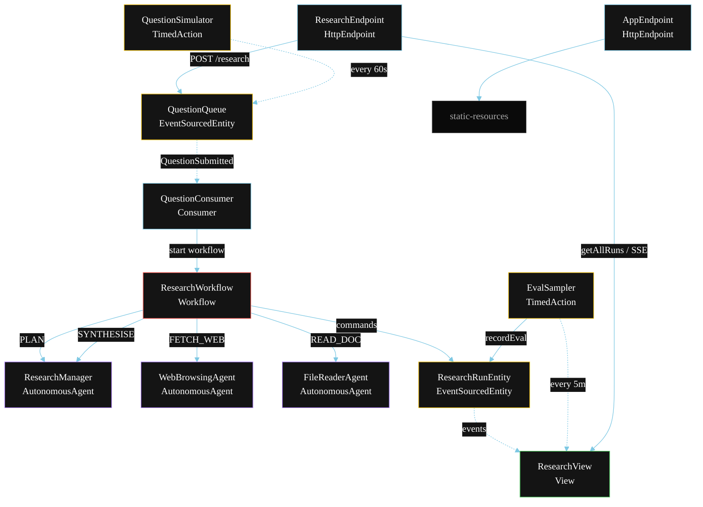
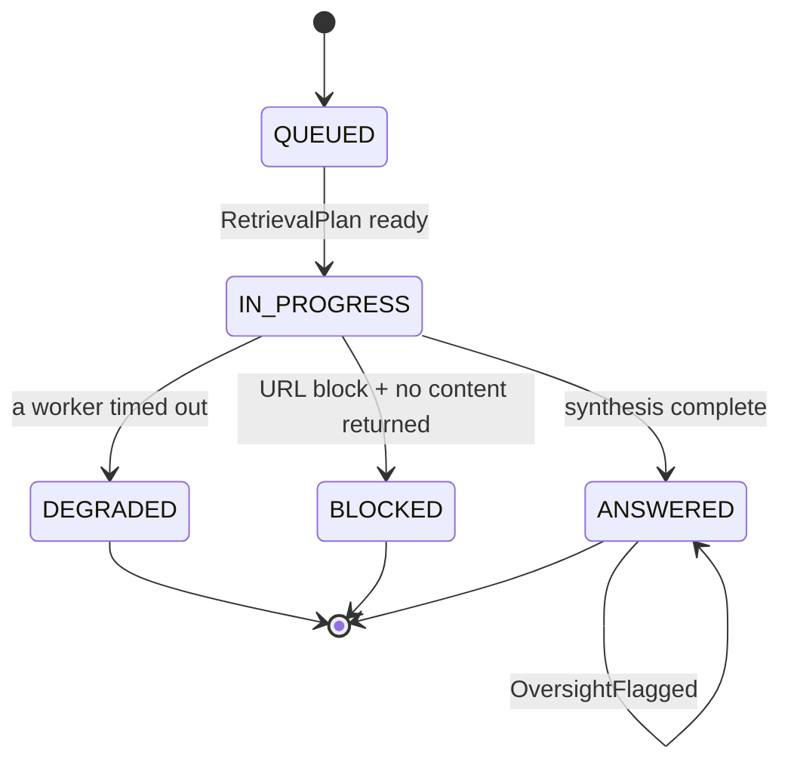
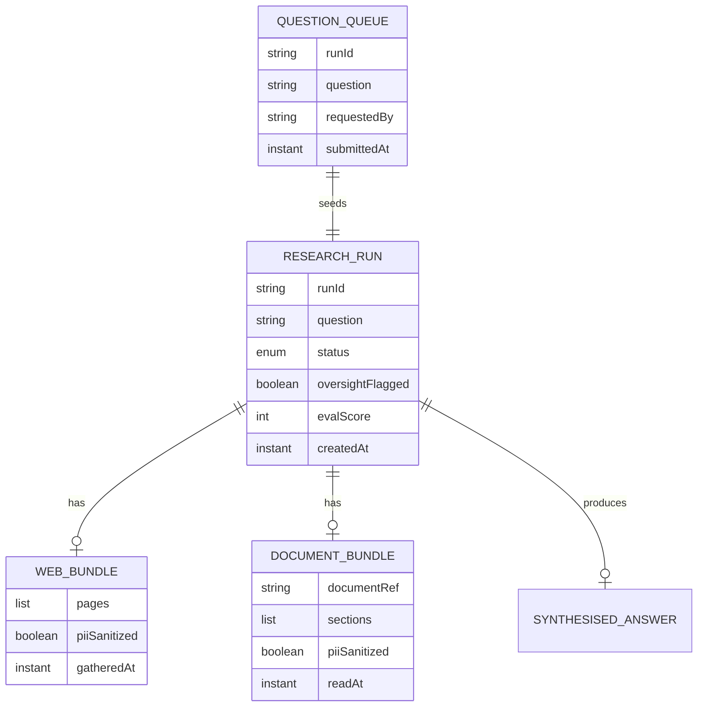

# PLAN — Open Deep Research

Architectural sketch for `/akka:specify`. Mirrors `SPEC.md` Section 4 component names exactly. Mermaid sources here are rendered on the Architecture tab of the embedded UI; carry the Lesson 24 CSS overrides into the generated `index.html`.

## Component graph



Solid arrows: synchronous commands. Dashed arrows: event subscriptions. Dotted arrows: scheduled ticks.

## Interaction sequence

```mermaid
sequenceDiagram
  participant U as User / Simulator
  participant RE as ResearchEndpoint
  participant QQ as QuestionQueue
  participant WF as ResearchWorkflow
  participant RM as ResearchManager
  participant WB as WebBrowsingAgent
  participant FR as FileReaderAgent
  participant RR as ResearchRunEntity

  U->>RE: POST /api/research {question}
  RE->>QQ: enqueueQuestion
  QQ-->>WF: QuestionConsumer starts workflow
  WF->>RR: createRun (QUEUED)
  WF->>RM: PLAN -> RetrievalPlan
  WF->>RR: status IN_PROGRESS
  par parallel fan-out
    WF->>WB: FETCH_WEB -> WebBundle (guardrail checks each URL)
  and
    WF->>FR: READ_DOC -> DocumentBundle
  end
  Note over WF: sanitizeStep strips PII from both bundles
  Note over WF: join; if either step times out (60s) -> degradeStep
  WF->>RM: SYNTHESISE(webContent, docContent) -> SynthesisedAnswer
  WF->>WF: monitorStep checks retry budget
  alt budget ok
    WF->>RR: answerRun (ANSWERED)
  else budget exceeded
    WF->>RR: flagOversight (OversightFlagged)
    WF->>RR: answerRun (ANSWERED)
  end
```

## State machine



## Entity model



## Component table

| Component | Akka primitive | File path |
|---|---|---|
| `ResearchManager` | AutonomousAgent | `application/ResearchManager.java` |
| `WebBrowsingAgent` | AutonomousAgent | `application/WebBrowsingAgent.java` |
| `FileReaderAgent` | AutonomousAgent | `application/FileReaderAgent.java` |
| `ResearchTasks` | Task constants | `application/ResearchTasks.java` |
| `ResearchWorkflow` | Workflow | `application/ResearchWorkflow.java` |
| `ResearchRunEntity` | EventSourcedEntity | `domain/ResearchRunEntity.java` |
| `QuestionQueue` | EventSourcedEntity | `domain/QuestionQueue.java` |
| `ResearchView` | View | `application/ResearchView.java` |
| `QuestionConsumer` | Consumer | `application/QuestionConsumer.java` |
| `QuestionSimulator` | TimedAction | `application/QuestionSimulator.java` |
| `EvalSampler` | TimedAction | `application/EvalSampler.java` |
| `ResearchEndpoint` | HttpEndpoint | `api/ResearchEndpoint.java` |
| `AppEndpoint` | HttpEndpoint | `api/AppEndpoint.java` |

## Concurrency notes

- **Step timeouts (Lesson 4):** `fetchWebStep` and `readDocStep` get 60s; `synthesiseStep` gets 90s. The 5s default fails every LLM call. `WorkflowSettings` is nested inside `Workflow` — no import.
- **Parallel fan-out:** `fetchWebStep` and `readDocStep` run concurrently via `CompletionStage` zip, not two sequential step calls.
- **Guardrail placement:** the `before-tool-call` guardrail runs inside `WebBrowsingAgent` before each individual fetch; it does not block the workflow step — only the specific disallowed URL is skipped.
- **PII sanitization:** `sanitizeStep` is a synchronous deterministic pass, not an LLM call, so it does not need a generous timeout.
- **Idempotency:** the workflow id is the `runId`. Re-delivery of the same `QuestionSubmitted` event resolves to the same workflow instance — no duplicate run.
- **Degrade path:** if either retrieval worker times out, `defaultStepRecovery` routes to `degradeStep`, which synthesises from whichever partial output exists. No infinite retry.
- **Eval sampling:** `EvalSampler` reads `ResearchView.getAllRuns` and filters client-side for the oldest `ANSWERED` run lacking an `evalScore`.
