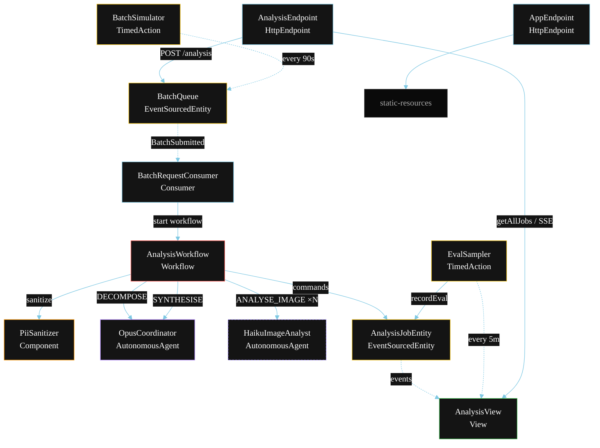
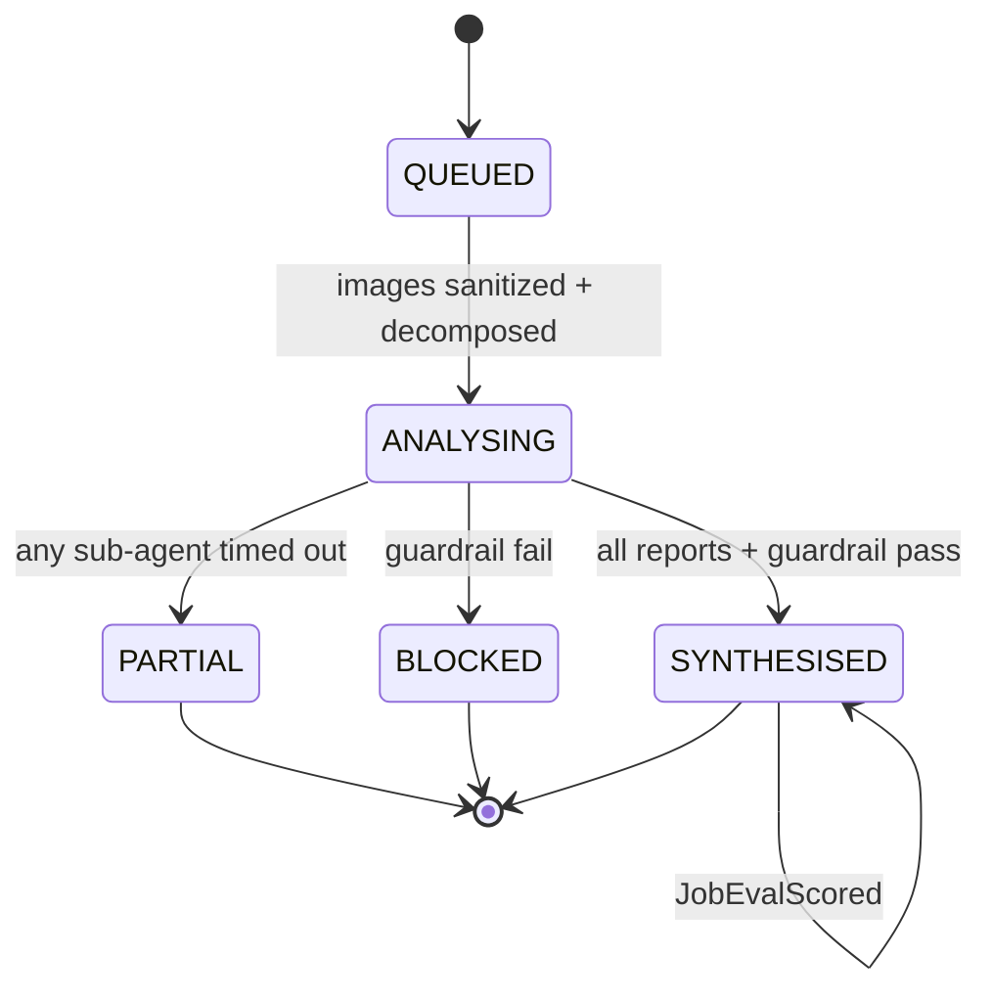
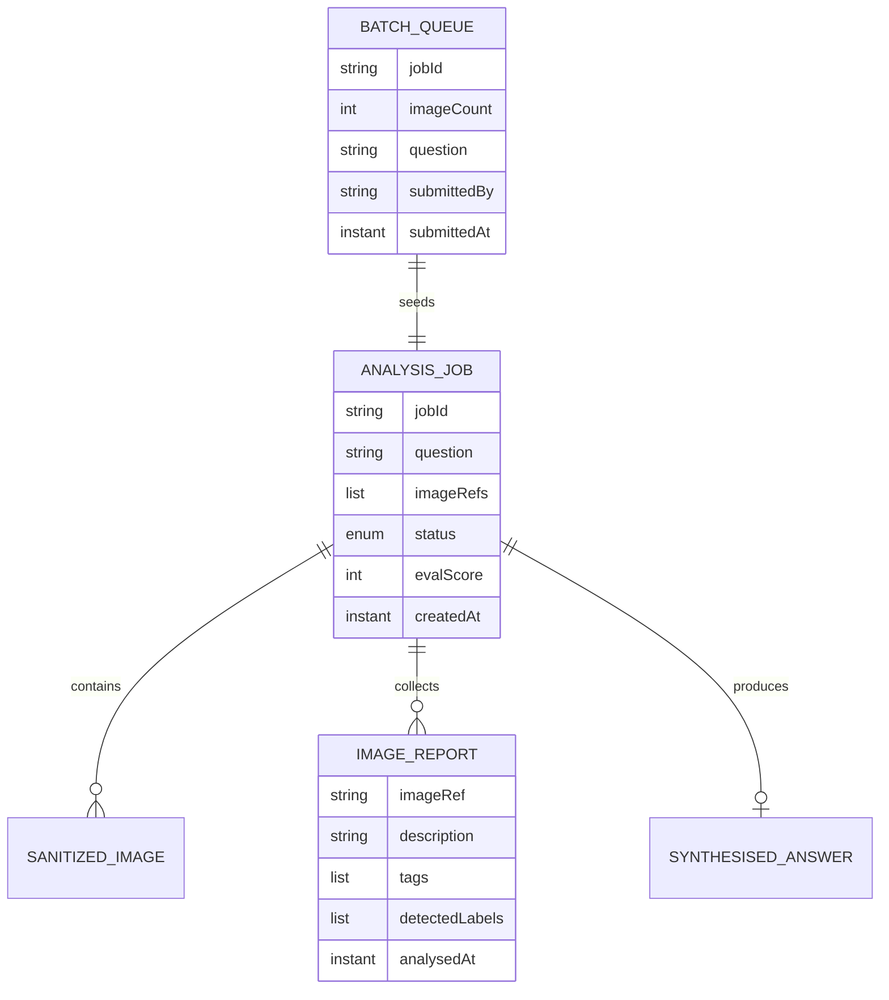

# PLAN — Haiku Sub-Agents under Opus (multimodal)

Architectural sketch for `/akka:specify`. Mirrors `SPEC.md` Section 4 component names exactly. Mermaid sources here are rendered on the Architecture tab of the embedded UI; carry the Lesson 24 CSS overrides into the generated `index.html`.

## Component graph



Solid arrows: synchronous calls or commands. Dashed arrows: event subscriptions or scheduled ticks. `HaikuImageAnalyst` (dashed border) runs N instances in parallel — one per image. `OpusCoordinator` (solid border) is called twice: once to decompose, once to synthesise.

## Interaction sequence

```mermaid
sequenceDiagram
  participant U as User / Simulator
  participant AE as AnalysisEndpoint
  participant BQ as BatchQueue
  participant WF as AnalysisWorkflow
  participant PS as PiiSanitizer
  participant OC as OpusCoordinator
  participant HIA as HaikuImageAnalyst (×N)
  participant JE as AnalysisJobEntity

  U->>AE: POST /api/analysis {question, images}
  AE->>BQ: enqueueBatch
  BQ-->>WF: BatchRequestConsumer starts workflow
  WF->>JE: createJob (QUEUED)
  WF->>PS: sanitize each ImagePayload
  WF->>JE: markSanitized (piiDetected flags)
  WF->>OC: DECOMPOSE -> List<ImageTask>
  WF->>JE: startAnalysis (ANALYSING)
  par parallel fan-out (one per image)
    WF->>HIA: ANALYSE_IMAGE(SanitizedImage, instruction) -> ImageReport
  and
    WF->>HIA: ANALYSE_IMAGE(SanitizedImage, instruction) -> ImageReport
  end
  Note over WF: join; if any step times out (45s) -> partialStep
  WF->>OC: SYNTHESISE(reports, question) -> SynthesisedAnswer
  WF->>WF: guardrailStep checks PII bleed-through
  alt guardrail passes
    WF->>JE: synthesise (SYNTHESISED)
  else guardrail fails
    WF->>JE: block (BLOCKED)
  end
```

## State machine



## Entity model



## Component table

| Component | Akka primitive | File path |
|---|---|---|
| `OpusCoordinator` | AutonomousAgent | `application/OpusCoordinator.java` |
| `HaikuImageAnalyst` | AutonomousAgent | `application/HaikuImageAnalyst.java` |
| `PiiSanitizer` | Component | `application/PiiSanitizer.java` |
| `AnalysisTasks` | Task constants | `application/AnalysisTasks.java` |
| `AnalysisWorkflow` | Workflow | `application/AnalysisWorkflow.java` |
| `AnalysisJobEntity` | EventSourcedEntity | `domain/AnalysisJobEntity.java` |
| `BatchQueue` | EventSourcedEntity | `domain/BatchQueue.java` |
| `AnalysisView` | View | `application/AnalysisView.java` |
| `BatchRequestConsumer` | Consumer | `application/BatchRequestConsumer.java` |
| `BatchSimulator` | TimedAction | `application/BatchSimulator.java` |
| `EvalSampler` | TimedAction | `application/EvalSampler.java` |
| `AnalysisEndpoint` | HttpEndpoint | `api/AnalysisEndpoint.java` |
| `AppEndpoint` | HttpEndpoint | `api/AppEndpoint.java` |

## Concurrency notes

- **Step timeouts (Lesson 4):** each `analyseStep` (per image) gets 45s; `synthesiseStep` gets 90s. The 5s default fails every LLM call. `WorkflowSettings` is nested inside `Workflow` — no import.
- **Parallel fan-out:** all image analysis steps run concurrently via `CompletionStage.allOf`, not sequential calls. The workflow collects the resulting `ImageReport` list in join order.
- **Idempotency:** the workflow id is the `jobId`. Re-delivery of the same `BatchSubmitted` event resolves to the same workflow instance — no duplicate job.
- **Partial path (compensation):** if any image step times out, `defaultStepRecovery` routes to `partialStep`, which calls synthesis with whichever `ImageReport` objects are present and ends with `JobPartial`. No infinite retry.
- **PII sanitizer ordering:** `sanitizeStep` runs sequentially over the image list before any parallel fan-out, so the order of `SanitizedImage` objects always matches the order of `ImageTask` objects returned by `decomposeStep`.
- **Eval sampling:** `EvalSampler` reads `AnalysisView.getAllJobs` (no enum WHERE clause) and filters client-side for the oldest `SYNTHESISED` job lacking an `evalScore`.
