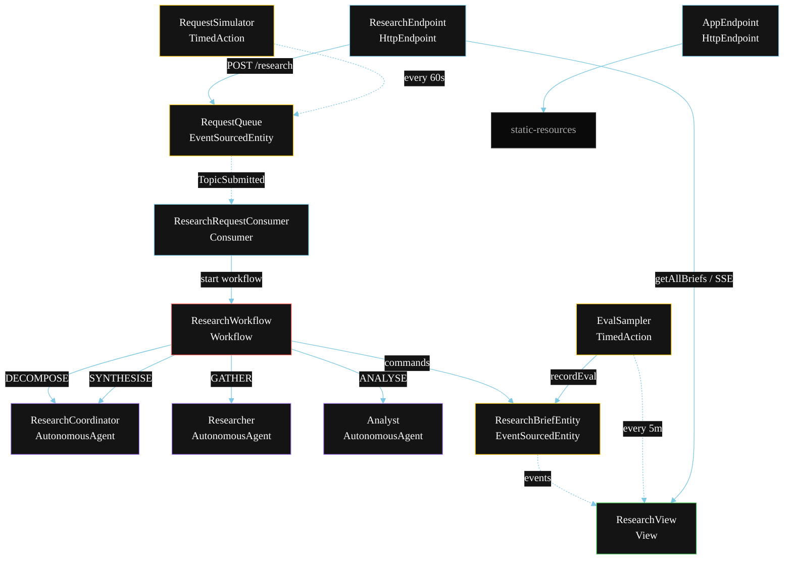
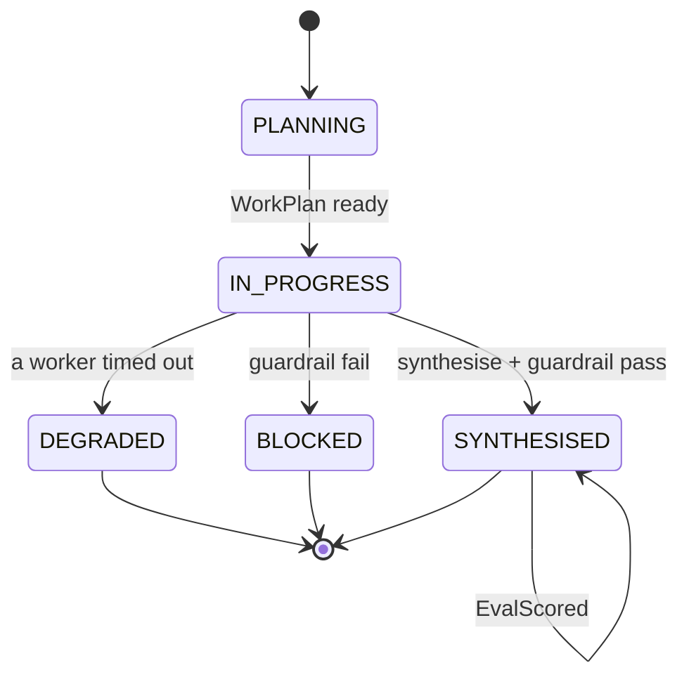
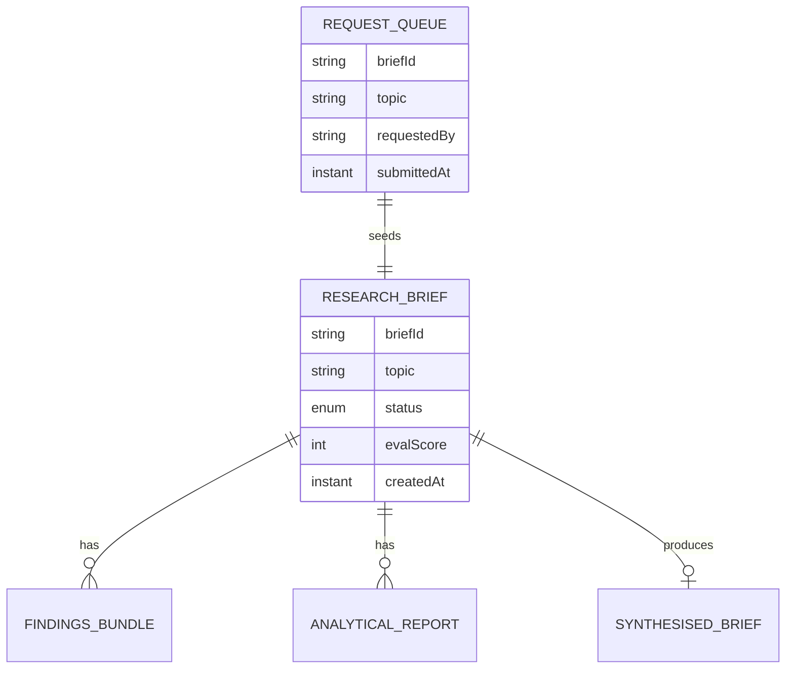

# PLAN — Multi-Agent Research Brief

Architectural sketch for `/akka:specify`. Mirrors `SPEC.md` Section 4 component names exactly. Mermaid sources here are rendered on the Architecture tab of the embedded UI; carry the Lesson 24 CSS overrides into the generated `index.html`.

## Component graph



Solid arrows: synchronous commands. Dashed arrows: event subscriptions. Dotted arrows: scheduled ticks.

## Interaction sequence

```mermaid
sequenceDiagram
  participant U as User / Simulator
  participant RE as ResearchEndpoint
  participant RQ as RequestQueue
  participant WF as ResearchWorkflow
  participant CO as ResearchCoordinator
  participant RR as Researcher
  participant AN as Analyst
  participant BE as ResearchBriefEntity

  U->>RE: POST /api/research {topic}
  RE->>RQ: enqueueTopic
  RQ-->>WF: ResearchRequestConsumer starts workflow
  WF->>BE: createBrief (PLANNING)
  WF->>CO: DECOMPOSE -> WorkPlan
  WF->>BE: status IN_PROGRESS
  par parallel fan-out
    WF->>RR: GATHER -> FindingsBundle
  and
    WF->>AN: ANALYSE -> AnalyticalReport
  end
  Note over WF: join; if either step times out (60s) -> degradeStep
  WF->>CO: SYNTHESISE(findings, analysis) -> SynthesisedBrief
  WF->>WF: guardrailStep vets the brief
  alt guardrail passes
    WF->>BE: synthesise (SYNTHESISED)
  else guardrail fails
    WF->>BE: block (BLOCKED)
  end
```

## State machine



## Entity model



## Component table

| Component | Akka primitive | File path |
|---|---|---|
| `ResearchCoordinator` | AutonomousAgent | `application/ResearchCoordinator.java` |
| `Researcher` | AutonomousAgent | `application/Researcher.java` |
| `Analyst` | AutonomousAgent | `application/Analyst.java` |
| `ResearchTasks` | Task constants | `application/ResearchTasks.java` |
| `ResearchWorkflow` | Workflow | `application/ResearchWorkflow.java` |
| `ResearchBriefEntity` | EventSourcedEntity | `domain/ResearchBriefEntity.java` |
| `RequestQueue` | EventSourcedEntity | `domain/RequestQueue.java` |
| `ResearchView` | View | `application/ResearchView.java` |
| `ResearchRequestConsumer` | Consumer | `application/ResearchRequestConsumer.java` |
| `RequestSimulator` | TimedAction | `application/RequestSimulator.java` |
| `EvalSampler` | TimedAction | `application/EvalSampler.java` |
| `ResearchEndpoint` | HttpEndpoint | `api/ResearchEndpoint.java` |
| `AppEndpoint` | HttpEndpoint | `api/AppEndpoint.java` |

## Concurrency notes

- **Step timeouts (Lesson 4):** `researchStep` and `analyseStep` get 60s; `synthesiseStep` gets 90s. The 5s default fails every LLM call. `WorkflowSettings` is nested inside `Workflow` — no import.
- **Parallel fan-out:** `researchStep` and `analyseStep` run concurrently via `CompletionStage` zip, not two sequential step calls.
- **Idempotency:** the workflow id is the `briefId`. Re-delivery of the same `TopicSubmitted` event resolves to the same workflow instance — no duplicate brief.
- **Degrade path (compensation):** if either worker times out, `defaultStepRecovery` routes to `degradeStep`, which synthesises from whichever partial output exists and ends with `BriefDegraded`. No infinite retry.
- **Eval sampling:** `EvalSampler` reads `ResearchView.getAllBriefs` (no enum WHERE clause — Lesson 2) and filters client-side for the oldest `SYNTHESISED` brief lacking an `evalScore`.
