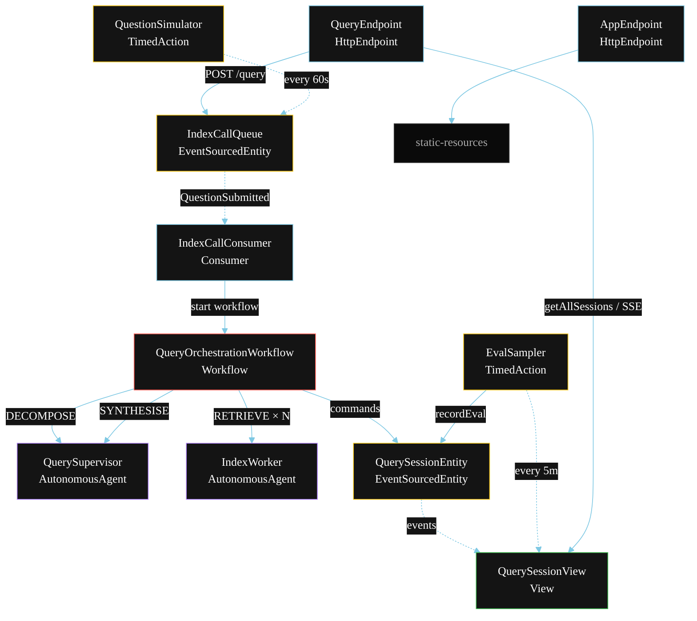
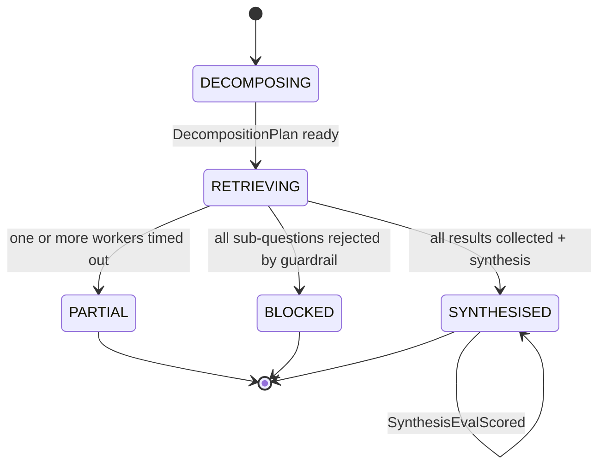
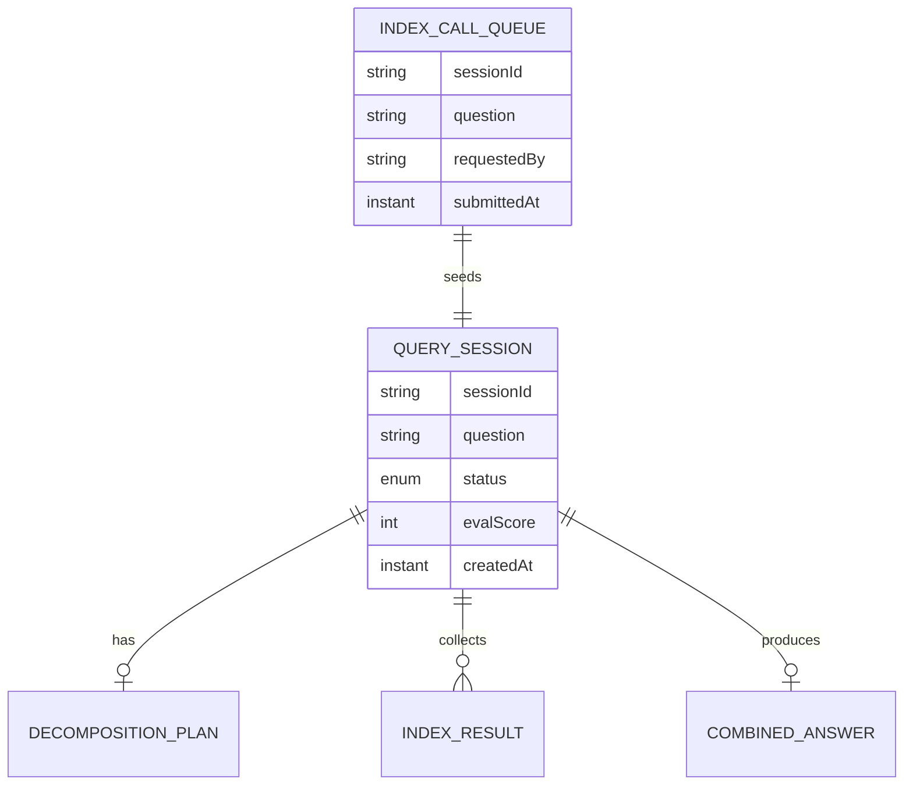

# PLAN — Sub-Question Query Engine

Architectural sketch for `/akka:specify`. Mirrors `SPEC.md` Section 4 component names exactly. Mermaid sources here are rendered on the Architecture tab of the embedded UI; carry the Lesson 24 CSS overrides into the generated `index.html`.

## Component graph



Solid arrows: synchronous commands. Dashed arrows: event subscriptions. Dotted arrows: scheduled ticks.

## Interaction sequence

```mermaid
sequenceDiagram
  participant U as User / Simulator
  participant QE as QueryEndpoint
  participant IQ as IndexCallQueue
  participant WF as QueryOrchestrationWorkflow
  participant QS as QuerySupervisor
  participant IW as IndexWorker
  participant SE as QuerySessionEntity

  U->>QE: POST /api/query {question}
  QE->>IQ: enqueueQuestion
  IQ-->>WF: IndexCallConsumer starts workflow
  WF->>SE: createSession (DECOMPOSING)
  WF->>QS: DECOMPOSE -> DecompositionPlan
  WF->>SE: status RETRIEVING
  par parallel sub-question dispatch
    WF->>IW: RETRIEVE (subQuestion_1) [guardrail checks before index call]
  and
    WF->>IW: RETRIEVE (subQuestion_2) [guardrail checks before index call]
  and
    WF->>IW: RETRIEVE (subQuestion_N) [...]
  end
  Note over WF: join; if any step times out (60s) -> partialStep
  WF->>QS: SYNTHESISE(indexResults) -> CombinedAnswer
  WF->>SE: synthesise (SYNTHESISED)
```

## State machine



## Entity model



## Component table

| Component | Akka primitive | File path |
|---|---|---|
| `QuerySupervisor` | AutonomousAgent | `application/QuerySupervisor.java` |
| `IndexWorker` | AutonomousAgent | `application/IndexWorker.java` |
| `QueryTasks` | Task constants | `application/QueryTasks.java` |
| `QueryOrchestrationWorkflow` | Workflow | `application/QueryOrchestrationWorkflow.java` |
| `QuerySessionEntity` | EventSourcedEntity | `domain/QuerySessionEntity.java` |
| `IndexCallQueue` | EventSourcedEntity | `domain/IndexCallQueue.java` |
| `QuerySessionView` | View | `application/QuerySessionView.java` |
| `IndexCallConsumer` | Consumer | `application/IndexCallConsumer.java` |
| `QuestionSimulator` | TimedAction | `application/QuestionSimulator.java` |
| `EvalSampler` | TimedAction | `application/EvalSampler.java` |
| `QueryEndpoint` | HttpEndpoint | `api/QueryEndpoint.java` |
| `AppEndpoint` | HttpEndpoint | `api/AppEndpoint.java` |

## Concurrency notes

- **Step timeouts (Lesson 4):** each `retrieveStep` (one per sub-question) gets 60s; `synthesiseStep` gets 90s. The 5s default fails every LLM call. `WorkflowSettings` is nested inside `Workflow` — no import.
- **Parallel fan-out:** all retrieval steps run concurrently via `CompletionStage` zip over the full list of sub-questions. Not sequential.
- **Guardrail placement:** the before-tool-call check runs inside `IndexWorker` before the seeded index tool is called. A `GuardrailException` propagates back to the workflow, which records an `IndexCallRejected` event and skips that sub-question.
- **Partial path (compensation):** if any worker times out, `defaultStepRecovery` routes to `partialStep`, which synthesises from whichever results arrived and ends with `SessionPartial`. No infinite retry.
- **All-rejected path:** if every sub-question is rejected by the guardrail, the workflow transitions to `SessionBlocked` with a `failureReason` listing the rejected sub-questions.
- **Idempotency:** the workflow id is the `sessionId`. Re-delivery of the same `QuestionSubmitted` event resolves to the same workflow instance — no duplicate session.
- **Eval sampling:** `EvalSampler` reads `QuerySessionView.getAllSessions` (no enum WHERE clause) and filters client-side for the oldest `SYNTHESISED` session lacking an `evalScore`.
