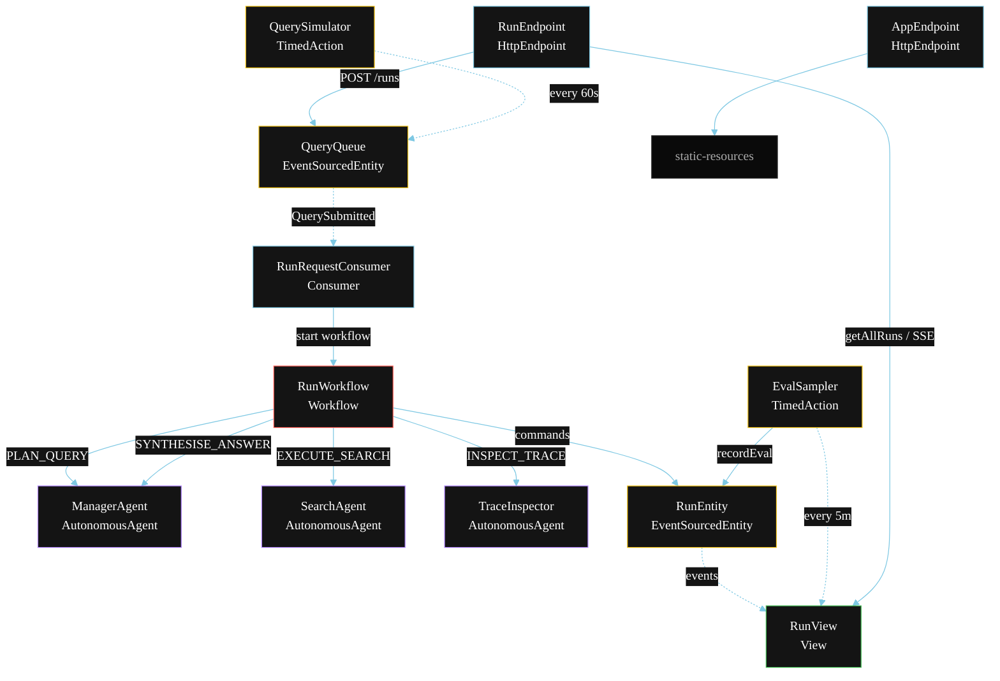
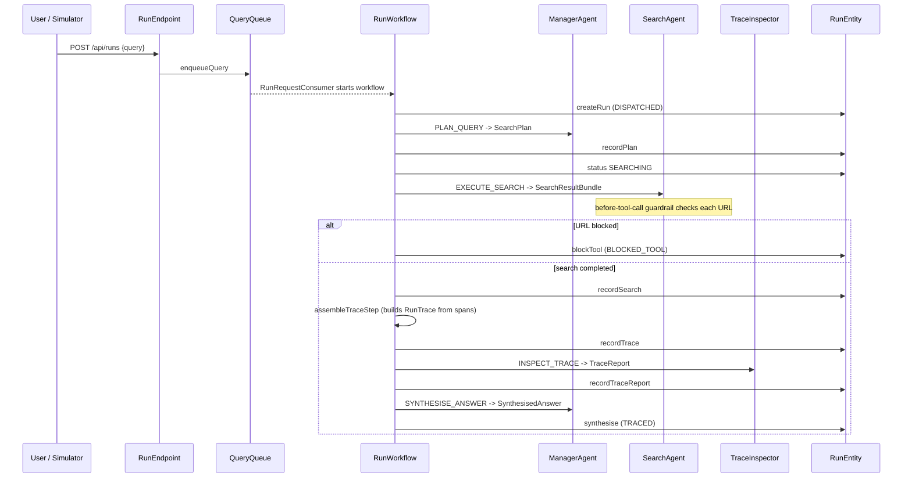
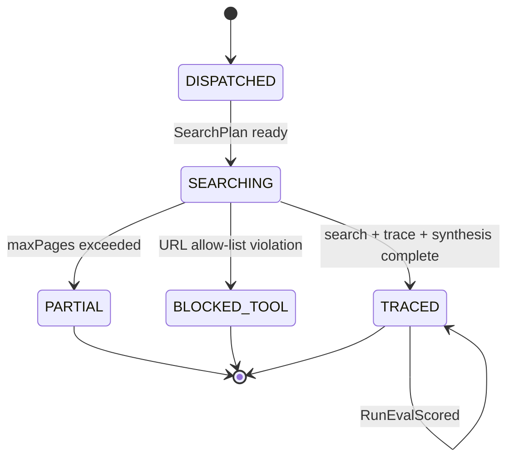
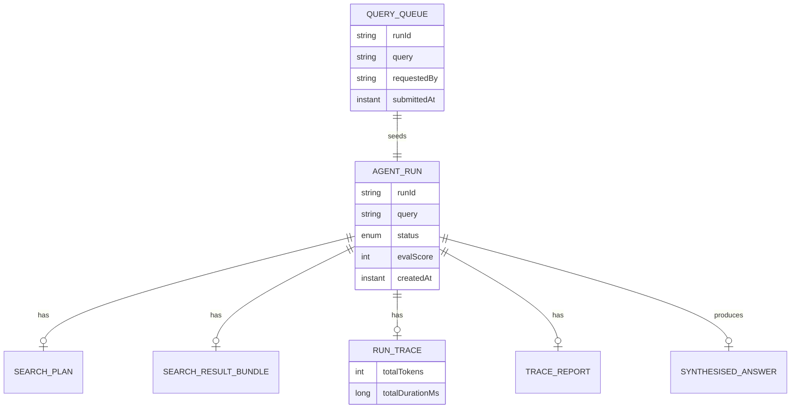

# PLAN — Inspect Multi-Agent Run (Phoenix)

Architectural sketch for `/akka:specify`. Mirrors `SPEC.md` Section 4 component names exactly. Mermaid sources here are rendered on the Architecture tab of the embedded UI; carry the Lesson 24 CSS overrides into the generated `index.html`.

## Component graph

Solid arrows: synchronous commands. Dashed arrows: event subscriptions. Dotted arrows: scheduled ticks.

## Interaction sequence

## State machine

## Entity model

## Component table

| Component | Akka primitive | File path |
|---|---|---|
| `ManagerAgent` | AutonomousAgent | `application/ManagerAgent.java` |
| `SearchAgent` | AutonomousAgent | `application/SearchAgent.java` |
| `TraceInspector` | AutonomousAgent | `application/TraceInspector.java` |
| `RunTasks` | Task constants | `application/RunTasks.java` |
| `RunWorkflow` | Workflow | `application/RunWorkflow.java` |
| `RunEntity` | EventSourcedEntity | `domain/RunEntity.java` |
| `QueryQueue` | EventSourcedEntity | `domain/QueryQueue.java` |
| `RunView` | View | `application/RunView.java` |
| `RunRequestConsumer` | Consumer | `application/RunRequestConsumer.java` |
| `QuerySimulator` | TimedAction | `application/QuerySimulator.java` |
| `EvalSampler` | TimedAction | `application/EvalSampler.java` |
| `RunEndpoint` | HttpEndpoint | `api/RunEndpoint.java` |
| `AppEndpoint` | HttpEndpoint | `api/AppEndpoint.java` |

## Concurrency notes

- **Step timeouts (Lesson 4):** `searchStep` and `synthesiseStep` get 90s; `inspectStep` gets 60s. The 5s default fails every LLM call. `WorkflowSettings` is nested inside `Workflow` — no import.
- **Guard before tool calls:** the before-tool-call guardrail runs synchronously inside `SearchAgent`'s tool dispatch before any HTTP request is made. The allow-list is a config-loaded `Set<String>`.
- **Trace assembly:** `assembleTraceStep` is a deterministic Java step — it collects `PhoenixSpan` records emitted during `searchStep` and sums token counts. No LLM call, no timeout risk.
- **Idempotency:** the workflow id is the `runId`. Re-delivery of the same `QuerySubmitted` event resolves to the same workflow instance — no duplicate runs.
- **Partial path:** if `SearchAgent` signals it has exceeded `maxPages`, the workflow transitions to `partialStep` which synthesises from available results and ends with `RunPartial`.
- **Eval sampling:** `EvalSampler` reads `RunView.getAllRuns` (no enum WHERE clause) and filters client-side for the oldest `TRACED` run lacking an `evalScore`.
