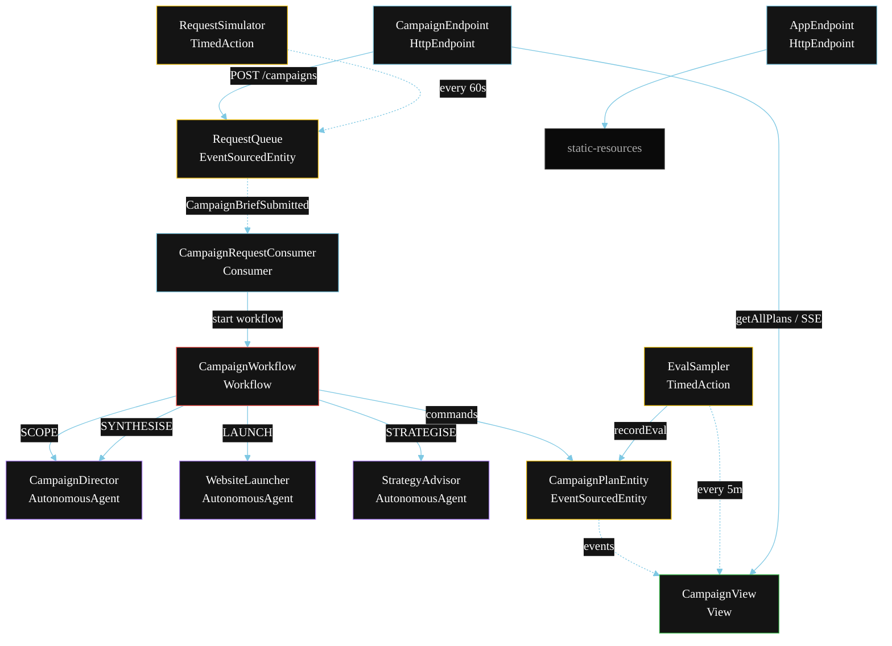
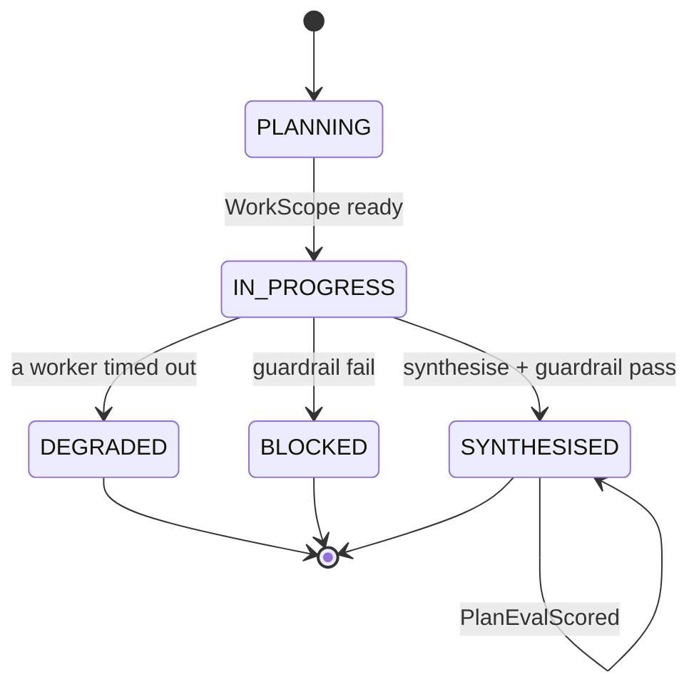
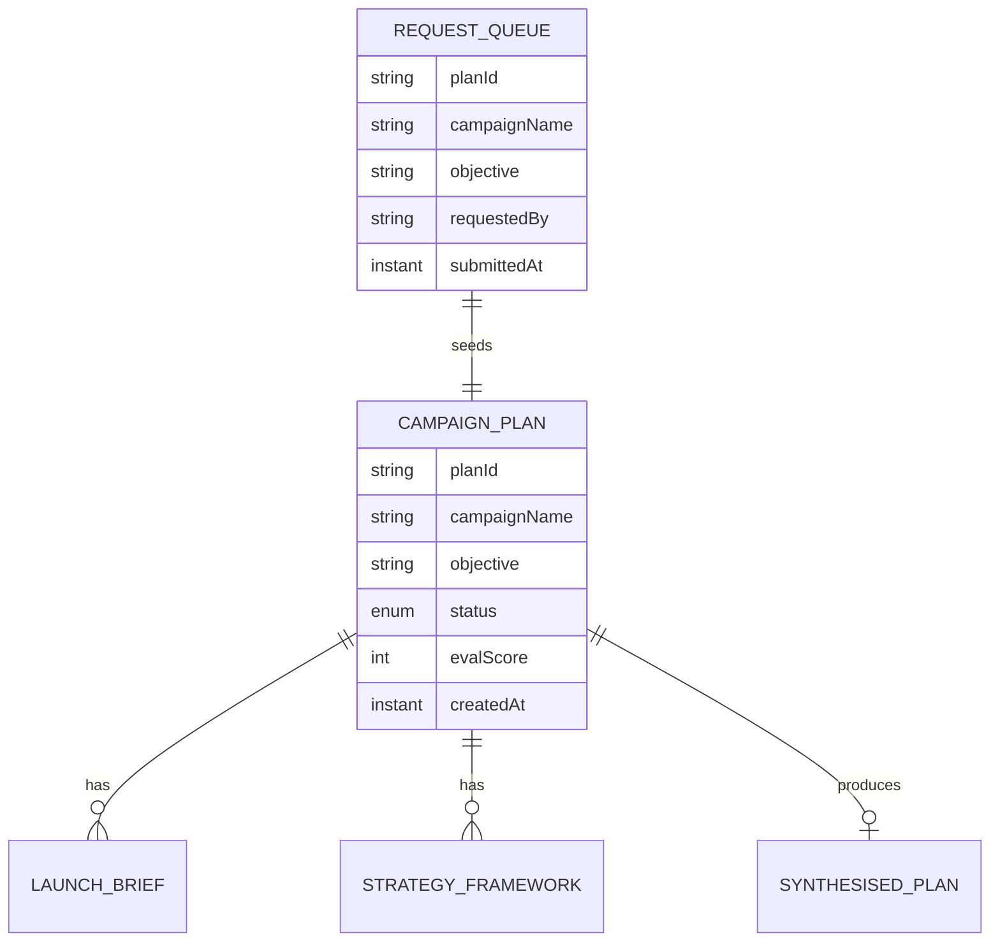

# PLAN — Marketing Agency Team

Architectural sketch for `/akka:specify`. Mirrors `SPEC.md` Section 4 component names exactly. Mermaid sources here are rendered on the Architecture tab of the embedded UI; carry the Lesson 24 CSS overrides into the generated `index.html`.

## Component graph



Solid arrows: synchronous commands. Dashed arrows: event subscriptions. Dotted arrows: scheduled ticks.

## Interaction sequence

```mermaid
sequenceDiagram
  participant U as User / Simulator
  participant CE as CampaignEndpoint
  participant RQ as RequestQueue
  participant WF as CampaignWorkflow
  participant CD as CampaignDirector
  participant WL as WebsiteLauncher
  participant SA as StrategyAdvisor
  participant PE as CampaignPlanEntity

  U->>CE: POST /api/campaigns {campaignName, objective}
  CE->>RQ: submitBrief
  RQ-->>WF: CampaignRequestConsumer starts workflow
  WF->>PE: createPlan (PLANNING)
  WF->>CD: SCOPE -> WorkScope
  WF->>PE: status IN_PROGRESS
  par parallel fan-out
    WF->>WL: LAUNCH -> LaunchBrief
  and
    WF->>SA: STRATEGISE -> StrategyFramework
  end
  Note over WF: join; if either step times out (60s) -> degradeStep
  WF->>CD: SYNTHESISE(launchBrief, strategyFramework) -> SynthesisedPlan
  WF->>WF: guardrailStep vets the plan
  alt guardrail passes
    WF->>PE: synthesise (SYNTHESISED)
  else guardrail fails
    WF->>PE: block (BLOCKED)
  end
```

## State machine



## Entity model



## Component table

| Component | Akka primitive | File path |
|---|---|---|
| `CampaignDirector` | AutonomousAgent | `application/CampaignDirector.java` |
| `WebsiteLauncher` | AutonomousAgent | `application/WebsiteLauncher.java` |
| `StrategyAdvisor` | AutonomousAgent | `application/StrategyAdvisor.java` |
| `MarketingTasks` | Task constants | `application/MarketingTasks.java` |
| `CampaignWorkflow` | Workflow | `application/CampaignWorkflow.java` |
| `CampaignPlanEntity` | EventSourcedEntity | `domain/CampaignPlanEntity.java` |
| `RequestQueue` | EventSourcedEntity | `domain/RequestQueue.java` |
| `CampaignView` | View | `application/CampaignView.java` |
| `CampaignRequestConsumer` | Consumer | `application/CampaignRequestConsumer.java` |
| `RequestSimulator` | TimedAction | `application/RequestSimulator.java` |
| `EvalSampler` | TimedAction | `application/EvalSampler.java` |
| `CampaignEndpoint` | HttpEndpoint | `api/CampaignEndpoint.java` |
| `AppEndpoint` | HttpEndpoint | `api/AppEndpoint.java` |

## Concurrency notes

- **Step timeouts (Lesson 4):** `launchStep` and `strategiseStep` get 60s; `synthesiseStep` gets 90s. The 5s default fails every LLM call. `WorkflowSettings` is nested inside `Workflow` — no import.
- **Parallel fan-out:** `launchStep` and `strategiseStep` run concurrently via `CompletionStage` zip, not two sequential step calls.
- **Idempotency:** the workflow id is the `planId`. Re-delivery of the same `CampaignBriefSubmitted` event resolves to the same workflow instance — no duplicate plan.
- **Degrade path (compensation):** if either worker times out, `defaultStepRecovery` routes to `degradeStep`, which synthesises from whichever partial output exists and ends with `PlanDegraded`. No infinite retry.
- **Eval sampling:** `EvalSampler` reads `CampaignView.getAllPlans` (no enum WHERE clause) and filters client-side for the oldest `SYNTHESISED` plan lacking an `evalScore`.
