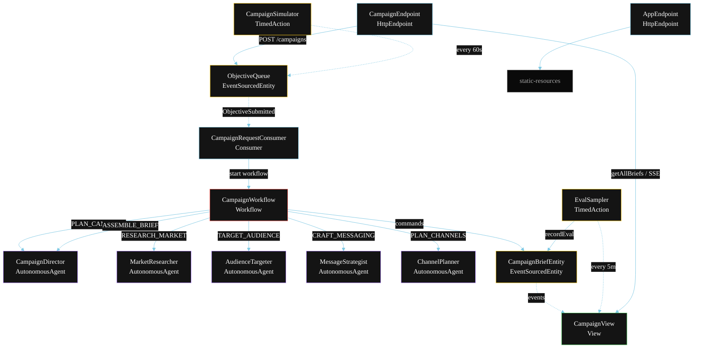
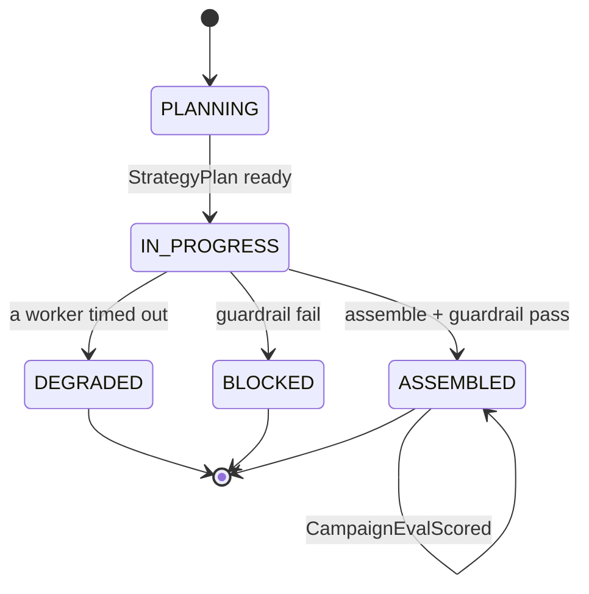
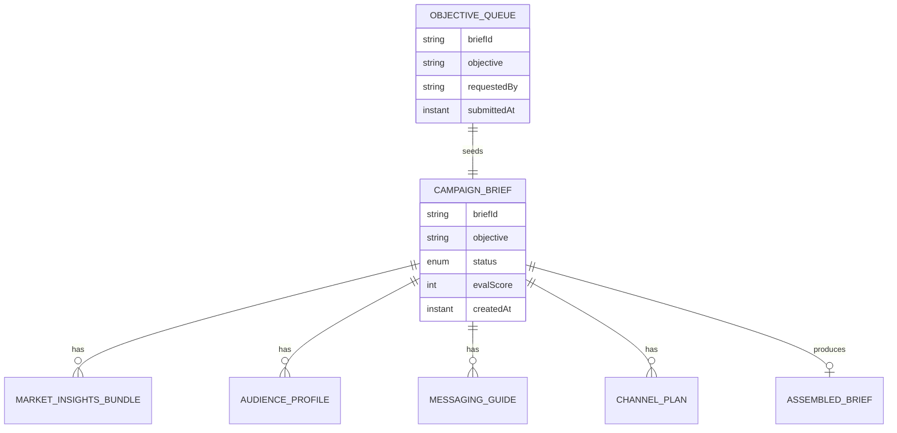

# PLAN — Marketing Strategy Team

Architectural sketch for `/akka:specify`. Mirrors `SPEC.md` Section 4 component names exactly. Mermaid sources here are rendered on the Architecture tab of the embedded UI; carry the Lesson 24 CSS overrides into the generated `index.html`.

## Component graph



Solid arrows: synchronous commands. Dashed arrows: event subscriptions. Dotted arrows: scheduled ticks.

## Interaction sequence

```mermaid
sequenceDiagram
  participant U as User / Simulator
  participant CE as CampaignEndpoint
  participant OQ as ObjectiveQueue
  participant WF as CampaignWorkflow
  participant CD as CampaignDirector
  participant MR as MarketResearcher
  participant AT as AudienceTargeter
  participant MS as MessageStrategist
  participant CP as ChannelPlanner
  participant BE as CampaignBriefEntity

  U->>CE: POST /api/campaigns {objective}
  CE->>OQ: enqueueObjective
  OQ-->>WF: CampaignRequestConsumer starts workflow
  WF->>BE: createBrief (PLANNING)
  WF->>CD: PLAN_CAMPAIGN -> StrategyPlan
  WF->>BE: status IN_PROGRESS
  par parallel fan-out
    WF->>MR: RESEARCH_MARKET -> MarketInsightsBundle
  and
    WF->>AT: TARGET_AUDIENCE -> AudienceProfile
  and
    WF->>MS: CRAFT_MESSAGING -> MessagingGuide
  and
    WF->>CP: PLAN_CHANNELS -> ChannelPlan
  end
  Note over WF: join; if any step times out (60s) -> degradeStep
  WF->>CD: ASSEMBLE_BRIEF(all four outputs) -> AssembledBrief
  WF->>WF: guardrailStep vets compliance
  alt guardrail passes
    WF->>BE: assemble (ASSEMBLED)
  else guardrail fails
    WF->>BE: block (BLOCKED)
  end
```

## State machine



## Entity model



## Component table

| Component | Akka primitive | File path |
|---|---|---|
| `CampaignDirector` | AutonomousAgent | `application/CampaignDirector.java` |
| `MarketResearcher` | AutonomousAgent | `application/MarketResearcher.java` |
| `AudienceTargeter` | AutonomousAgent | `application/AudienceTargeter.java` |
| `MessageStrategist` | AutonomousAgent | `application/MessageStrategist.java` |
| `ChannelPlanner` | AutonomousAgent | `application/ChannelPlanner.java` |
| `CampaignTasks` | Task constants | `application/CampaignTasks.java` |
| `CampaignWorkflow` | Workflow | `application/CampaignWorkflow.java` |
| `CampaignBriefEntity` | EventSourcedEntity | `domain/CampaignBriefEntity.java` |
| `ObjectiveQueue` | EventSourcedEntity | `domain/ObjectiveQueue.java` |
| `CampaignView` | View | `application/CampaignView.java` |
| `CampaignRequestConsumer` | Consumer | `application/CampaignRequestConsumer.java` |
| `CampaignSimulator` | TimedAction | `application/CampaignSimulator.java` |
| `EvalSampler` | TimedAction | `application/EvalSampler.java` |
| `CampaignEndpoint` | HttpEndpoint | `api/CampaignEndpoint.java` |
| `AppEndpoint` | HttpEndpoint | `api/AppEndpoint.java` |

## Concurrency notes

- **Step timeouts (Lesson 4):** `researchStep`, `targetStep`, `messagingStep`, and `channelStep` each get 60s; `assembleStep` gets 120s. The 5s default fails every LLM call. `WorkflowSettings` is nested inside `Workflow` — no import.
- **Parallel fan-out:** all four worker steps run concurrently via `CompletionStage` zip chaining, not four sequential step calls.
- **Idempotency:** the workflow id is the `briefId`. Re-delivery of the same `ObjectiveSubmitted` event resolves to the same workflow instance — no duplicate brief.
- **Degrade path (compensation):** if any worker times out, `defaultStepRecovery` routes to `degradeStep`, which assembles from whichever partial outputs exist and ends with `BriefDegraded`. No infinite retry.
- **Eval sampling:** `EvalSampler` reads `CampaignView.getAllBriefs` (no enum WHERE clause — Lesson 2) and filters client-side for the oldest `ASSEMBLED` brief lacking an `evalScore`.
