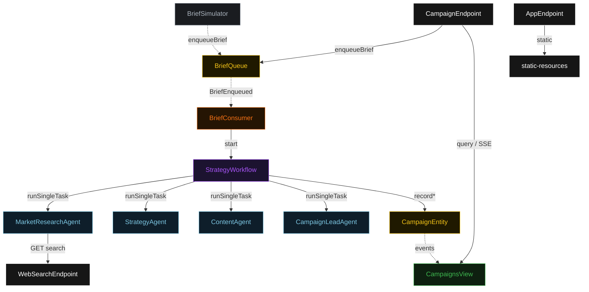
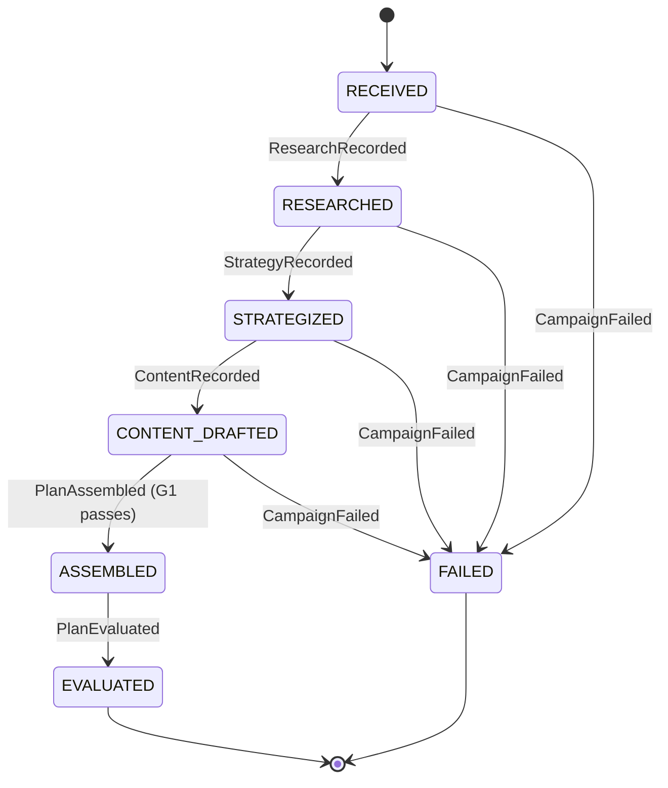
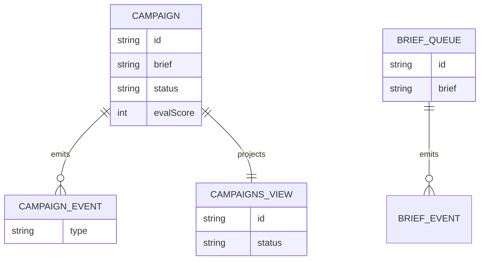

# PLAN — marketing-strategy-team

Architectural sketch. All four mermaid diagrams + the component table are required. The generated system renders these on the Architecture tab.

---

## Component graph



Solid arrows are synchronous commands/queries; dashed arrows are event subscriptions or scheduled drips.

## Interaction sequence

```mermaid
sequenceDiagram
  autonumber
  participant U as User / Simulator
  participant CE as CampaignEndpoint
  participant BQ as BriefQueue
  participant BC as BriefConsumer
  participant WF as StrategyWorkflow
  participant RA as MarketResearchAgent
  participant SA as StrategyAgent
  participant CA as ContentAgent
  participant LA as CampaignLeadAgent
  participant E as CampaignEntity

  U->>CE: POST /api/briefs
  CE->>BQ: enqueueBrief
  BQ-->>BC: BriefEnqueued
  BC->>WF: start(campaignId)
  WF->>RA: RESEARCH task
  RA-->>WF: MarketFindings
  WF->>E: recordResearch
  WF->>SA: STRATEGIZE task
  SA-->>WF: StrategyDraft
  WF->>E: recordStrategy
  WF->>CA: DRAFT_CONTENT task
  CA-->>WF: ContentArtifacts
  WF->>E: recordContent
  WF->>LA: ASSEMBLE task
  LA-->>WF: CampaignPlan
  Note over WF: G1 claim-grounding guardrail — claims must appear in MarketFindings; else retry assemble
  WF->>E: assemblePlan
  WF->>LA: EVALUATE task
  LA-->>WF: PlanEval
  WF->>E: recordEvaluation
```

## State machine



## Entity model



## Component table

| Component | Path (generated) |
|---|---|
| CampaignLeadAgent | `application/CampaignLeadAgent.java` |
| CampaignLeadTasks | `application/CampaignLeadTasks.java` |
| MarketResearchAgent | `application/MarketResearchAgent.java` |
| MarketResearchTasks | `application/MarketResearchTasks.java` |
| StrategyAgent | `application/StrategyAgent.java` |
| StrategyTasks | `application/StrategyTasks.java` |
| ContentAgent | `application/ContentAgent.java` |
| ContentTasks | `application/ContentTasks.java` |
| StrategyWorkflow | `application/StrategyWorkflow.java` |
| CampaignEntity | `domain/CampaignEntity.java` |
| BriefQueue | `domain/BriefQueue.java` |
| CampaignsView | `application/CampaignsView.java` |
| BriefConsumer | `application/BriefConsumer.java` |
| BriefSimulator | `application/BriefSimulator.java` |
| WebSearchEndpoint | `api/WebSearchEndpoint.java` |
| CampaignEndpoint | `api/CampaignEndpoint.java` |
| AppEndpoint | `api/AppEndpoint.java` |
| Bootstrap | `Bootstrap.java` |

## Concurrency notes

- Step timeouts: every agent-calling workflow step (`researchStep`, `strategyStep`, `contentStep`, `assembleStep`, `evalStep`) overrides `stepTimeout` to 60s; the default 5s is too short for LLM calls (Lesson 4).
- Recovery: `defaultStepRecovery(maxRetries(2).failoverTo(StrategyWorkflow::error))`; `error` records `CampaignFailed`.
- Idempotency: the workflow id is the `campaignId`; `BriefConsumer` derives a deterministic workflow id from the queued event offset so a redelivered event does not start a duplicate workflow.
- Guardrail retry: `assembleStep` runs the G1 claim-grounding check; an ungrounded plan fails the step and re-runs the assemble (max 2 retries) before failover.
- No saga/compensation: phases append-only onto `CampaignEntity`; a failed phase transitions to `FAILED`, nothing is rolled back.
