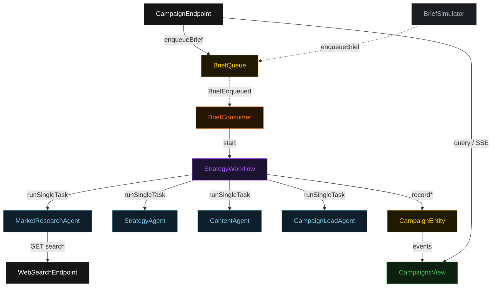

# Architecture

The system demonstrates the delegation-supervisor-workers pattern: one supervisor agent breaks a brief into assignments, three worker agents each return a typed artifact, and the supervisor assembles a final plan. A durable `StrategyWorkflow` drives the delegation; an event-sourced `CampaignEntity` holds each campaign's lifecycle; a `CampaignsView` projects it for the UI.

## Component graph

The workflow is the supervisor's spine: it issues each worker task in turn and writes each result onto the campaign. The lead agent runs last — once as the assembler, once as the evaluator.

## Interaction sequence

See PLAN.md for the full sequence diagram. The path is: brief enqueued → consumer starts the workflow → research → strategy → content → assemble (with the G1 claim-grounding guardrail) → self-evaluation.

## State machine

`CampaignStatus` advances `RECEIVED → RESEARCHED → STRATEGIZED → CONTENT_DRAFTED → ASSEMBLED → EVALUATED`. Any phase can fail to `FAILED`. The G1 guardrail gates the `CONTENT_DRAFTED → ASSEMBLED` transition: an ungrounded plan re-runs the assemble step rather than advancing.

## Entity model

`CampaignEntity` emits `CampaignEvent`s that the `CampaignsView` table updater consumes into a `Campaign` row. `BriefQueue` emits `BriefEnqueued`, which `BriefConsumer` reacts to. The View's single non-streaming query returns all campaigns; status filtering is done client-side because Akka cannot auto-index the enum column (Lesson 2).

## Grounding source

The web-search grounding is modeled in-process. `WebSearchEndpoint` answers `GET /api/search?q=...` from `src/main/resources/sample-docs/search-index.json`, matching query terms against canned result entries. The production analog would call a real search API; the env-var swap to a real client is the only change.
