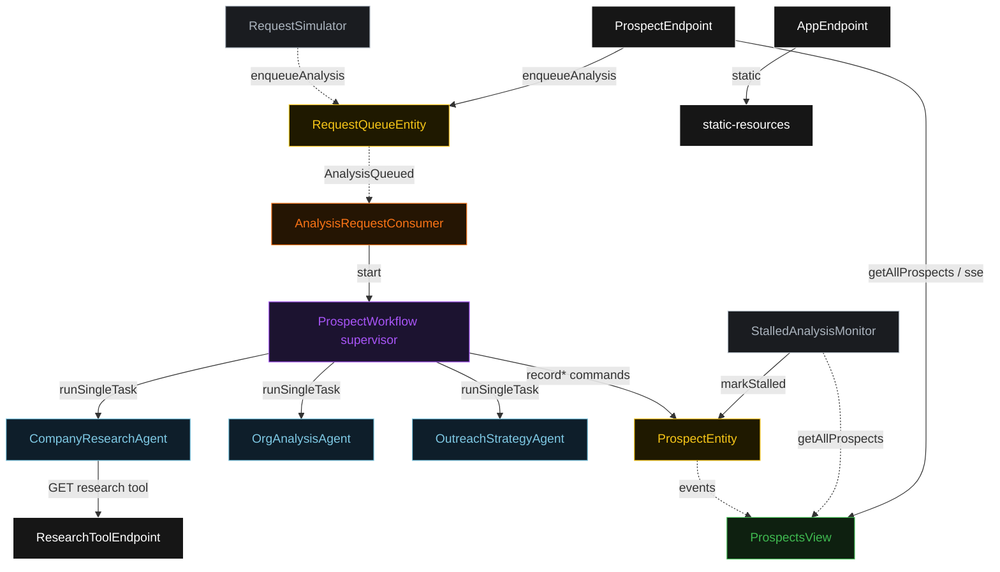
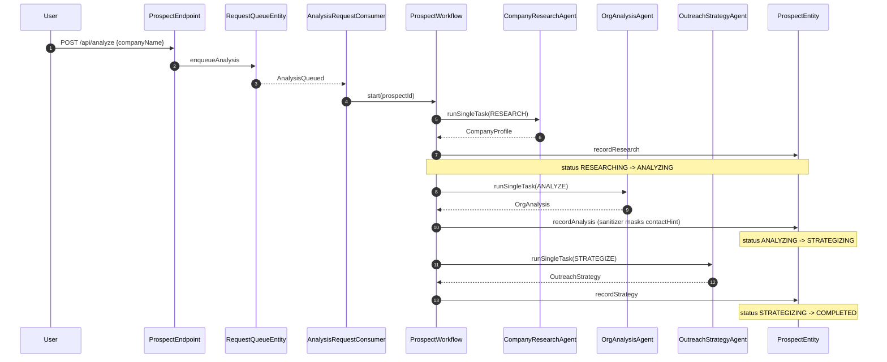
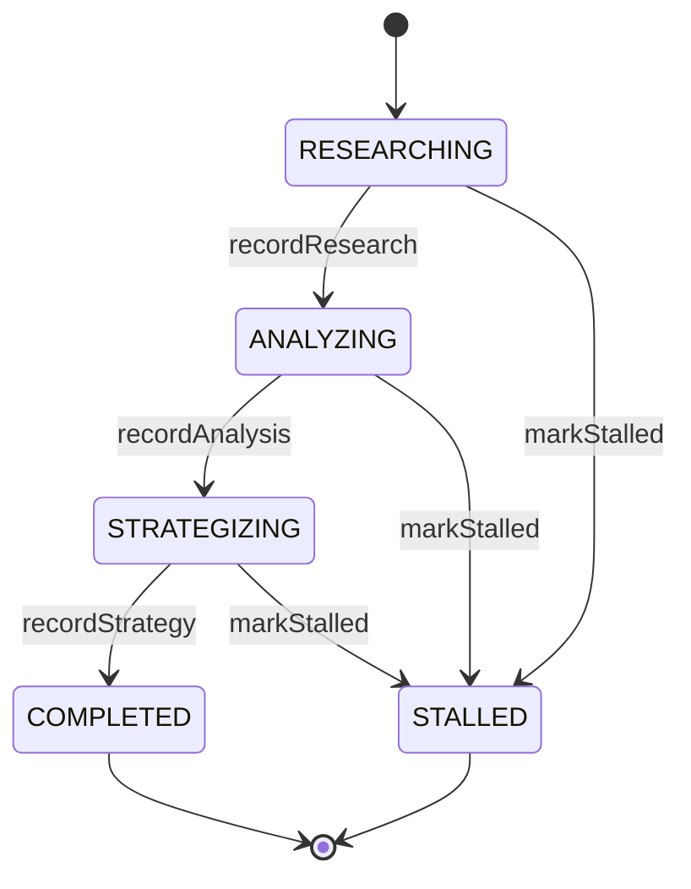
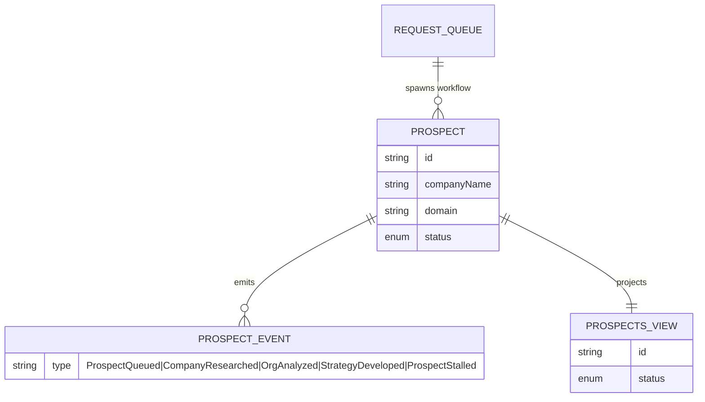

# PLAN — prospect-analysis

Architectural sketch for the delegation-supervisor-workers × sales-marketing cell. All four mermaid diagrams render on the Architecture tab with the Lesson 24 colour overrides.

---

## Component graph

Solid arrows are synchronous commands/queries; dashed arrows are event subscriptions; dotted arrows are scheduled ticks.

## Interaction sequence

## State machine

## Entity model

## Component table

| Component | Path (generated) |
|---|---|
| `CompanyResearchAgent` | `application/CompanyResearchAgent.java` |
| `OrgAnalysisAgent` | `application/OrgAnalysisAgent.java` |
| `OutreachStrategyAgent` | `application/OutreachStrategyAgent.java` |
| `ProspectWorkflow` | `application/ProspectWorkflow.java` |
| `ProspectTasks` | `application/ProspectTasks.java` |
| `ProspectEntity` | `application/ProspectEntity.java` |
| `RequestQueueEntity` | `application/RequestQueueEntity.java` |
| `ProspectsView` | `application/ProspectsView.java` |
| `AnalysisRequestConsumer` | `application/AnalysisRequestConsumer.java` |
| `RequestSimulator` | `application/RequestSimulator.java` |
| `StalledAnalysisMonitor` | `application/StalledAnalysisMonitor.java` |
| `ProspectEndpoint` | `api/ProspectEndpoint.java` |
| `ResearchToolEndpoint` | `api/ResearchToolEndpoint.java` |
| `AppEndpoint` | `api/AppEndpoint.java` |
| `Prospect`, records, enum | `domain/` |

## Concurrency notes

- Each agent-calling workflow step (`researchStep`, `analyzeStep`, `strategizeStep`) sets `stepTimeout(ofSeconds(60))` — the 5s default would expire mid-LLM-call (Lesson 4). `defaultStepRecovery(maxRetries(2).failoverTo(error))` routes a persistently failing step to a terminal error step rather than looping forever.
- Idempotency: the workflow is keyed by `prospectId` (a fresh UUID per `AnalysisQueued`), so a redelivered queue event cannot start a duplicate analysis for the same prospect instance.
- No multi-step saga/compensation: phases are append-only event records on `ProspectEntity`. A failed step leaves the prospect in its last good state until the monitor marks it `STALLED`; no rollback of earlier phases is required.
- The before-tool-call guardrail (G1) is synchronous and blocking — an off-domain call is refused before the worker's tool invocation reaches `ResearchToolEndpoint`.
