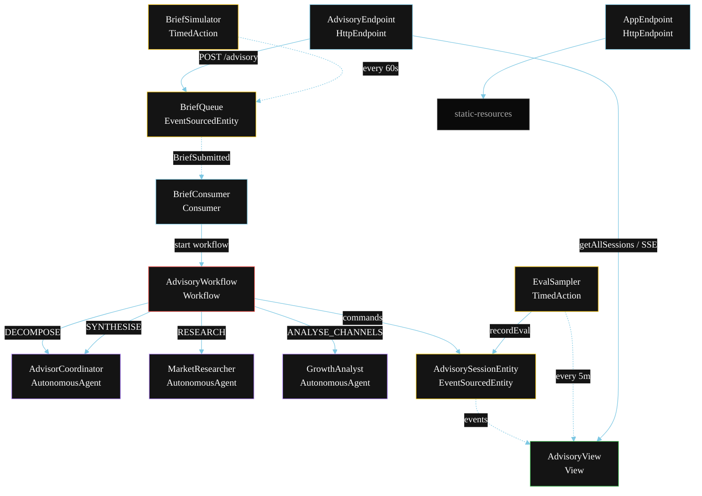
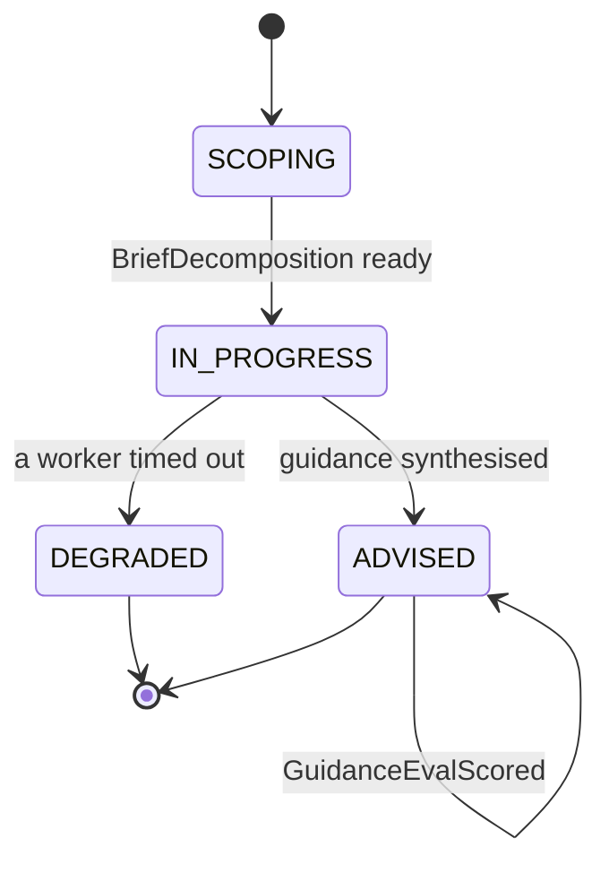
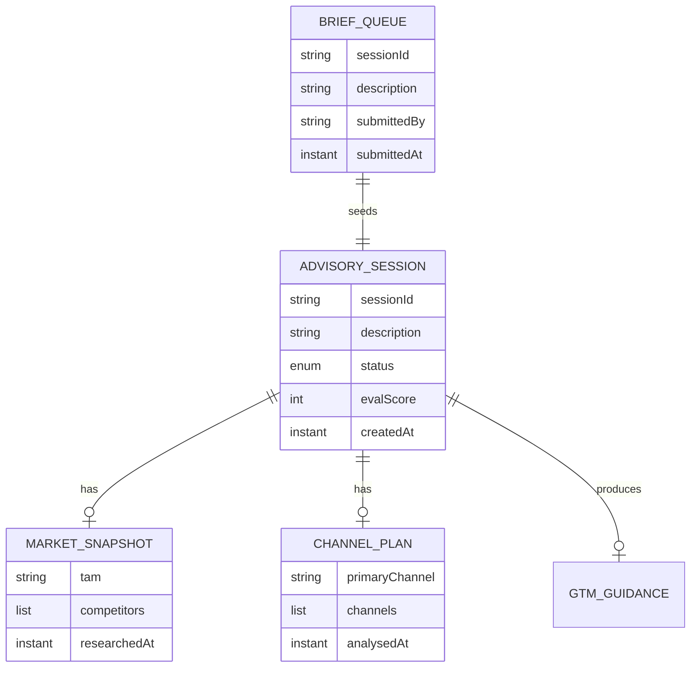

# PLAN — Startup Advisor (MCP)

Architectural sketch for `/akka:specify`. Mirrors `SPEC.md` Section 4 component names exactly. Mermaid sources here are rendered on the Architecture tab of the embedded UI; carry the Lesson 24 CSS overrides into the generated `index.html`.

## Component graph



Solid arrows: synchronous commands. Dashed arrows: event subscriptions. Dotted arrows: scheduled ticks.

## Interaction sequence

```mermaid
sequenceDiagram
  participant U as User / Simulator
  participant AE as AdvisoryEndpoint
  participant BQ as BriefQueue
  participant WF as AdvisoryWorkflow
  participant CO as AdvisorCoordinator
  participant MR as MarketResearcher
  participant GA as GrowthAnalyst
  participant SE as AdvisorySessionEntity

  U->>AE: POST /api/advisory {description}
  AE->>BQ: enqueueBrief
  BQ-->>WF: BriefConsumer starts workflow
  WF->>SE: createSession (SCOPING)
  WF->>CO: DECOMPOSE -> BriefDecomposition
  WF->>SE: status IN_PROGRESS
  par parallel fan-out
    WF->>MR: RESEARCH -> MarketSnapshot
    Note over MR: before-tool-call guardrail<br/>checks allow-list first
  and
    WF->>GA: ANALYSE_CHANNELS -> ChannelPlan
    Note over GA: before-tool-call guardrail<br/>checks allow-list first
  end
  Note over WF: join; if either step times out (60s) -> degradeStep
  WF->>CO: SYNTHESISE(snapshot, plan) -> GtmGuidance
  WF->>SE: synthesiseGuidance (ADVISED)
```

## State machine



## Entity model



## Component table

| Component | Akka primitive | File path |
|---|---|---|
| `AdvisorCoordinator` | AutonomousAgent | `application/AdvisorCoordinator.java` |
| `MarketResearcher` | AutonomousAgent | `application/MarketResearcher.java` |
| `GrowthAnalyst` | AutonomousAgent | `application/GrowthAnalyst.java` |
| `AdvisoryTasks` | Task constants | `application/AdvisoryTasks.java` |
| `AdvisoryWorkflow` | Workflow | `application/AdvisoryWorkflow.java` |
| `AdvisorySessionEntity` | EventSourcedEntity | `domain/AdvisorySessionEntity.java` |
| `BriefQueue` | EventSourcedEntity | `domain/BriefQueue.java` |
| `AdvisoryView` | View | `application/AdvisoryView.java` |
| `BriefConsumer` | Consumer | `application/BriefConsumer.java` |
| `BriefSimulator` | TimedAction | `application/BriefSimulator.java` |
| `EvalSampler` | TimedAction | `application/EvalSampler.java` |
| `AdvisoryEndpoint` | HttpEndpoint | `api/AdvisoryEndpoint.java` |
| `AppEndpoint` | HttpEndpoint | `api/AppEndpoint.java` |

## Concurrency notes

- **Step timeouts (Lesson 4):** `researchStep` and `analyseChannelsStep` get 60s; `synthesiseStep` gets 90s. The 5s default fails every LLM call. `WorkflowSettings` is nested inside `Workflow` — no import.
- **Parallel fan-out:** `researchStep` and `analyseChannelsStep` run concurrently via `CompletionStage` zip, not two sequential step calls.
- **Before-tool-call guardrail:** the allow-list check runs synchronously before each MCP tool invocation inside `MarketResearcher` and `GrowthAnalyst`. A disallowed call is rejected immediately and surfaces a `failureReason`; no tool side-effects occur.
- **Idempotency:** the workflow id is the `sessionId`. Re-delivery of the same `BriefSubmitted` event resolves to the same workflow instance — no duplicate session.
- **Degrade path:** if either worker times out, `defaultStepRecovery` routes to `degradeStep`, which synthesises from whichever partial output exists and ends with `SessionDegraded`. No infinite retry.
- **Eval sampling:** `EvalSampler` reads `AdvisoryView.getAllSessions` (no enum WHERE clause) and filters client-side for the oldest `ADVISED` session lacking an `evalScore`.
