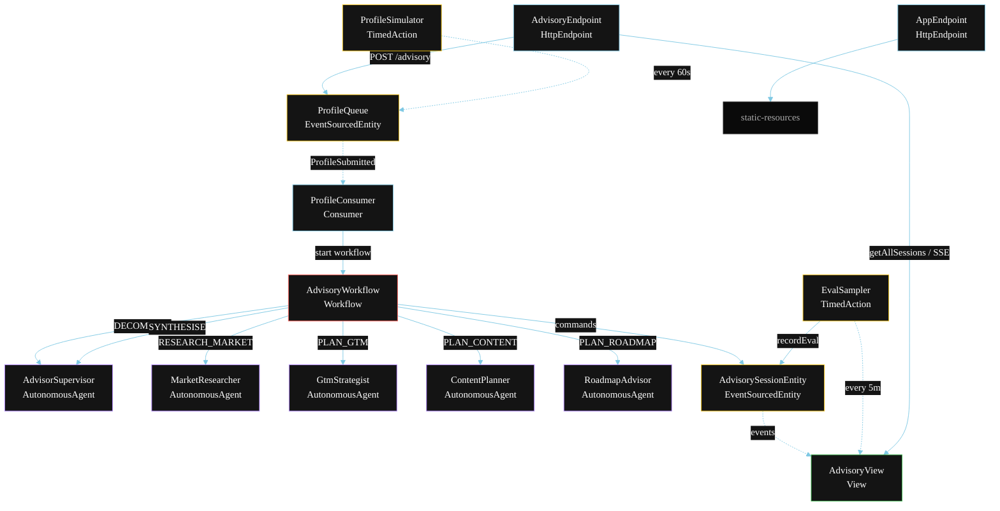
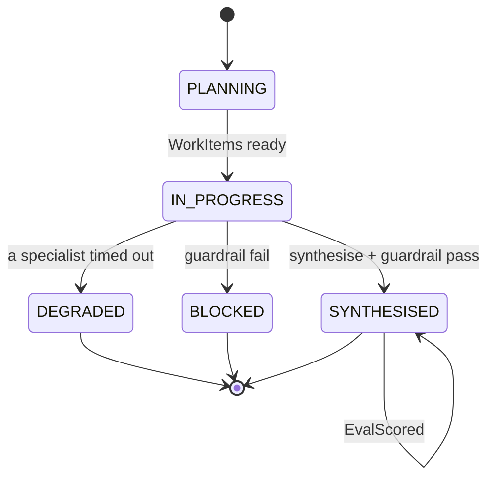
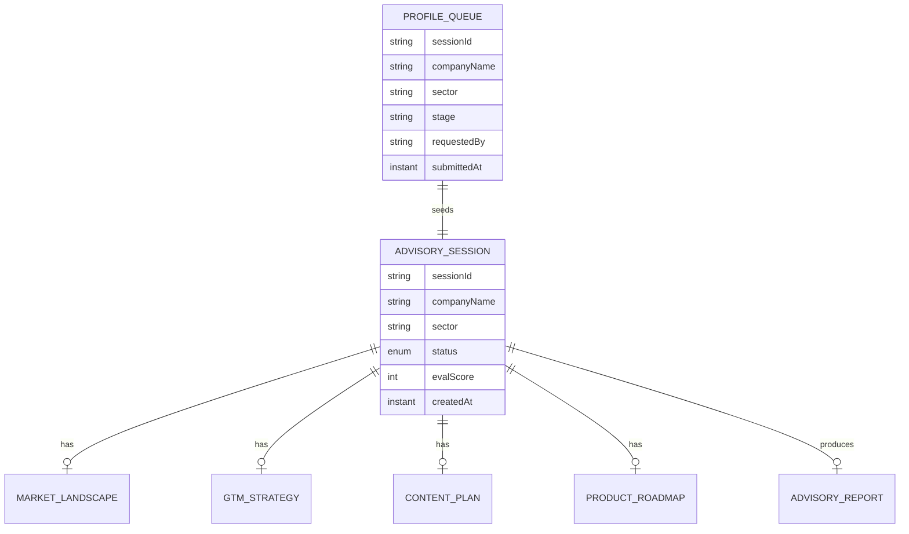

# PLAN — Startup Advisor (Multi-Agent)

Architectural sketch for `/akka:specify`. Mirrors `SPEC.md` Section 4 component names exactly. Mermaid sources here are rendered on the Architecture tab of the embedded UI; carry the Lesson 24 CSS overrides into the generated `index.html`.

## Component graph



Solid arrows: synchronous commands. Dashed arrows: event subscriptions. Dotted arrows: scheduled ticks.

## Interaction sequence

```mermaid
sequenceDiagram
  participant U as User / Simulator
  participant AE as AdvisoryEndpoint
  participant PQ as ProfileQueue
  participant WF as AdvisoryWorkflow
  participant SUP as AdvisorSupervisor
  participant MR as MarketResearcher
  participant GTM as GtmStrategist
  participant CP as ContentPlanner
  participant RA as RoadmapAdvisor
  participant SE as AdvisorySessionEntity

  U->>AE: POST /api/advisory {companyName, sector, stage, problemStatement}
  AE->>PQ: enqueueProfile
  PQ-->>WF: ProfileConsumer starts workflow
  WF->>SE: createSession (PLANNING)
  WF->>SUP: DECOMPOSE -> WorkItems
  WF->>SE: status IN_PROGRESS
  par parallel fan-out
    WF->>MR: RESEARCH_MARKET -> MarketLandscape
  and
    WF->>GTM: PLAN_GTM -> GtmStrategy
  and
    WF->>CP: PLAN_CONTENT -> ContentPlan
  and
    WF->>RA: PLAN_ROADMAP -> ProductRoadmap
  end
  Note over WF: join; if any step times out (60s) -> degradeStep
  WF->>SUP: SYNTHESISE(market, gtm, content, roadmap) -> AdvisoryReport
  WF->>WF: guardrailStep vets the report
  alt guardrail passes
    WF->>SE: synthesise (SYNTHESISED)
  else guardrail fails
    WF->>SE: block (BLOCKED)
  end
```

## State machine



## Entity model



## Component table

| Component | Akka primitive | File path |
|---|---|---|
| `AdvisorSupervisor` | AutonomousAgent | `application/AdvisorSupervisor.java` |
| `MarketResearcher` | AutonomousAgent | `application/MarketResearcher.java` |
| `GtmStrategist` | AutonomousAgent | `application/GtmStrategist.java` |
| `ContentPlanner` | AutonomousAgent | `application/ContentPlanner.java` |
| `RoadmapAdvisor` | AutonomousAgent | `application/RoadmapAdvisor.java` |
| `AdvisorTasks` | Task constants | `application/AdvisorTasks.java` |
| `AdvisoryWorkflow` | Workflow | `application/AdvisoryWorkflow.java` |
| `AdvisorySessionEntity` | EventSourcedEntity | `domain/AdvisorySessionEntity.java` |
| `ProfileQueue` | EventSourcedEntity | `domain/ProfileQueue.java` |
| `AdvisoryView` | View | `application/AdvisoryView.java` |
| `ProfileConsumer` | Consumer | `application/ProfileConsumer.java` |
| `ProfileSimulator` | TimedAction | `application/ProfileSimulator.java` |
| `EvalSampler` | TimedAction | `application/EvalSampler.java` |
| `AdvisoryEndpoint` | HttpEndpoint | `api/AdvisoryEndpoint.java` |
| `AppEndpoint` | HttpEndpoint | `api/AppEndpoint.java` |

## Concurrency notes

- **Step timeouts (Lesson 4):** `marketStep`, `gtmStep`, `contentStep`, and `roadmapStep` each get 60s; `synthesiseStep` gets 120s. The 5s default fails every LLM call. `WorkflowSettings` is nested inside `Workflow` — no import.
- **Parallel fan-out:** all four specialist steps run concurrently via `CompletionStage` allOf zip, not sequential step calls.
- **Idempotency:** the workflow id is the `sessionId`. Re-delivery of the same `ProfileSubmitted` event resolves to the same workflow instance — no duplicate session.
- **Degrade path (compensation):** if any specialist times out, `defaultStepRecovery` routes to `degradeStep`, which synthesises from whichever partial outputs exist and ends with `SessionDegraded`. No infinite retry.
- **Eval sampling:** `EvalSampler` reads `AdvisoryView.getAllSessions` and filters client-side for the oldest `SYNTHESISED` session lacking an `evalScore`.
